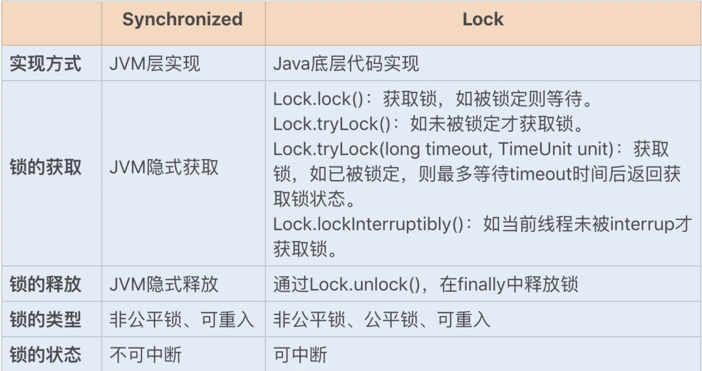
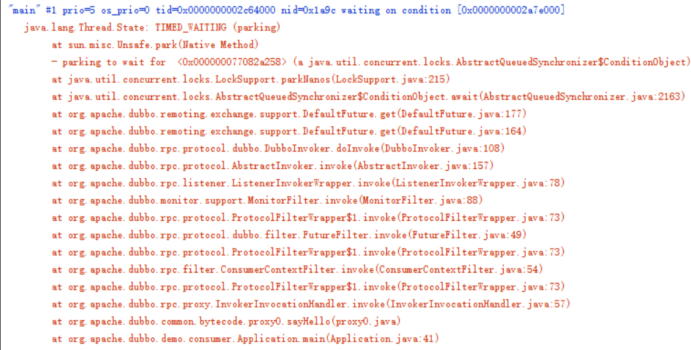

<!-- MarkdownTOC -->
- [1 Lock接口](#1-lock接口)
  - [1.1 Lock与synchronized](#11-lock与synchronized)
  - [1.2 Lock接口方法](#12-lock接口方法)
  - [1.3 Lock如何保证可见性](#13-lock如何保证可见性)
- [2 ReentrantLock](#2-reentrantlock)
  - [2.1 可重入](#21-可重入)
  - [2.2 公平/非公平](#22-公平非公平)
  - [2.3 中断与超时等待](#23-中断与超时等待)
  - [2.4 重入锁执行流程](#24-重入锁执行流程)
- [3 ReetrantReadWriteLock](#3-reetrantreadwritelock)
  - [3.1 读锁](#31-读锁)
    - [3.1.1 读锁加锁](#311-读锁加锁)
    - [3.1.2 读锁释放](#312-读锁释放)
  - [3.2 写锁](#32-写锁)
    - [3.2.1 写锁加锁](#321-写锁加锁)
    - [3.2.2 写锁释放](#322-写锁释放)
  - [3.3 读写锁实现缓存](#33-读写锁实现缓存)
  - [3.4 读写锁的升级与降级](#34-读写锁的升级与降级)
  - [3.4 读写锁小结](#34-读写锁小结)
- [4 StampedLock](#4-stampedlock)
- [5 Condition接口](#5-condition接口)
  - [5.1 常用方法](#51-常用方法)
  - [5.2 Dubbo 源码分析](#52-dubbo-源码分析)
- [参考资料](#参考资料)

<!-- /MarkdownTOC -->

------

**写在最前**

在并发编程领域，有两大核心问题：一个是**互斥**，即同一时刻只允许一个线程访问共享资源；另一个是**同步**，即线程之间如何通信、协作。这两大问题，管程都是能够解决的。**Java SDK 并发包通过 Lock 和 Condition 两个接口来实现管程，其中 Lock 用于解决互斥问题，Condition 用于解决同步问题**。

在《深入理解synchronized原理》一文中，我们知道了Java 语言本身提供的 synchronized 也是管程的一种实现，既然 Java 从语言层面已经实现了管程了，那为什么还要在 SDK 里提供另外一种实现呢？

# 1 Lock接口

## 1.1 Lock与synchronized

在Lock接口出现之前，Java程序是靠**synchronized**关键字用来实现锁功能，使用时**隐式地获取和释放锁**，但是它将锁的获取和释放固化了。

所以，如果占有锁的线程由于要等待I/O或者其他原因（比如调用sleep方法）被阻塞了，其他线程就会只能一直等待，直到占有锁的线程释放掉锁，释放锁有以下几种情况：

（1）获取锁的线程执行完了该代码块，然后会自动释放锁。

（2）执行线程发生了异常，JVM会自动释放掉线程的锁。

（3）占有锁的线程进入 WAITING 状态从而释放锁，例如调用了wait()方法等。

这会极大影响程序执行效率。因此，需要有一种机制保证等待的线程不是一直处于无期限地等待的状态（解决方案：`tryLock(long time, TimeUnit unit))/lockInterruptibly() `）。

除此之外，使用**synchronized的局限性**还有：

* 当多个线程读写文件时，读操作与读操作之间不会发生冲突。但采用synchronized关键字实现同步时，还是只能一个线程进行读操作，其他读线程只能等待锁的释放而无法进行读操作。因此，需要一种机制来保证多线程都只是进行读操作时，线程之间不会发生冲突(解决方案：ReentrantReadWriteLock) 。
* synchronized同步块无法异步处理锁（即不能立即知道是否可以拿到锁） (解决方案：ReentrantLock)。
* 同步块无法根据条件灵活的加锁解锁（即只能跟同步块范围一致）。
* 同步块的阻塞无法中断（不能 Interruptibly）。
* 同步块的阻塞无法控制超时（无法自动解锁）。

为弥补synchronized使用的局限性，Java SE 5之后，并发包中新增了Lock、ReadWriteLock等接口（以及相关实现）。虽然它们缺少了隐式获取释放锁的便捷性，但是却拥有了**锁获取与释放的可操作性、可中断的获取锁以及超时获取锁**等多种synchronized关键字所不具备的同步特性。

<div align="center">  

</div>

## 1.2 Lock接口方法

Lock 锁使用方式方式灵活可控，性能开销小，其锁工具包位于`java.util.concurrent.locks`下。

Lock接口有6个方法：

```java
// 获取锁; 类比 synchronized (lock)
void lock()   

// 如果当前线程未被中断，则获取锁，可以响应中断  
void lockInterruptibly() throws InterruptedException;  

// 返回绑定到此 Lock 实例的新 Condition 实例  
Condition newCondition()   

// 支持非阻塞获取锁的API，可以响应中断，成功则返回 true 
boolean tryLock()   

// 如果锁在给定的等待时间内空闲，并且当前线程未被中断，则获取锁  
boolean tryLock(long time, TimeUnit unit) throws InterruptedException;

// 释放锁  
void unlock()
```

`lock()、tryLock()、tryLock(long time, TimeUnit unit)和lockInterruptibly()`方法是用来获取锁的。`unLock()`方法是用来释放锁的。

（1）`lock() & unlock()`　

`lock()`用来获取锁。如果锁已被其他线程获取，则进行等待。使用Lock，**必须主动去释放锁**，并且在发生异常时，不会自动释放锁。因此，一般来说，使用Lock必须在try()/catch()块中进行，并且将释放锁的操作放在finally块中进行，以保证锁一定被被释放，防止死锁的发生。通常使用Lock来进行同步的话，是以下面这种形式去使用的：

```java
Lock lock = ...;
lock.lock();// 获取锁
try{
    //处理任务
}catch(Exception ex){

}finally{
    lock.unlock();   //释放锁
}
```

（2）`tryLock() & tryLock(long time, TimeUnit unit)`

`tryLock()`方法有返回值。它表示尝试获取锁，如果获取成功，则返回true；如果获取失败（即锁已被其他线程获取），则返回false。值得注意的是，这个方法**无论如何都会立即返回**（在拿不到锁时不会一直在那等待）。

`tryLock(long time, TimeUnit  unit)`方法和`tryLock()`方法类似，区别在于`tryLock(long time, TimeUnit  unit)`在拿不到锁时会等待一定的时间，在时间期限之内如果还拿不到锁，就返回false，同时可以响应中断。如果一开始拿到锁或者在等待期间内拿到了锁，则返回true。

一般情况下，通过tryLock()是这样使用的：

```java
Lock lock = ...;
if(lock.tryLock()) {
     try{
         //处理任务
     }catch(Exception ex){

     }finally{
         lock.unlock();   //释放锁
     } 
}else {
    //如果不能获取锁，则直接做其他事情
}
```

（3）`lockInterruptibly()`

使用`lockInterruptibly()`方法能够响应中断，即中断线程的等待状态。例如，当两个线程A、B同时通过`lock.lockInterruptibly()`获取锁时，假若此时线程A获取到了锁，而线程B进入等待状态，那么线程B就可调用`interrupt()`方法中断线程B的等待过程。（`interrupt()`方法只能中断阻塞过程中的线程）

`lockInterruptibly()`一般的使用形式如下：

```java
public void method() throws InterruptedException {
    lock.lockInterruptibly();
    try {  
     //.....
    }
    finally {
        lock.unlock();
    }
}
```

Lock接口的实现类有：

<div align="center">  

</div>

## 1.3 Lock如何保证可见性

我们已经知道Java中的可见性是通过Happen-Before规则来保证的，而synchronized之所以能保证可见性，也是因为synchronized 相关的规则：synchronized 的解锁 Happens-Before 于后续对这个锁的加锁。那么Lock靠什么保证可见性呢？例如在下面的代码中，线程 T1 对 value 进行了 +=1 操作，那后续的线程 T2 能够看到 value 的正确结果吗？

```java
class X {
  private final Lock rtl = new ReentrantLock();
  int value;
  public void addOne() {
    // 获取锁
    rtl.lock();  
    try {
      value+=1;
    } finally {
      // 保证锁能释放
      rtl.unlock();
    }
  }
}
```

答案是肯定的，Java SDK里面锁实现挺复杂，这里不展开细说，但是原理简单介绍一下：**它是利用了volatile相关的volatile相关的Happens-Before规则**。Java SDK 里面的 ReentrantLock，内部持有一个 volatile 的成员变量 state，获取锁的时候，会读写 state 的值；解锁的时候，也会读写 state 的值（简化后的代码如下面所示）。也就是说，在执行 value+=1 之前，程序先读写了一次 volatile 变量 state，在执行 value+=1 之后，又读写了一次 volatile 变量 state。根据相关的 Happens-Before 规则：

1. **顺序性规则**：对于线程 T1，value+=1 Happens-Before 释放锁的操作 unlock()；
2. **volatile 变量规则**：由于 state = 1 会先读取 state，所以线程 T1 的 unlock() 操作 Happens-Before 线程 T2 的 lock() 操作；
3. **传递性规则**：线程 T1 的 value+=1 Happens-Before 线程 T2 的 lock() 操作。

所以说，后续线程 T2 能够看到 value 的正确结果。

# 2 ReentrantLock

ReentrantLock是Lock接口的主要实现类，ReentrantLock是**可重入锁**，顾名思义，就是支持重进入的锁，它表示该锁**能够支持一个线程对资源的重复加锁**。

<div align="center">  

</div>

它实现了 Lock 接口，内部类 Sync 是 AQS 的子类；Sync的两个子类 NonfairSync 和 FairSync 分别对应**公平锁和非公平锁两种策略**。（如果在绝对时间上，先对锁进行获取的请求一定先被满足，那么这个锁是公平的；反之，是不公平的。）公平的获取锁，也就是等待时间最长的线程最优先获取锁，也可以说锁获取是顺序的。ReentrantLock提供了一个构造函数，能够控制锁是否是公平的。

```java
    public ReentrantLock() {
        sync = new NonfairSync();
    }

    public ReentrantLock(boolean fair) {
        sync = fair ? new FairSync() : new NonfairSync();
    }
```

也就是说，调用ReentrantLock时，不传参数或者传入参数`true`，即是公平锁；传入参数`false`，就是非公平锁。（**ReentrantLock默认采用非公平的策略**）

## 2.1 可重入

**可重入锁**又名递归锁。可重入指的是**任意线程在获取到锁之后能够再次获取该锁而不会被锁所阻塞**（前提锁对象得是同一个对象或者class）。Java中**ReentrantLock和synchronized都是可重入锁**，可重入锁的一个优点是可一定程度避免死锁。

例如：

```java
    public synchronized void fun1() {
        System.out.println("方法1执行...");
        fun2();
    }

    public synchronized void fun2() {
        System.out.println("方法2执行...");
    }
```

类中的两个方法都是被内置锁synchronized修饰的，fun1()方法中调用fun2()方法。因为内置锁是可重入的，所以同一个线程在调用fun2()时可以直接获得当前对象的锁，进入fun2()进行操作。

如果是一个不可重入锁，那么当前线程在调用fun2()之前需要将执行fun1()时获取当前对象的锁释放掉，实际上该对象锁已被当前线程所持有，且无法释放，这种情况下会出现死锁。

那么ReentrantLock是如何实现可重入的呢？下面以非公平锁为例，分析可重入实现原理。

首先查看NonfairSync方法：

```java
    static final class NonfairSync extends Sync {
        private static final long serialVersionUID = 7316153563782823691L;

        final void lock() {
            // 利用CAS尝试设置AQS的state为1。设置成功，表示获取锁成功；
            // 如果设置失败，表示state已经>=1。
            if (compareAndSetState(0, 1))
                // 线程获取AQS锁成功，需要设置AQS中的变量exclusiveOwnerThread
                // 为当前持有锁的线程，做保存记录
                setExclusiveOwnerThread(Thread.currentThread());
            else
                // 调用acquire()，再次尝试或者线程进入等待队列。
                acquire(1);
        }

        // 子类重写的tryAcquire方法
        protected final boolean tryAcquire(int acquires) {
            // 调用nonfairTryAcquire方法
            return nonfairTryAcquire(acquires);
        }
    }
```

查看acquire方法：

```java
public final void acquire(int arg) {
    // 调用子类重写的tryAcquire方法，如果tryAcquire方法返回false，那么线程就会进入同步队列。
    if (!tryAcquire(arg) &&
        acquireQueued(addWaiter(Node.EXCLUSIVE), arg))
        selfInterrupt();
}
```

查看nonfairTryAcquire方法：

```java
	final boolean nonfairTryAcquire(int acquires) {
            final Thread current = Thread.currentThread();
            int c = getState();// 获取锁状态（0未加锁；1已加锁）
            if (c == 0) {
                // 直接CAS尝试获取锁，直接返回true，当前线程不会进入同步队列。
                if (compareAndSetState(0, acquires)) {
                    setExclusiveOwnerThread(current);
                    return true;
                }
            }
            // 如果当前线程已占用锁，再次获取锁
            else if (current == getExclusiveOwnerThread()) {
                int nextc = c + acquires;// status+1（可重入性）
                if (nextc < 0)
                    throw new Error("Maximum lock count exceeded");
                setState(nextc);// 重新设置锁的状态
                return true;
            }
            return false;
        }
```

ReentrantLock继承父类AQS，重写了父类tryAcquire方法。其父类AQS中维护了一个同步状态status来计数重入次数，status初始值为0。

当线程尝试获取锁时，可重入锁先尝试获取并更新status值，如果status == 0表示没有其他线程在执行同步代码，则把status置为1，当前线程开始执行。如果status != 0，则判断当前线程是否是获取到这个锁的线程，如果是的话执行status+1，且当前线程可以再次获取锁。

释放锁时，调用tryRelease()方法：

```java
    protected final boolean tryRelease(int releases) {
        int c = getState() - releases;// 释放锁时status-1
        if (Thread.currentThread() != getExclusiveOwnerThread())
            throw new IllegalMonitorStateException();// 先判断当前线程是否已是占用锁的线程
        boolean free = false;
        if (c == 0) {// 只有status=0时才释放锁。
            free = true;
            setExclusiveOwnerThread(null);
        }
        setState(c);
        return free;
    }
```
释放锁时，可重入锁同样先获取当前status的值，在当前线程是持有锁的线程的前提下。如果status-1 == 0，则表示当前线程所有重复获取锁的操作都已经执行完毕，然后该线程才会真正释放锁。如果该锁被获取了n次，那么前(n-1)次tryRelease(int releases)方法必然返回false，而只有同步状态完全释放了，才能返回true。

## 2.2 公平/非公平

**公平锁**是指多个线程**按照申请锁的顺序来获取锁**，线程直接进入队列中排队，队列中的第一个线程才能获得锁（不可插队，等待时间越长，请求锁时会被优先满足）。**公平锁的优点是等待锁的线程不会饥饿**。缺点是整体吞吐效率相对非公平锁要低，等待队列中除第一个线程以外的所有线程都会阻塞，CPU唤醒阻塞线程的开销比非公平锁大。

**非公平锁**是多个线程**加锁时直接尝试获取锁**，获取不到才会到等待队列的队尾等待（可插队的）。但如果此时锁刚好可用，那么这个线程可以无需阻塞直接获取到锁，所以非公平锁有可能出现后申请锁的线程先获取锁的场景。非公平锁的优点是**可以减少唤起线程的开销，整体的吞吐效率高**，因为线程有几率不阻塞直接获得锁，CPU不必唤醒所有线程。缺点是处于等待队列中的线程可能会饥饿，或者等很久才会获得锁。

> Tips：如果一个进程被多次回滚，迟迟不能占用必需的系统资源，可能会导致进程饥饿
>
> 导致线程饥饿常见原因：
>
> 1. 高优先级线程吞噬所有的低优先级线程的CPU时间。
> 2. 线程被永久堵塞在一个等待进入同步快的状态。
> 3. 等待的线程永远不被唤醒。

查看公平加锁方法的源码：

```java
        protected final boolean tryAcquire(int acquires) {
            // 获取当前的线程
            final Thread current = Thread.currentThread();
             // 获取锁的状态
            int c = getState();
            if (c == 0) {
                // hasQueuedPredecessors 判断队列还有没有其它node
                if (!hasQueuedPredecessors() &&
                    compareAndSetState(0, acquires)) {
                    // 设置获取锁的线程
                    setExclusiveOwnerThread(current);
                    return true;
                }
            }
            // 设置获取锁的线程
            else if (current == getExclusiveOwnerThread()) {
                // 获取过了就累加，因为可以重入
                int nextc = c + acquires;
                if (nextc < 0)
                    throw new Error("Maximum lock count exceeded");
                // 重新设置锁的状态
                setState(nextc);
                return true;
            }
            return false;
        }
```

非公平加锁方法的源码：

```java
        final boolean nonfairTryAcquire(int acquires) {
            final Thread current = Thread.currentThread();
            int c = getState();
            if (c == 0) {
                if (compareAndSetState(0, acquires)) {
                    setExclusiveOwnerThread(current);
                    return true;
                }
            }
            else if (current == getExclusiveOwnerThread()) {
                int nextc = c + acquires;
                if (nextc < 0) // overflow
                    throw new Error("Maximum lock count exceeded");
                setState(nextc);
                return true;
            }
            return false;
        }
```

`unlock()`释放锁，其实就是把state从n（可能发生了锁的重入，需要多次释放）变成0，此方法**不区分公平与否**。

公平锁与非公平锁解锁方法的源码：

```java
    public void unlock() {
        sync.release(1);
    }

    public final boolean release(int arg) {
        // 子类重写的tryRelease方法，需要等锁的state=0，即tryRelease返回true的时候，才会去唤醒其它线程进行尝试获取锁。
        if (tryRelease(arg)) {
            Node h = head;
            if (h != null && h.waitStatus != 0)
                unparkSuccessor(h);
            return true;
        }
        return false;
    }

	protected final boolean tryRelease(int releases) {
        // 获取锁的状态
        int c = getState() - releases;
        // 判断锁的所有者是不是该线程
        if (Thread.currentThread() != getExclusiveOwnerThread())
            // 如果所的所有者不是该线程 则抛出异常 也就是锁释放的前提是线程拥有这个锁
            throw new IllegalMonitorStateException();
        boolean free = false;
        // 直到锁的状态是0，说明锁释放成功。即锁没有重入，那么直接将将锁的所有者设置成null
        // 我们在一个线程里面调用几次lock，就要调用几次unlock，才能最终释放锁
        if (c == 0) {
            free = true;
            // 释放线程的拥有者
            setExclusiveOwnerThread(null);
        }
        setState(c);
        return free;
    }
```

可见，平锁的释放和非公平锁的释放一样的。公平锁与非公平锁的lock()方法唯一的区别就在于**公平锁在获取同步状态时多了一个限制条件：hasQueuedPredecessors()**。

```java
    public final boolean hasQueuedPredecessors() {
        // 判断当前线程是否位于同步队列中的第一个。如果是则返回true，否则返回false。
        Node t = tail; 
        Node h = head;
        Node s;
        return h != t &&
            ((s = h.next) == null || s.thread != Thread.currentThread());
    }
```

由此可见，**公平锁就是通过同步队列来实现多个线程按照申请锁的顺序来获取锁，从而实现公平的特性。非公平锁加锁时不考虑排队等待问题，直接尝试获取锁，所以才会存在线程后申请却先获得锁的情况**。


## 2.3 中断与超时等待

**（1）lockInterruptibly可中断方式获取锁**

`lockInterruptibly()`支持中断的获取锁，其实是调用了AQS的lockInterruptibly方法。

```java
    public void lockInterruptibly() throws InterruptedException {
        sync.acquireInterruptibly(1);
    }
```

最终调用AQS的doAcquireInterruptibly(int arg)方法：

```java
    public final void acquireInterruptibly(int arg)
        // 当前线程已经中断了，抛出异常。
        if (Thread.interrupted())
            throw new InterruptedException();
        // 当前线程仍然未成功获取锁，则调用doAcquireInterruptibly方法，这个方法和
        // acquireQueued方法没什么区别，就是线程在等待状态的过程中，如果线程被中断，线程会抛出异常。
        if (!tryAcquire(arg))
            doAcquireInterruptibly(arg);
    }
```

**（2）tryLock超时等待方式获取锁**

`tryLock(long timeout, TimeUnit unit)`也支持中断，并且在这个基础上增加了超时设置，其实也是调用了AQS的tryAcquireNanos方法。

```java
 	public boolean tryLock(long timeout, TimeUnit unit)
            throws InterruptedException {
        return sync.tryAcquireNanos(1, unit.toNanos(timeout));
    }
```

最终调用AQS的doAcquireNanos(int arg, long nanosTimeout)方法：

```java
    public final boolean tryAcquireNanos(int arg, long nanosTimeout)
            throws InterruptedException {
        // 如果当前线程已经中断，则抛出异常
        if (Thread.interrupted())
            throw new InterruptedException();
        //再尝试获取一次，如果不成功则调用doAcquireNanos方法进行超时等待获取锁。
        return tryAcquire(arg) ||
            doAcquireNanos(arg, nanosTimeout);
    }
```

查看tryAcquireNanos方法：

```java
private boolean doAcquireNanos(int arg, long nanosTimeout)
        throws InterruptedException {
    if (nanosTimeout <= 0L)
        return false;
    // 计算超时的时间=当前虚拟机的时间+设置的超时时间
    final long deadline = System.nanoTime() + nanosTimeout;
    // 调用addWaiter将当前线程封装成独占模式的节点，并且加入到同步队列尾部。
    final Node node = addWaiter(Node.EXCLUSIVE);
    boolean failed = true;
    try {
        for (;;) {
            final Node p = node.predecessor();
            if (p == head && tryAcquire(arg)) {
                // 如果当前节点的前驱节点为头结点，则让当前节点去尝试获取锁。
                setHead(node);
                p.next = null; // help GC
                failed = false;
                return true;
            }
            // 如果当前节点的前驱节点不是头结点，或当前节点获取锁失败，
            // 则再次判断当前线程是否已经超时。
            nanosTimeout = deadline - System.nanoTime();
            if (nanosTimeout <= 0L)
                return false;
            // 调用shouldParkAfterFailedAcquire方法，告诉当前节点的前驱节点，马上进入
            // 等待状态了，即做好进入等待状态前的准备。
            if (shouldParkAfterFailedAcquire(p, node) &&
                nanosTimeout > spinForTimeoutThreshold)
                // 调用LockSupport.parkNanos方法，将当前线程设置成超时等待的状态。
                LockSupport.parkNanos(this, nanosTimeout);
            if (Thread.interrupted())
                throw new InterruptedException();
        }
    } finally {
        if (failed)
            cancelAcquire(node);
    }
}
```

## 2.4 重入锁执行流程

<div align="center">  

</div>

# 3 ReetrantReadWriteLock

之前提到锁（如Mutex和ReentrantLock）基本都是**排他锁**，这些锁在同一时刻只允许一个线程进行访问。而**读写锁（ReadWriteLock）**在**同一时刻可以允许多个读线程访问，只允许一个写线程访问，且在写线程访问时，所有的读线程和其他写线程均被阻塞**。

可以看出，读写锁与互斥锁最大的区别在于：读写锁允许多个读线程同时读共享变量，而互斥锁是不允许的，这是读写锁在读多写少场景下性能优于互斥锁的关键。

ReadWriteLock维护了一组锁，一个是只读的锁，一个是写锁。读锁可以在没有写锁的时候被多个线程同时持有，写锁是独占的。如何用一个共享变量来区分锁是写锁还是读锁呢？答案就是`按位拆分`。

由于state是int类型的变量，在内存中`占用4个字节，也就是32位`。将其拆分为两部分：高16位和低16位，其中`高16位用来表示读锁状态，低16位用来表示写锁状态`。当设置读锁成功时，就将高16位加1，释放读锁时，将高16位减1；当设置写锁成功时，就将低16位加1，释放写锁时，将第16位减1。

<div align="center">  

</div>

ReadWriteLock 接口只有两个方法：

```java
//返回读锁  
Lock readLock()   
//返回写锁  
Lock writeLock() 
```

Java并发库中**ReetrantReadWriteLock（简称RRW）**实现了ReadWriteLock接口并添加了可重入的特性。

<div align="center">  

</div>

ReentrantReadWriteLock有两个构造方法：

```java
public ReentrantReadWriteLock() {
    this(false);// 默认为false，采用非公平模式
}

public ReentrantReadWriteLock(boolean fair) {
    sync = fair ? new FairSync() : new NonfairSync();
    readerLock = new ReadLock(this);
    writerLock = new WriteLock(this);
}
```

可以看到，默认的构造方法使用的是非公平模式，创建的Sync是NonfairSync对象，然后初始化读锁和写锁。一旦初始化后，ReadWriteLock接口中的两个方法就有返回值了，如下：

```java
    public ReentrantReadWriteLock.WriteLock writeLock() { return writerLock; }
    public ReentrantReadWriteLock.ReadLock  readLock()  { return readerLock; }
```

从上面可以看到，构造方法决定了Sync是FairSync还是NonfairSync。Sync继承了AQS，而Sync是一个抽象类，NonfairSync和FairSync继承了Sync，并重写了其中的抽象方法。

Sync中提供了很多方法，但是有两个方法是抽象的，子类必须实现。

```java
abstract boolean readerShouldBlock();
abstract boolean writerShouldBlock();
```

FairSync/NonfairSync实现方法如下： 

```java
    /**
     * 非公平
     */
    static final class NonfairSync extends Sync {
        private static final long serialVersionUID = -8159625535654395037L;
        final boolean writerShouldBlock() {
            return false; // 直接返回false，说明不需要排队
        }
        final boolean readerShouldBlock() {
            /* 当前线程是写锁占用的线程时，返回true；否则返回false。
             * 如果当前有一个写线程正在写，那么该读线程应该阻塞。
             */
            return apparentlyFirstQueuedIsExclusive();
        }
    }

    /**
     * 公平
     */
    static final class FairSync extends Sync {
        private static final long serialVersionUID = -2274990926593161451L;
        final boolean writerShouldBlock() {
            return hasQueuedPredecessors();// 判断同步队列中是否有人在排队
        }
        final boolean readerShouldBlock() {
            return hasQueuedPredecessors();
        }
    }
```

writerShouldBlock()方法的作用是判断当前线程是否应该阻塞，对于公平的写锁和非公平写锁的具体实现不一样。    

* 对于非公平写锁而言，直接返回false，因为非公平锁获取锁之前不需要去判断是否排队。
* 对于公平锁写锁而言，它会判断同步队列中是否有人在排队，有人排队，就返回true，表示当前线程需要阻塞。无人排队就返回false。

## 3.1 读锁

### 3.1.1 读锁加锁

获取读锁时，首先调用ReadLock类中的lock方法：

```java
public void lock() {
    sync.acquireShared(1);
}
```

读锁使用的也是AQS的共享模式，AQS的acquireShared方法如下：

```java
    public final void acquireShared(int arg) {
        if (tryAcquireShared(arg) < 0)
            doAcquireShared(arg);
    }
```

当tryAcquireShared()方法小于0时，那么会执行doAcquireShared方法将该线程加入到等待队列中。

Sync实现了tryAcquireShared方法，如下：

```java
        protected final int tryAcquireShared(int unused) {
            Thread current = Thread.currentThread();
            int c = getState();
            // exclusiveCount(c)返回的是写锁的数量，如果它不为0，说明写锁被占用
            // 如果此时占用写锁的线程不是当前线程，就返回-1，表示获取锁失败
            if (exclusiveCount(c) != 0 &&
                getExclusiveOwnerThread() != current)
                return -1;
            // 得到读锁的数量
            int r = sharedCount(c);
            
            /**
             * 在下面的代码中进行了三个判断：
             * 1、读锁是否应该排队。没有排队，就进行if后面的判断。
             *    排队，就直接调用fullTryAcquireShared()方法。
             * 2、读锁数量是否超过最大值。（最大数量为2的16次方-1=65535）
             * 3、是否获取到同步变量的最新状态值
             */          
            if (!readerShouldBlock() &&
                r < MAX_COUNT &&
                compareAndSetState(c, c + SHARED_UNIT)) {
                // 如果读锁数量为0时，当前线程设置为firstReader，即第一个读线程就是当前线程
                if (r == 0) {
                    firstReader = current;
                    firstReaderHoldCount = 1;
                } else if (firstReader == current) {
                    // 如果当前读线程重入了，firstReaderHoldCount累加
                    firstReaderHoldCount++; 
                } else {
                    // 读锁数量不为0，且第一个获取到读锁的线程不是当前线程
                    // 下面这一段逻辑就是保存当前线程获取读锁的次数，如何保存的呢？
                    // 通过ThreadLocal来实现的，readHolds就是一个ThreadLocal的实例
                    HoldCounter rh = cachedHoldCounter;
                    if (rh == null || rh.tid != getThreadId(current))
                        cachedHoldCounter = rh = readHolds.get();
                    else if (rh.count == 0)
                        readHolds.set(rh);
                    rh.count++;
                }
                // 返回1表示获取读锁成功
                return 1;
            }
            // 否则，循环尝试
            return fullTryAcquireShared(current);
        }
```

查看fullTryAcquiredShared方法：

```java
  final int fullTryAcquireShared(Thread current) {   
            HoldCounter rh = null;
     		// for死循环，直到满足相应的条件才会return退出，否则一直循环
            for (;;) {
                int c = getState();
                // 锁的状态为写锁时，持有锁的线程不等于当前线程，说明当前线程获取锁失败，返回-1
                if (exclusiveCount(c) != 0) {
                    if (getExclusiveOwnerThread() != current)
                        return -1;
                } 
                // 如果读锁需要排队
                else if (readerShouldBlock()) {
                    // Make sure we're not acquiring read lock reentrantly
                    if (firstReader == current) {
                        // assert firstReaderHoldCount > 0;
                    }
                    // 说明有别的读线程占有了锁
                    else {
                        if (rh == null) {
                            rh = cachedHoldCounter;
                            if (rh == null || rh.tid != getThreadId(current)) {
                                rh = readHolds.get();
                                if (rh.count == 0)
                                    readHolds.remove();
                            }
                        }
                        if (rh.count == 0)
                            return -1;
                    }
                }
                // 如果读锁达到了最大值，抛出异常
                if (sharedCount(c) == MAX_COUNT)
                    throw new Error("Maximum lock count exceeded");
        		// 尝试设置同步变量的值，只要设置成功了，就表示当前线程获取到了锁，
                // 然后就设置锁的获取次数等相关信息
                if (compareAndSetState(c, c + SHARED_UNIT)) {
                    if (sharedCount(c) == 0) {
                        firstReader = current;
                        firstReaderHoldCount = 1;
                    } else if (firstReader == current) {
                        firstReaderHoldCount++;
                    } else {
                        if (rh == null)
                            rh = cachedHoldCounter;
                        if (rh == null || rh.tid != getThreadId(current))
                            rh = readHolds.get();
                        else if (rh.count == 0)
                            readHolds.set(rh);
                        rh.count++;
                        cachedHoldCounter = rh; // cache for release
                    }
                    return 1;
                }
            }
        }
```

从上面可以看到多次调用了readerShouldBlock方法，对于公平锁，只要队列中有线程在等待，那么将会返回true，也就意味着读线程需要阻塞；对于非公平锁，如果当前有线程获取了写锁，则返回true。一旦不阻塞，那么读线程将会有机会获得读锁。

### 3.1.2 读锁释放

当调用readLock.unlock()方法时，会先调用到AQS的releaseShared()方法，在releaseShared()方法中会先调用子类的tryReleaseShared()方法。在这里会调用的是ReentrantReadWriteLock的内部类Sync的`tryReleaseShared()`方法。该方法的源码如下。

```java
protected final boolean tryReleaseShared(int unused) {
    Thread current = Thread.currentThread();
    if (firstReader == current) {
        // assert firstReaderHoldCount > 0;
        if (firstReaderHoldCount == 1)
            firstReader = null;
        else
            firstReaderHoldCount--;
    } else {
        HoldCounter rh = cachedHoldCounter;
        if (rh == null || rh.tid != getThreadId(current))
            rh = readHolds.get();
        int count = rh.count;
        if (count <= 1) {
            readHolds.remove();
            if (count <= 0)
                throw unmatchedUnlockException();
        }
        --rh.count;
    }
    for (;;) {
        int c = getState();
        // 将修改同步变量的值（读锁状态减去1<<16）
        int nextc = c - SHARED_UNIT;
        if (compareAndSetState(c, nextc))
            // Releasing the read lock has no effect on readers,
            // but it may allow waiting writers to proceed if
            // both read and write locks are now free.
            return nextc == 0;
    }
}
```

## 3.2 写锁

### 3.2.1 写锁加锁

首先调用WriteLock类中的lock方法：

```java
public void lock() {
    sync.acquire(1);
}
```

AQS的acquire方法如下：

```java
public final void acquire(int arg) {
    if (!tryAcquire(arg) &&
        acquireQueued(addWaiter(Node.EXCLUSIVE), arg))
        // 写锁使用的是AQS的独占模式。首先尝试获取锁，如果获取失败，那么将会把该线程加入到等待队列中。
        selfInterrupt();
}
```

Sync实现了tryAcquire方法用于尝试获取一把锁，如下：

```java
protected final boolean tryAcquire(int acquires) {
            // 得到调用lock方法的当前线程
            Thread current = Thread.currentThread();
            int c = getState();
            // exclusiveCount()方法的作用是将同步变量与0xFFFF做&运算，计算结果就是写锁的数量。
    		// w即是写锁的数量。
            int w = exclusiveCount(c);
            // 如果线程占有了写锁或者读锁
            if (c != 0) {
                // 如果写锁数量为0，线程占有的必是读锁，
                // 而且这个线程并不是当前线程（完全不符合重入），返回false
                if (w == 0 || current != getExclusiveOwnerThread())
                    return false;
                // 如果写锁的数量超过了最大值，抛出异常
                if (w + exclusiveCount(acquires) > MAX_COUNT)
                    throw new Error("Maximum lock count exceeded");
                // 写锁重入，返回true
                setState(c + acquires);
                return true;
            }
    
            /**
             * 1. writerShouldBlock()返回true，当前线程不能直接获取锁，tryAcquire()直接返回false。
             * 2. writerShouldBlock()返回false，当前线程可以尝试去获取锁，因此会执行if判断中后面的逻辑
             * 	  即通过CAS方法尝试去修改同步变量的值。
             * 3. 如果修改同步变量成功，则表示当前线程获取到了锁，最终tryAcquire()方法会返回true。
             *	  如果修改失败，那么tryAcquire()会返回false，表示获取锁失败。
             */
            // 如果当前没有写锁或者读锁，如果写线程应该阻塞或者CAS失败，返回false
            if (writerShouldBlock() ||
                !compareAndSetState(c, c + acquires))
                return false;
            // 否则将当前线程置为获得写锁的线程，返回true
            setExclusiveOwnerThread(current);
            return true;
        }
```

从上面可以看到调用了writerShouldBlock方法，FairSync的实现是如果等待队列中有等待线程，则返回false，说明公平模式下，只要队列中有线程在等待，那么后来的这个线程也是需要记入队列等待的；NonfairSync中的直接返回的直接是false，说明不需要阻塞。从上面的代码可以得出，当没有锁时，如果使用的非公平模式下的写锁的话，那么返回false，直接通过CAS就可以获得写锁。

### 3.2.2 写锁释放

写锁的释放与排他锁的释放逻辑也几乎一样。当调用writeLock.unlock()时，先调用到AQS的release()方法，在release()方法中会先调用子类的tryRelease()方法。在这里调用的是ReentrantReadWriteLock的内部类Sync的tryRelease()方法。写锁的释放逻辑比较简单，可以参考下面源码中的注释。方法的源码和注释如下。

```java
protected final boolean tryRelease(int releases) {
    // 判断是否是当前线程持有锁
    if (!isHeldExclusively())
        throw new IllegalMonitorStateException();
    // 将state的值减去releases
    int nextc = getState() - releases;
    // 调用exclusiveCount()方法，计算写锁的数量。如果写锁的数量为0，
    // 表示写锁被完全释放，此时将AQS的exclusiveOwnerThread属性置为null
    // 并返回free标识，表示写锁是否被完全释放
    boolean free = exclusiveCount(nextc) == 0;
    if (free)
        setExclusiveOwnerThread(null);
    setState(nextc);
    return free;
}
```

## 3.3 读写锁实现缓存

这里用读写锁实现一个缓存工具类。在下面的代码中，我们声明了一个 Cache<K, V> 类，其中类型参数 K 代表缓存里 key 的类型，V 代表缓存里 value 的类型。缓存的数据保存在 Cache 类内部的 HashMap 里面，HashMap 不是线程安全的，这里我们使用读写锁 ReadWriteLock 来保证其线程安全。ReadWriteLock 是一个接口，它的实现类是 ReentrantReadWriteLock，通过名字你应该就能判断出来，它是支持可重入的。下面我们通过 ReadWriteLock 创建了一把读锁和一把写锁。

Cache 这个工具类，我们提供了两个方法，一个是读缓存方法 get()，另一个是写缓存方法 put()。读缓存需要用到读锁，读锁的使用和前面我们介绍的 Lock 的使用是相同的，都是 `try{}finally{}`这个编程范式。写缓存则需要用到写锁，写锁的使用和读锁是类似的。这样看来，读写锁的使用还是非常简单的。

```java
class Cache<K,V> {
  final Map<K, V> m = new HashMap<>();
  final ReadWriteLock rwl = new ReentrantReadWriteLock();
  // 读锁
  final Lock r = rwl.readLock();
  // 写锁
  final Lock w = rwl.writeLock();
  // 读缓存
  V get(K key) {
    r.lock();
    try { return m.get(key); }
    finally { r.unlock(); }
  }
  // 写缓存
  V put(K key, V value) {
    w.lock();
    try { return m.put(key, value); }
    finally { w.unlock(); }
  }
}
```

**使用缓存首先要解决缓存数据的初始化问题**。如果源头数据的数据量不大，就可以采用一次性加载的方式；如果源头数据量非常大，那么就需要按需加载了，按需加载也叫懒加载，指的是只有当应用查询缓存，并且数据不在缓存里的时候，才触发加载源头相关数据进缓存的操作。

<div align="center">  

</div>

下面的这段代码实现了按需加载的功能，这里我们假设缓存的源头是数据库。需要注意的是，如果缓存中没有缓存目标对象，那么就需要从数据库中加载，然后写入缓存，写缓存需要用到写锁，所以在代码中的⑤处，我们调用了 `w.lock()` 来获取写锁。

另外，还需要注意的是，在获取写锁之后，我们并没有直接去查询数据库，而是在代码⑥⑦处，重新验证了一次缓存中是否存在，再次验证如果还是不存在，我们才去查询数据库并更新本地缓存。为什么我们要再次验证呢？

```java
class Cache<K,V> {
  final Map<K, V> m = new HashMap<>();
  final ReadWriteLock rwl = new ReentrantReadWriteLock();
  final Lock r = rwl.readLock();
  final Lock w = rwl.writeLock();
 
  V get(K key) {
    V v = null;
    // 读缓存
    r.lock();         // 1
    try {
      v = m.get(key); // 2
    } finally{
      r.unlock();     // 3
    }
    // 缓存中存在，返回
    if(v != null) {return v;}  // 4
    // 缓存中不存在，查询数据库
    w.lock();         // 5
    try {
      // 再次验证
      // 其他线程可能已经查询过数据库
      v = m.get(key); // 6
      if(v == null){  // 7
        // 查询数据库
        v= 省略代码无数
        m.put(key, v);
      }
    } finally{
      w.unlock();
    }
    return v; 
  }
}
```

原因是在高并发的场景下，有可能会有多线程竞争写锁。假设缓存是空的，没有缓存任何东西，如果此时有三个线程 T1、T2 和 T3 同时调用 get() 方法，并且参数 key 也是相同的。那么它们会同时执行到代码⑤处，但此时只有一个线程能够获得写锁，假设是线程 T1，线程 T1 获取写锁之后查询数据库并更新缓存，最终释放写锁。此时线程 T2 和 T3 会再有一个线程能够获取写锁，假设是 T2，如果不采用再次验证的方式，此时 T2 会再次查询数据库。T2 释放写锁之后，T3 也会再次查询一次数据库。而实际上线程 T1 已经把缓存的值设置好了，T2、T3 完全没有必要再次查询数据库。所以，再次验证的方式，能够避免高并发场景下重复查询数据的问题。

## 3.4 读写锁的升级与降级

上面按需加载的示例代码中，在①处获取读锁，在③处释放读锁，那是否可以在②处的下面增加验证缓存并更新缓存的逻辑呢？详细的代码如下。

```java
// 读缓存
r.lock();         // 1
try {
  v = m.get(key); // 2
  if (v == null) {
    w.lock();
    try {
      // 再次验证并更新缓存
      // 省略详细代码
    } finally{
      w.unlock();
    }
  }
} finally{
  r.unlock();     // 3
}
```

这样看上去好像是没有问题的，先是获取读锁，然后再升级为写锁，对此还有个专业的名字，叫**锁的升级**。可惜 ReadWriteLock 并不支持这种升级。在上面的代码示例中，读锁还没有释放，此时获取写锁，会导致写锁永久等待，最终导致相关线程都被阻塞，永远也没有机会被唤醒。锁的升级是不允许的，这个你一定要注意。

不过，虽然锁的升级是不允许的，但是锁的降级却是允许的。以下代码来源自 ReentrantReadWriteLock 的官方示例，略做了改动。你会发现在代码①处，获取读锁的时候线程还是持有写锁的，这种锁的降级是支持的。

```java
class CachedData {
  Object data;
  volatile boolean cacheValid;
  final ReadWriteLock rwl = new ReentrantReadWriteLock();
  // 读锁  
  final Lock r = rwl.readLock();
  // 写锁
  final Lock w = rwl.writeLock();
  
  void processCachedData() {
    // 获取读锁
    r.lock();
    if (!cacheValid) {
      // 释放读锁，因为不允许读锁的升级
      r.unlock();
      // 获取写锁
      w.lock();
      try {
        // 再次检查状态  
        if (!cacheValid) {
          data = ...
          cacheValid = true;
        }
        // 释放写锁前，降级为读锁
        // 降级是可以的
        r.lock(); // 1
      } finally {
        // 释放写锁
        w.unlock(); 
      }
    }
    // 此处仍然持有读锁
    try {use(data);} 
    finally {r.unlock();}
  }
}
```

## 3.4 读写锁小结

读写锁类似于 ReentrantLock，也支持公平模式和非公平模式。读锁和写锁都实现了 `java.util.concurrent.locks.Lock `接口，所以除了支持 lock() 方法外，tryLock()、lockInterruptibly() 等方法也都是支持的。但是有一点需要注意，那就是只有写锁支持条件变量，读锁是不支持条件变量的，读锁调用 `newCondition()` 会抛出 `UnsupportedOperationException` 异常。

ReadWriteLock读写锁执行流程：

<div align="center">  

</div>
**读写锁不支持锁升级，支持锁降级**。锁降级指的是线程获取到了写锁，在没有释放写锁的情况下，又获取读锁。

# 4 StampedLock

RRW 被很好地应用在了读大于写的并发场景中，然而 RRW 在性能上还有可提升的空间。在读取很多、写入很少的情况下，RRW 会使写入线程遭遇饥饿（Starvation）问题，也就是说写入线程会因迟迟无法竞争到锁而一直处于等待状态。

在 JDK1.8 中，Java 提供了 StampedLock 类解决了这个问题。StampedLock 不是基于 AQS 实现的，但实现的原理和 AQS 是一样的，都是基于队列和锁状态实现的。与 RRW 不一样的是，StampedLock 控制锁有三种模式: **写、悲观读以及乐观读**，并且 StampedLock 在获取锁时会返回一个票据 stamp，获取的 stamp 除了在释放锁时需要校验，在乐观读模式下，stamp 还会作为读取共享资源后的二次校验。

我们先通过一个官方的例子来了解下 StampedLock 是如何使用的，代码如下：

```java

public class Point {
    private double x, y;
    private final StampedLock s1 = new StampedLock();

    void move(double deltaX, double deltaY) {
        //获取写锁
        long stamp = s1.writeLock();
        try {
            x += deltaX;
            y += deltaY;
        } finally {
            //释放写锁
            s1.unlockWrite(stamp);
        }
    }

    double distanceFormOrigin() {
        //乐观读操作
        long stamp = s1.tryOptimisticRead();  
        //拷贝变量
        double currentX = x, currentY = y;
        //判断读期间是否有写操作
        if (!s1.validate(stamp)) {
            //升级为悲观读
            stamp = s1.readLock();
            try {
                currentX = x;
                currentY = y;
            } finally {
                s1.unlockRead(stamp);
            }
        }
        return Math.sqrt(currentX * currentX + currentY * currentY);
    }
}
```

可以发现：一个写线程获取写锁的过程中，首先是通过 WriteLock 获取一个票据 stamp，WriteLock 是一个独占锁，同时只有一个线程可以获取该锁，当一个线程获取该锁后，其它请求的线程必须等待，当没有线程持有读锁或者写锁的时候才可以获取到该锁。请求该锁成功后会返回一个 stamp 票据变量，用来表示该锁的版本，当释放该锁的时候，需要 unlockWrite 并传递参数 stamp。

接下来就是一个读线程获取锁的过程。首先线程会通过乐观锁 tryOptimisticRead 操作获取票据 stamp ，如果当前没有线程持有写锁，则返回一个非 0 的 stamp 版本信息。线程获取该 stamp 后，将会拷贝一份共享资源到方法栈，在这之前具体的操作都是基于方法栈的拷贝数据。

之后方法还需要调用 validate，验证之前调用 tryOptimisticRead 返回的 stamp 在当前是否有其它线程持有了写锁，如果是，那么 validate 会返回 0，升级为悲观锁；否则就可以使用该 stamp 版本的锁对数据进行操作。

相比于 RRW，StampedLock 获取读锁只是使用与或操作进行检验，不涉及 CAS 操作，即使第一次乐观锁获取失败，也会马上升级至悲观锁，这样就可以避免一直进行 CAS 操作带来的 CPU 占用性能的问题，因此 StampedLock 的效率相对RRW更高。

# 5 Condition接口

## 5.1 常用方法

Java SDK 并发包里的 Lock 有别于 synchronized 隐式锁的三个特性：能够响应中断、支持超时和非阻塞地获取锁；而**Condition 实现了管程模型里面的条件变量**。Condition 可以看做是 Lock 对象上的信号，类似于 wait/notify。Conditiion接口下重要方法如下：

| 重要方法                                                                         | 说明                                                  |
| -------------------------------------------------------------------------------- | ----------------------------------------------------- |
| **void** await() **throws** InterruptedException;                                | 等待信号; 类比 Object#wait()                          |
| **void** awaitUninterruptibly();                                                 | 等待信号;                                             |
| **boolean** await(**long** time, TimeUnit unit) **throws** InterruptedException; | 等待信号; 超时则返回 **false**                        |
| **boolean** awaitUntil(Date deadline) **throws** InterruptedException;           | 等待信号; 超时则返回 **false**                        |
| **void** signal();                                                               | 给一个等待线程发送唤醒信号; 类比<br/>Object#notify () |
| **void** signalAll();                                                            | 给**所有**等待线程发送唤醒信号;类比Object#notifyAll() |

在很多并发场景下，支持多个条件变量能够让我们的并发程序可读性更好，实现起来也更容易。例如，实现一个阻塞队列，就需要两个条件变量。

**那如何利用两个条件变量快速实现阻塞队列呢？**

一个阻塞队列，需要两个条件变量，一个是队列不空（空队列不允许出列），两外一个是队列不满（队列已满不允许出列），代码如下：

```java
public class BlockedQueue<T>{
  final Lock lock = new ReentrantLock();
  // 条件变量：队列不满  
  final Condition notFull = lock.newCondition();
  // 条件变量：队列不空  
  final Condition notEmpty = lock.newCondition();
 
  // 入队
  void enq(T x) {
    lock.lock();
    try {
      while (队列已满){
        notFull.await(); // 等待队列不满
      }  
      // 省略入队操作...
      notEmpty.signal(); // 入队后, 通知可出队
    }finally {
      lock.unlock();
    }
  }
  // 出队
  void deq(){
    lock.lock();
    try {
      while (队列已空){
        notEmpty.await(); // 等待队列不空
      }  
      // 省略出队操作...
      notFull.signal(); // 出队后，通知可入队
    }finally {
      lock.unlock();
    }  
  }
}
```

不过，这里你需要注意，Lock 和 Condition 实现的管程，**线程等待和通知需要调用 await()、signal()、signalAll()**，它们的语义和 wait()、notify()、notifyAll() 是相同的。但是不一样的是，Lock&Condition 实现的管程里只能使用前面的 await()、signal()、signalAll()，而后面的 wait()、notify()、notifyAll() 只有在 synchronized 实现的管程里才能使用。如果一不小心在 Lock&Condition 实现的管程里调用了 wait()、notify()、notifyAll()，那程序可就彻底玩儿完了。Java SDK 并发包里的 Lock 和 Condition 不过就是管程的一种实现而已。

下面我们就来看看在知名项目 Dubbo 中，Lock 和 Condition 是怎么用的。不过在开始介绍源码之前，我还先要介绍两个概念：同步和异步。

------

同步与异步的区别是什么呢？通俗点讲就是调用方是否需要等待结果，如果需要等待结果，就是同步；如果不需要等待结果，就是异步。

比如在以下代码中，比如在下面的代码里，有一个计算圆周率小数点后 100 万位的方法`pai1M()`，这个方法可能需要执行俩礼拜，如果调用`pai1M()`之后，线程一直等着计算结果，等俩礼拜之后结果返回，就可以执行 `printf("hello world")`了，这个属于同步；如果调用`pai1M()`之后，线程不用等待计算结果，立刻就可以执行 `printf("hello world")`，这个就属于异步。

```java
// 计算圆周率小说点后 100 万位 
String pai1M() {
  // 省略代码无数
}
 
pai1M()
printf("hello world")
```

同步，是 Java 代码默认的处理方式。如果你想让你的程序支持异步，可以通过下面两种方式来实现：

1. 调用方创建一个子线程，在子线程中执行方法调用，这种调用我们称为异步调用；
2. 方法实现的时候，创建一个新的线程执行主要逻辑，主线程直接 return，这种方法我们一般称为异步方法。

## 5.2 Dubbo 源码分析

在编程领域，异步的场景还是挺多的，比如 TCP 协议本身就是异步的，我们工作中经常用到的 RPC 调用，**在 TCP 协议层面，发送完 RPC 请求后，线程是不会等待 RPC 的响应结果的**。可能你会觉得奇怪，平时工作中的 RPC 调用大多数都是同步的啊？这是怎么回事呢？

其实很简单，一定是有人帮你做了异步转同步的事情，例如知名RPC 框架 Dubbo 就为我们做了异步转同步的事情。

对于下面一个简单的 RPC 调用，默认情况下` sayHello() `方法，是个同步方法，也就是说，执行 `service.sayHello(“dubbo”) `的时候，线程会停下来等结果。

```java
DemoService service = 初始化部分省略
String message = service.sayHello("dubbo");
System.out.println(message);
```

如果此时你将调用线程 dump 出来的话，会是下图这个样子，你会发现调用线程阻塞了，线程状态是 TIMED_WAITING。本来发送请求是异步的，但是调用线程却阻塞了，说明 Dubbo 帮我们做了异步转同步的事情。通过调用栈，你能看到线程是阻塞在 DefaultFuture.get() 方法上，所以可以推断：Dubbo 异步转同步的功能应该是通过 DefaultFuture 这个类实现的。

<div align="center">  

</div>


不过为了理清前后关系，还是有必要分析一下调用 DefaultFuture.get() 之前发生了什么。DubboInvoker 的 108 行调用了 DefaultFuture.get()，这一行很关键，我稍微修改了一下列在了下面。这一行先调用了 request(inv, timeout) 方法，这个方法其实就是发送 RPC 请求，之后通过调用 get() 方法等待 RPC 返回结果。

```java
public class DubboInvoker{
  Result doInvoke(Invocation inv){
    // 下面这行就是源码中 108 行
    // 为了便于展示，做了修改
    return currentClient 
      .request(inv, timeout)
      .get();
  }
}
```

DefaultFuture 这个类是很关键，我把相关的代码精简之后，列到了下面。不过在看代码之前，你还是有必要重复一下我们的需求：当 RPC 返回结果之前，阻塞调用线程，让调用线程等待；当 RPC 返回结果后，唤醒调用线程，让调用线程重新执行。不知道你有没有似曾相识的感觉，这不就是经典的等待 - 通知机制吗？这个时候想必你的脑海里应该能够浮现出管程的解决方案了。有了自己的方案之后，我们再来看看 Dubbo 是怎么实现的。

```java
// 创建锁与条件变量
private final Lock lock = new ReentrantLock();
private final Condition done = lock.newCondition();
 
// 调用方通过该方法等待结果
Object get(int timeout){
  long start = System.nanoTime();
  lock.lock();
  try {
	while (!isDone()) {
	  done.await(timeout);
      long cur=System.nanoTime();
	  if (isDone() || 
          cur-start > timeout){
	    break;
	  }
	}
  } finally {
	lock.unlock();
  }
  if (!isDone()) {
	throw new TimeoutException();
  }
  return returnFromResponse();
}
// RPC 结果是否已经返回
boolean isDone() {
  return response != null;
}
// RPC 结果返回时调用该方法   
private void doReceived(Response res) {
  lock.lock();
  try {
    response = res;
    if (done != null) {
      done.signal();
    }
  } finally {
    lock.unlock();
  }
}
```

调用线程通过调用 get() 方法等待 RPC 返回结果，这个方法里面，你看到的都是熟悉的“面孔”：调用 lock() 获取锁，在 finally 里面调用 unlock() 释放锁；获取锁后，通过经典的在循环中调用 await() 方法来实现等待。

当 RPC 结果返回时，会调用 doReceived() 方法，这个方法里面，调用 lock() 获取锁，在 finally 里面调用 unlock() 释放锁，获取锁后通过调用 signal() 来通知调用线程，结果已经返回，不用继续等待了。

至此，Dubbo 里面的异步转同步的源码就分析完了，有没有觉得还挺简单的？最近这几年，工作中需要异步处理的越来越多了，其中有一个主要原因就是有些 API 本身就是异步 API。例如 websocket 也是一个异步的通信协议，如果基于这个协议实现一个简单的 RPC，你也会遇到异步转同步的问题。现在很多公有云的 API 本身也是异步的，例如创建云主机，就是一个异	步的 API，调用虽然成功了，但是云主机并没有创建成功，你需要调用另外一个 API 去轮询云主机的状态。如果你需要在项目内部封装创建云主机的 API，你也会面临异步转同步的问题，因为同步的 API 更易用。

# 参考资料

* 《JAVA并发编程的艺术》
* [不可不说的Java“锁”事](https://tech.meituan.com/2018/11/15/java-lock.html)
* [从ReentrantLock的实现看AQS的原理及应用](https://tech.meituan.com/2019/12/05/aqs-theory-and-apply.html)
* [读写锁ReadWriteLock的实现原理](https://juejin.im/post/6844903988169555975)