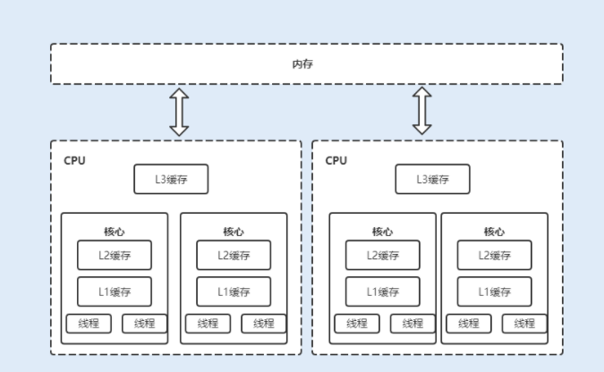

<!-- MarkdownTOC -->
- [1 Atomic原子类简介](#1-atomic原子类简介)
  - [1.1 基本类型](#11-基本类型)
  - [1.2 数组类型](#12-数组类型)
  - [1.3 对象的属性修改类型](#13-对象的属性修改类型)
  - [1.4  引用类型](#14--引用类型)
  - [1.5 原子累加器](#15-原子累加器)
- [2 原子操作实现原理](#2-原子操作实现原理)
  - [2.1 乐观锁与悲观锁](#21-乐观锁与悲观锁)
  - [2.2 CAS实现原理](#22-cas实现原理)
  - [2.3 CAS实现原子操作的三大问题](#23-cas实现原子操作的三大问题)
    - [2.3.1 ABA问题](#231-aba问题)
    - [2.3.2 循环时间长开销大](#232-循环时间长开销大)
    - [2.3.3 只能保证一个共享变量的原子操作](#233-只能保证一个共享变量的原子操作)
  - [2.4 优化 CAS 乐观锁](#24-优化-cas-乐观锁)
- [参考资料](#参考资料)

<!-- /MarkdownTOC -->

# 1 Atomic原子类简介

原子（atomic）本意是“不能被进一步分割的最小粒子”，而原子操作（atomic operation）意为“不可被中断的一个或一系列操作”。

即使是在多个线程一起执行的时候，一个操作一旦开始，就不会被其他线程干扰。简而言之，**原子类就是具有原子/原子操作特征的类，它们能无锁地避免原子性问题**。

并发包 `java.util.concurrent` 的原子类都存放在`java.util.concurrent.atomic`下。

<div align="center">  

</div>


根据操作的数据类型，可以将JUC包中的原子类分为主要5类：

**（1）基本类型**

- AtomicInteger：整型原子类
- AtomicLong：长整型原子类
-  AtomicBoolean ：布尔型原子类

**（2）数组类型**


- AtomicIntegerArray：整型数组原子类
- AtomicLongArray：长整型数组原子类
- AtomicReferenceArray ：引用类型数组原子类

**（3）引用类型**

- AtomicReference：引用类型原子类
- AtomicMarkableReference：原子更新带有标记的引用类型。
- AtomicStampedReference ：原子更新带有版本号的引用类型。

**（4）对象的属性修改类型**

- AtomicIntegerFieldUpdater：原子更新整型字段的更新器
- AtomicLongFieldUpdater：原子更新长整型字段的更新器
- AtomicReferenceFieldUpdater：原子更新引用类型里的字段

**（5）原子累加器**

- DoubleAccumulator
- DoubleAdder
- LongAccumulator
- LongAdder

## 1.1 基本类型

基本类型原子类有三个：`AtomicInteger`、`AtomicLong`与`AtomicBoolean `。介于三个类提供的方法几乎相同，这里以整型原子类` AtomicInteger`为例来学习。

 AtomicInteger 类常用方法有：

| 方法                                            | 描述                                                                                             |
| ----------------------------------------------- | ------------------------------------------------------------------------------------------------ |
| `get()`                                         | 获取当前的值                                                                                     |
| `getAndSet(int newValue)`                       | 获取当前的值，并设置新的值                                                                       |
| `getAndIncrement()`                             | 获取当前的值，并自增                                                                             |
| `getAndDecrement()`                             | 获取当前的值，并自减                                                                             |
| `getAndAdd(int delta)`                          | 获取当前的值，并加上预期的值                                                                     |
| `boolean compareAndSet(int expect, int update)` | 如果输入的数值等于预期值，则以原子方式将该值设置为输入值（update）                               |
| `lazySet(int newValue)`                         | 最终设置为newValue,使用 lazySet 设置之后可能导致其他线程在之后的一小段时间内还是可以读到旧的值。 |

代码示例：

```java
public class AtomicIntegerTest1 {
    public static void main(String[] args) {
        int temValue = 0;
        AtomicInteger i = new AtomicInteger(0);
        temValue = i.getAndSet(12);
        System.out.println("temValue:" + temValue + ";  i:" + i);
        temValue = i.getAndIncrement();
        System.out.println("temValue:" + temValue + ";  i:" + i);
        temValue = i.getAndAdd(-10);
        System.out.println("temValue:" + temValue + ";  i:" + i);
    }
}
```

执行结果：

```java
temValue:0;  i:12
temValue:12;  i:13
temValue:13;  i:3
```

## 1.2 数组类型

数组类型原子类有三个：`AtomicIntegerArray`、`AtomicLongArray`与`AtomicReferenceArray `。介于三个类提供的方法几乎相同，这里以 `AtomicIntegerArray`为例来学习。

**AtomicIntegerArray常用方法**

| 方法                                           | 描述                                                                                                                 |
| ---------------------------------------------- | -------------------------------------------------------------------------------------------------------------------- |
| `get(int i)`                                   | 获取 index=i 位置元素的值                                                                                            |
| `getAndSet(int i, int newValue)`               | 返回 index=i 位置的当前的值，并将其设置为新值：newValue                                                              |
| `getAndIncrement(int i)`                       | 获取 index=i 位置元素的值，并让该位置的元素自增                                                                      |
| `getAndDecrement(int i)`                       | 获取 index=i 位置元素的值，并让该位置的元素自减                                                                      |
| `getAndAdd(int i, int delta)`                  | 获取 index=i 位置元素的值，并加上预期的值                                                                            |
| `compareAndSet(int i, int expect, int update)` | 如果输入的数值等于预期值，则以原子方式将 index=i 位置的元素值设置为输入值（update）                                  |
| `lazySet(int i, int newValue)`                 | 最终将index=i 位置的元素设置为newValue,使用 lazySet 设置之后可能导致其他线程在之后的一小段时间内还是可以读到旧的值。 |

代码示例：

```java
public class AtomicIntegerArrayTest {
    public static void main(String[] args) {
        int temValue = 0;
        int[] nums = {-2, -1, 1, 2, 3, 4};
        AtomicIntegerArray i = new AtomicIntegerArray(nums);
        for (int j = 0; j < nums.length; j++) {
            System.out.println(i.get(j));
        }
        temValue = i.getAndSet(0, 2);
        System.out.println("temValue:" + temValue + ";  i:" + i);
        temValue = i.getAndIncrement(0);
        System.out.println("temValue:" + temValue + ";  i:" + i);
        temValue = i.getAndAdd(0, 5);
        System.out.println("temValue:" + temValue + ";  i:" + i);
    }
}
```

执行结果：

```java
-2
-1
1
2
3
4
temValue:-2;  i:[2, -1, 1, 2, 3, 4]
temValue:2;  i:[3, -1, 1, 2, 3, 4]
temValue:3;  i:[8, -1, 1, 2, 3, 4]

Process finished with exit code 0
```

## 1.3 对象的属性修改类型

对象的属性修改类型原子类有`AtomicIntegerFieldUpdater`、`AtomicLongFieldUpdater`、`AtomicReferenceFieldUpdater `三个。

介于三个类提供的方法几乎相同，这里以 `AtomicIntegerFieldUpdater `为例来学习。

子地更新对象的属性需要两步：

* 因为对象的属性修改类型原子类都是抽象类，所以每次使用都必须使用静态方法**newUpdater()**创建一个更新器，并且需要设置想要更新的类和属性。

* 更新的对象属性必须使用**public volatile修饰符**。

`AtomicIntegerFieldUpdater`类使用示例

```java
public class AtomicIntegerFieldUpdaterTest {
	public class AtomicIntegerFieldUpdaterTest {
    public static void main(String[] args) {
        AtomicIntegerFieldUpdater<User> a = AtomicIntegerFieldUpdater.newUpdater(User.class, "age");

        User user = new User("ZhangSan", 20);
        System.out.println(a.getAndIncrement(user));
        System.out.println(a.get(user));
    }
}

class User {
    private String name;
    public volatile int age;

    public User(String name, int age) {
        super();
        this.name = name;
        this.age = age;
    }

    public String getName() {
        return name;
    }

    public void setName(String name) {
        this.name = name;
    }

    public int getAge() {
        return age;
    }

    public void setAge(int age) {
        this.age = age;
    }
}
```

输出结果：

```java
20
21
```

## 1.4  引用类型

基本类型原子类只能更新一个变量，如果需要原子**更新多个变量**，需要使用引用类型原子类。引用类型原子类分为`AtomicReference`、`AtomicStampedReference`、`AtomicMarkableReference `三类。

* AtomicReference：引用类型原子类

- AtomicStampedReference：原子更新带有版本号的引用类型。该类将整数值与引用关联起来，可用于解决原子的更新数据和数据的版本号，**可以解决使用 CAS 进行原子更新时可能出现的 ABA 问题**。
- AtomicMarkableReference ：原子更新带有标记的引用类型。该类将 boolean 标记与引用关联起来。

（1）`AtomicReference类`使用示例：

```java
public class AtomicReferenceTest {
    public static void main(String[] args) {
        AtomicReference<Person> personAtomicReference = new AtomicReference<>();
        Person person = new Person("Zhangsan", 20);
        personAtomicReference.set(person);
        Person updatePerson = new Person("LiSi", 30);
        personAtomicReference.compareAndSet(person, updatePerson);

        System.out.println(personAtomicReference.get().getName());
        System.out.println(personAtomicReference.get().getAge());
    }
}

class Person {
    private String name;
    private int age;

    public Person(String name, int age) {
        super();
        this.name = name;
        this.age = age;
    }

    public String getName() {
        return name;
    }

    public void setName(String name) {
        this.name = name;
    }

    public int getAge() {
        return age;
    }

    public void setAge(int age) {
        this.age = age;
    }
}
```

上述代码首先创建了一个 Person 对象，然后把 Person 对象设置进 AtomicReference 对象中，然后调用 compareAndSet 方法，该方法就是通过 CAS 操作设置 personAtomicReference。如果 personAtomicReference的值为 person 的话，则将其设置为 updatePerson。实现原理与 AtomicInteger 类中的 compareAndSet 方法相同。

输出结果：

```java
LiSi
30
```

（2）` AtomicMarkableReference`类使用示例

AtomicMarkableReference是将一个boolean值作是否有更改的标记，本质就是它的版本号只有两个，true和false，修改的时候在这两个版本号之间来回切换，这样做并不能解决ABA的问题，只是会降低ABA问题发生的几率。

``` java
public class SolveABAByAtomicMarkableReference {
    private static AtomicMarkableReference atomicMarkableReference = new AtomicMarkableReference(100, false);

    public static void main(String[] args) {

        Thread refT1 = new Thread(() -> {
            try {
                TimeUnit.SECONDS.sleep(1);
            } catch (InterruptedException e) {
                e.printStackTrace();
            }
            atomicMarkableReference.compareAndSet(100, 101, atomicMarkableReference.isMarked(), !atomicMarkableReference.isMarked());
            atomicMarkableReference.compareAndSet(101, 100, atomicMarkableReference.isMarked(), !atomicMarkableReference.isMarked());
        });

        Thread refT2 = new Thread(() -> {
            boolean marked = atomicMarkableReference.isMarked();
            try {
                TimeUnit.SECONDS.sleep(2);
            } catch (InterruptedException e) {
                e.printStackTrace();
            }
            boolean c3 = atomicMarkableReference.compareAndSet(100, 101, marked, !marked);
            System.out.println(c3); // 返回true,实际应该返回false
        });

        refT1.start();
        refT2.start();
    }
}
```

输出结果：

```java
true
```

## 1.5 原子累加器

**原子类型累加器**是**JDK1.8**引进的并发新技术，它可以看做**AtomicLong**和**AtomicDouble**的部分加强类型。


原子类型累加器的用法及原理可以参考[Java多线程进阶（十七）—— J.U.C之atomic框架：LongAdder](https://segmentfault.com/a/1190000015865714)一文。

**有了AtomictLong为什么还要引入LongAdder？**

* 引入LongAdder累加器的初衷------解决高并发环境下AtomictLong的自旋瓶颈问题。

**那LongAdder为什么高并发性场景能会更好？**

* 原子累加器通过**分段思想**改进原子类，其改进思路：
  * AtomicInteger 和 AtomicLong 里的 value 是所有线程竞争读写的热点数据；
  * 将单个 value 拆分成跟线程一样多的数组 `Cell[]`；
  * 每个线程写自己的 `Cell[i]++`，最后对数组求和。

>  AtomicLong 里内部变量value保存着实际值，在高并发场景下，value变量也就成了多线程竞争的一个热点。而LongAdder的基本思路就是“分散热点”，将value值分散到一个数组中，不同线程会命中到数组的不同槽中，各个线程只对自己槽中的那个值进行CAS操作，这样分散热点，减小冲突的概率。如果要获取真正的值，只要将各个槽中的变量值累加返回即可。这种做法其实跟JDK1.8之前的ConcurrentHashMap“分段锁”的实现思路是一样的。

**LongAdder能否替代AtomicLong吗？**

* AtomicLong提供的功能更丰富，尤其是`addAndGet、decrementAndGet、compareAndSet`这些方法。addAndGet、decrementAndGet除了单纯的做自增自减外，还可以立即获取增减后的值，而LongAdder则需要做同步控制才能精确获取增减后的值。如果业务需求需要精确的控制计数，则使用AtomicLong比较合适；
* 一般而言，**在低竞争的并发环境下 `AtomicInteger` 的性能是要比 `LongAdder` 的性能好，而高竞争环境下和者写多读少环境下， `LongAdder` 的性能比 `AtomicInteger` 好**。

# 2 原子操作实现原理

## 2.1 乐观锁与悲观锁

乐观锁与悲观锁是一种广义上的概念，体现了看待线程同步的不同角度。

对于同一个数据的并发操作，**悲观锁**认为自己在使用数据的时候一定会别的线程来修改数据，因此在获取数据的时候会先加锁，确保数据不会被别的线程修改。Java中，synchronized关键字和Lock的实现类都是悲观锁。

而**乐观锁**认为自己使用数据时不会有别的线程来修改数据，所以不会添加锁，只是在更新数据的时候会去判断之前有没有别的线程更新这个数据。如果这个数据没有被更新，当前线程将子哦系修改的数据成功写入。如果数据已经被其他线程更新，则根据不同的实现方式执行不同的操作（例如报错或者自动重试）。

所以，乐观锁相比悲观锁来说，不会带来死锁、饥饿等活性故障问题，线程间的相互影响也远远比悲观锁要小。更为重要的是，乐观锁没有因竞争造成的系统开销，所以在性能上也是更胜一筹。

乐观锁在Java中是通过无锁编程来实现的，最常采用的是CAS算法，Java原子类中的递增操作就是通过**CAS自旋**实现的。

## 2.2 CAS实现原理

CAS全称 **Compare And Swap（比较与交换）**，是一种无锁算法。在不使用锁（没有线程被阻塞）的情况下实现多线程之间的**变量同步**。

CAS是**原子性**的操作(读和写两者同时具有原子性)，其实现方式是通过借助`C/C++`调用CPU指令完成的，效率很高。

CAS算法涉及到三个操作数：

- V 内存地址存放的实际值
- A 比较的旧值 
- B 更新的新值

**当且仅当V的值等于A时（旧值和内存中实际的值相同），表明旧值A已经是目前最新版本的值，自然而然可以将新值 B 赋值给 V**。反之则表明V和A变量不同步，直接返回V即可。当多个线程使用CAS操作一个变量时，只有一个线程会更新成功，其余失败的线程会重新尝试。也就是说，“更新”是一个不断重试的操作。

下面以基本原子类`AtomicInteger`为例，来理解原子操作的实现原理。

查看`AtomicInteger`源码：

```java
public class AtomicInteger extends Number implements java.io.Serializable {
    private static final long serialVersionUID = 6214790243416807050L;

    // 获取并操作内存的数据。
    private static final Unsafe unsafe = Unsafe.getUnsafe();
    // 存储value在AtomicInteger中的偏移量。
    private static final long valueOffset;

    static {
        try {
            valueOffset = unsafe.objectFieldOffset
                (AtomicInteger.class.getDeclaredField("value"));
        } catch (Exception ex) { throw new Error(ex); }
    }
	
    // 存储AtomicInteger的int值，该属性需要借助volatile关键字保证其在线程间是可见的。
    private volatile int value;
```

接下来，查看`AtomicInteger`的自增函数`incrementAndGet()`的源码时，发现自增函数底层调用的是`unsafe.getAndAddInt()`。

```java
    // AtomicInteger 自增方法
    public final int incrementAndGet() {
      return unsafe.getAndAddInt(this, valueOffset, 1) + 1;
    }    
------------------------------------------------------------------------
	// Unsafe.class
	public final int getAndAddInt(Object var1, long var2, int var4) {
        int var5;
        do {
            var5 = this.getIntVolatile(var1, var2);
        } while(!this.compareAndSwapInt(var1, var2, var5, var5 + var4));

        return var5;
    }
```

`Unsafe`还有很多个`CAS`操作的相关方法，比如：

```java
public final native boolean compareAndSwapObject(Object var1, long var2, Object var4, Object var5);

public final native boolean compareAndSwapLong(Object var1, long var2, long var4, long var6);

--- omit ---
```

这些函数是是`CAS`缩写的由来。

还是以`compareAndSwapInt`为例，查看OpenJDK 8 中Unsafe.cpp的源码：

```java
// Unsafe.java
public final int getAndAddInt(Object o, long offset, int delta) {
   int v;
   do {
       v = getIntVolatile(o, offset);
   } while (!compareAndSwapInt(o, offset, v, v + delta));
   return v;
}
```

根据OpenJDK 8的源码我们可以看出，`getAndAddInt()`循环获取给定对象o中的偏移量处的值v，然后判断内存值是否等于v。如果相等则将内存值设置为 v + delta，否则返回false，继续循环进行重试，直到设置成功才能退出循环，并且将旧值返回。整个“比较+更新”操作封装在`compareAndSwapInt()`中，在JNI里是借助于一个CPU指令完成的，属于原子操作，可以保证多个线程都能够看到同一个变量的修改值。

后续JDK通过CPU的**cmpxchg指令**，去比较寄存器中的 A 和 内存中的值 V。如果相等，就把要写入的新值 B 存入内存中。如果不相等，就将内存值 V 赋值给寄存器中的值 A。然后通过Java代码中的**while循环调用cmpxchg指令进行重试，直到设置成功为止**。

CAS 是调用处理器底层指令来实现原子操作，那么处理器底层又是如何实现原子操作的呢？

处理器和物理内存之间的通信速度要远慢于处理器间的处理速度，所以处理器有自己的内部缓存。如下图所示，在执行操作时，频繁使用的内存数据会缓存在处理器的 L1、L2 和 L3 高速缓存中，以加快频繁读取的速度。

<div align="center">  

</div>

一般情况下，一个单核处理器能自我保证基本的内存操作是原子性的，当一个线程读取一个字节时，所有进程和线程看到的字节都是同一个缓存里的字节，其它线程不能访问这个字节的内存地址。

但现在的服务器通常是多处理器，并且每个处理器都是多核的。每个处理器维护了一块字节的内存，每个内核维护了一块字节的缓存，这时候多线程并发就会存在缓存不一致的问题，从而导致数据不一致。

这个时候，处理器提供了**总线锁定**和**缓存锁定**两个机制来保证复杂内存操作的原子性。

当处理器要操作一个共享变量的时候，其在总线上会发出一个 Lock 信号，这时其它处理器就不能操作共享变量了，该处理器会独享此共享内存中的变量。但总线锁定在阻塞其它处理器获取该共享变量的操作请求时，也可能会导致大量阻塞，从而增加系统的性能开销。

于是，后来的处理器都提供了缓存锁定机制，也就说当某个处理器对缓存中的共享变量进行了操作，就会通知其它处理器放弃存储该共享资源或者重新读取该共享资源。**目前最新的处理器都支持缓存锁定机制**。

## 2.3 CAS实现原子操作的三大问题

CAS虽然很高效地解决了原子操作，但是CAS仍然存在三大问题。ABA问题，循环时间长开销大，以及只能保证一个共享变量的原子操作。

### 2.3.1 ABA问题

CAS需要在操作值的时候去检查内存中的值是否发生变化，没有发生变化才会更新内存值。但是如果一个值原来是A，变成了B，又变成了A，那么使用CAS进行检查时会发现它的值没有发生变化，但是实际上却变化了。这就是一个典型的ABA问题。

代码示例：

```java
@Slf4j(topic = "AtomicReferenceTest")
public class AtomicReferenceTest {
    public static void main(String[] args) {
        Person person1 = new Person("ZhangSan");
        Person person2 = new Person("LiSi");
        Person person3 = new Person("WangWu");
        AtomicReference<Person> atomicReference = new AtomicReference<>(person1);
        log.info("success? " + atomicReference.compareAndSet(person1, person2));
        log.info("success? " + atomicReference.compareAndSet(person2, person1));
        log.info("success? " + atomicReference.compareAndSet(person1, person3));
    }
}

class Person {
    private String name;

    public Person(String name) {
        this.name = name;
    }

    public String getName() {
        return name;
    }

    public void setName(String name) {
        this.name = name;
    }

    @Override
    public String toString() {
        return "Person{" +
                "name='" + name + '\'' +
                '}';
    }
}
```

输出结果：

```java
// 三个CAS的结果都是true。说明CAS只是比较的两者的值是否相等，对其他内容的变化并不关心。
11:17:13.359 [main] INFO AtomicReferenceTest - success? true
11:17:13.366 [main] INFO AtomicReferenceTest - success? true
11:17:13.366 [main] INFO AtomicReferenceTest - success? true
```

ABA问题的解决思路就是在变量前面**添加版本号**，每次变量更新的时候都把版本号加1，这样变化过程就从“A－B－A”变成了“1A－2B－3A”。

JDK从1.5开始提供了**带版本号的引用类型AtomicStampedReference类**来解决ABA问题，具体操作封装在compareAndSet()中。compareAndSet()首先检查当前引用和当前标志与预期引用和预期标志是否相等，如果都相等，则以原子方式将引用值和标志的值设置为给定的更新值。

```java
    public boolean compareAndSet(V   expectedReference,		// 预期引用
                                 V   newReference,			// 更新后引用
                                 int expectedStamp,			// 预期标志
                                 int newStamp) {			// 更新后标志
		--- omit ---
    }
```

上面代码修改为：

```java
        AtomicStampedReference<Person> atomicStampedReference = new AtomicStampedReference(person1, 0);
        log.info("success? " + atomicStampedReference.compareAndSet(person1, person2, 0, 1));
        log.info("success? " + atomicStampedReference.compareAndSet(person2, person1, 1, 2));
        log.info("success? " + atomicStampedReference.compareAndSet(person1, person3, 0, 1));
        log.info("success? " + atomicStampedReference.compareAndSet(person1, person3, 2, 3));
```

运行结果：

```java
11:19:37.839 [main] INFO AtomicReferenceTest - success? true
11:19:37.846 [main] INFO AtomicReferenceTest - success? true
11:19:37.846 [main] INFO AtomicReferenceTest - success? false	// 不是预期版本，CAS失败
11:19:37.846 [main] INFO AtomicReferenceTest - success? true
```

### 2.3.2 循环时间长开销大

CAS操作如果长时间不成功，会导致其一直自旋，给CPU带来非常大的开销。

如果JVM能支持处理器提供的**pause指令**，那么效率会有一定的提升。pause指令有两个作用：第一，它可以延迟流水线执行指令（de-pipeline），使CPU不会消耗过多的执行资源，延迟的时间取决于具体实现的版本，在一些处理器上延迟时间是零；第二，它可以避免在退出循环的时候因内存顺序冲突（MemoryOrder Violation）而引起CPU流水线被清空（CPU Pipeline Flush），从而提高CPU的执行效率。

### 2.3.3 只能保证一个共享变量的原子操作

对一个共享变量执行操作时，CAS能够保证原子操作，但是对多个共享变量操作时，CAS是无法保证操作的原子性的。

多个共享变量操作时，一般都用锁解决。但Java从1.5开始JDK提供了**引用类型AtomicReference类**来保证引用对象之间的原子性，可以把多个变量放在一个对象里来进行CAS操作。

## 2.4 优化 CAS 乐观锁

虽然乐观锁在并发性能上要比悲观锁优越，但是在写大于读的操作场景下，CAS 失败的可能性会增大，如果不放弃此次 CAS 操作，就需要循环做 CAS 重试，这无疑会长时间地占用 CPU。

在 Java7 中，通过以下代码我们可以看到：AtomicInteger 的 getAndSet 方法中使用了 for 循环不断重试 CAS 操作，如果长时间不成功，就会给 CPU 带来非常大的执行开销。到了 Java8，for 循环虽然被去掉了，但我们反编译 Unsafe 类时就可以发现该循环其实是被封装在了 Unsafe 类中，CPU 的执行开销依然存在。

```java
   public final int getAndSet(int newValue) {
        for (;;) {
            int current = get();
            if (compareAndSet(current, newValue))
                return current;
        }
    }
```

在 JDK1.8 中，Java 提供了一个新的原子类 LongAdder。**LongAdder 在高并发场景下会比 AtomicInteger 和 AtomicLong 的性能更好，代价就是会消耗更多的内存空间**。这也就是上面所提到的原子累加器。

LongAdder 的原理就是降低操作共享变量的并发数，也就是将对单一共享变量的操作压力分散到多个变量值上，将竞争的每个写线程的 value 值分散到一个数组中，不同线程会命中到数组的不同槽中，各个线程只对自己槽中的 value 值进行 CAS 操作，最后在读取值的时候会将原子操作的共享变量与各个分散在数组的 value 值相加，返回一个近似准确的数值。

LongAdder 内部由一个 base 变量和一个 cell[]数组组成。当只有一个写线程，没有竞争的情况下，LongAdder 会直接使用 base 变量作为原子操作变量，通过 CAS 操作修改变量；当有多个写线程竞争的情况下，除了占用 base 变量的一个写线程之外，其它各个线程会将修改的变量写入到自己的槽 cell[]数组中。

LongAdder 在操作后的返回值只是一个**近似准确**的数值，但是 AtomicLong 最终返回的是一个准确的数值， 所以在一些对实时性要求比较高的场景下，**LongAdder 并不能取代 AtomicInteger 或 AtomicLong**。

# 参考资料

- 《Java并发编程的艺术》
- [Java中的无锁编程](https://my.oschina.net/cqqcqqok/blog/1925073)
- [Atomic原子类总结](https://github.com/Snailclimb/JavaGuide/blob/master/docs/java/multi-thread/Atomic%E5%8E%9F%E5%AD%90%E7%B1%BB%E6%80%BB%E7%BB%93.md)
- [ABA问题的本质及其解决办法](https://segmentfault.com/a/1190000022798961)
