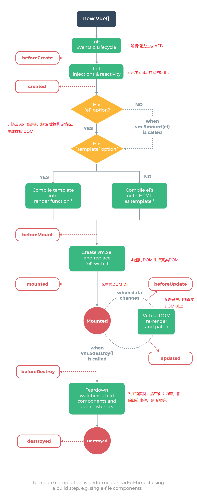

Vue 中要渲染一块页面内容的时候，主要这么几个过程：

（1） 解析语法生成 AST。
（2） 根据 AST 结果，完成 data 数据初始化。
（3） 根据 AST 结果和 data 数据绑定情况，生成虚拟 DOM。
（4） 将虚拟 DOM 生成真正的 DOM 插入到页面中，此时页面会被渲染。

当我们绑定的数据进行更新的时候，又会产生以下这些过程：

（5）框架接收到数据变更的事件，根据数据生成新的虚拟 DOM 树。比较新旧两棵虚拟 DOM 树，得到差异。
（6）把差异应用到真正的 DOM 树上，即根据差异来更新页面内容。

当我们清空页面内容时，还有：

（7）注销实例，清空页面内容，移除绑定事件、监听器等。

**Vue 生命周期说明**

| 生命周期钩子    | 说明                                                         | 对应上述步骤   |
| --------------- | ------------------------------------------------------------ | -------------- |
| `beforeCreate`  | 初始化实例前，`data`、`methods`等不可获取                    | 1 之后，2 之前 |
| `created`       | 实例初始化完成，此时可获取`data`里数据和`methods`事件，无法获取 DOM | 2 之后，3 之前 |
| `beforeMount`   | 虚拟 DOM 创建完成，此时未挂载到页面中，`vm.$el`可获取未挂载模板 | 3 之后，4 之前 |
| `mounted`       | 数据绑定完成，真实 DOM 已挂载到页面，`vm.$el`可获取真实 DOM  | 4 之后         |
| `beforeUpdate`  | 数据更新，DOM Diff 得到差异，未更新到页面                    | 5 之后，6 之前 |
| `updated`       | 数据更新，页面也已更新                                       | 6 之后         |
| `beforeDestroy` | 实例销毁前                                                   | 7 之前         |
| `destroyed`     | 实例销毁完成                                                 | 7 之后         |

我们可以更新官方的生命周期图如下：


生命周期钩子的使用方式也很简单，我们可以根据需要在特定的生命周期钩子里进行一些处理：

```html
<div id="app"></div>
<script>
  new Vue({
    el: "#app",
    template: "<div>{{ message }}</div>",
    data() {
      return {
        message: "欢迎来到Vue的世界"
      };
    },
    methods: {
      test() {}
    },
    beforeCreate: function() {
      // 在实例初始化之后，数据观测 (data observer) 和 event/watcher 事件配置之前被调用
      console.log("beforeCreate", this.message, this.test, this.$el);
    },
    created: function() {
      // 在实例创建完成后被立即调用
      // 在这一步，实例已完成以下的配置：数据观测 (data observer)，属性和方法的运算，watch/event 事件回调
      // 挂载阶段还没开始，$el 属性目前不可见
      console.log("created", this.message, this.test, this.$el);
    },
    beforeMount: function() {
      // 在挂载开始之前被调用：相关的 render 函数首次被调用
      console.log("beforeMount", this.message, this.test, this.$el);
    },
    mounted: function() {
      // el 被新创建的 vm.$el 替换，并挂载到实例上去之后调用该钩子
      // 如果 root 实例挂载了一个文档内元素，当 mounted 被调用时 vm.$el 也在文档内
      // mounted 不会承诺所有的子组件也都一起被挂载
      // 如果希望等到整个视图都渲染完毕，可以用 vm.$nextTick 替换掉 mounted
      console.log("mounted", this.message, this.test, this.$el);
      this.$nextTick(function() {
        // 此处整个视图已渲染完毕
      });
    },
    beforeUpdate: function() {
      // 数据更新时调用，发生在虚拟 DOM 打补丁之前
      // 这里适合在更新之前访问现有的 DOM，比如手动移除已添加的事件监听器
    },
    updated: function() {
      // 由于数据更改导致的虚拟 DOM 重新渲染和打补丁，在这之后会调用该钩子
      // 当这个钩子被调用时，组件 DOM 已经更新，所以你现在可以执行依赖于 DOM 的操作
    },
    beforeDestroy: function() {
      // 实例销毁之前调用。在这一步，实例仍然完全可用
    },
    destroyed: function() {
      // Vue 实例销毁后调用
      // 调用后，Vue 实例指示的所有东西都会解绑定，所有的事件监听器会被移除，所有的子实例也会被销毁
    }
  });
</script>
```

**Vue 实例常用选项**

| 选项名       | 说明                                                         | 类型                                                         |
| ------------ | ------------------------------------------------------------ | ------------------------------------------------------------ |
| `el`         | 通过 CSS 选择器或者 HTMLElement 实例的方式，提供一个在页面上已存在的 DOM 元素作为 Vue 实例的挂载目标 | `string`/`Element`                                           |
| `template`   | 字符串模板，将会替换挂载的元素                               | `string`                                                     |
| `render`     | 字符串模板的代替方案，该渲染函数接收一个`createElement`方法作为第一个参数用来创建 VNode | `(createElement: () => VNode) => VNode`                      |
| `data`       | Vue 实例的数据对象，用于数据绑定                             | `Object`/`Function` 组件只支持`Function`                     |
| `props`      | 用于接收来自父组件的数据                                     | `Array<string>`/`Object`                                     |
| `methods`    | Vue 实例的事件，可用于事件绑定                               | `{ [key: string]: Function }`                                |
| `computed`   | 计算属性，用于简化模板的复杂数据计算                         | `{ [key: string]: Function or { get: Function, set: Function } }` |
| `watch`      | 观察 Vue 实例变化的一个表达式或计算属性函数                  | `{ [key: string]: string or Function or Object or Array }`   |
| `directives` | 自定义指令                                                   | `Object`                                                     |
| `filters`    | 过滤器                                                       | `Object`                                                     |
| `components` | 组件                                                         | `Object`                                                     |