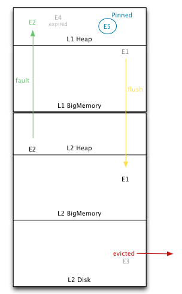
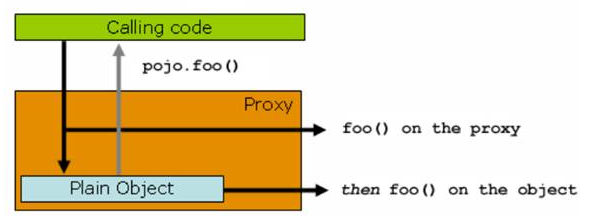
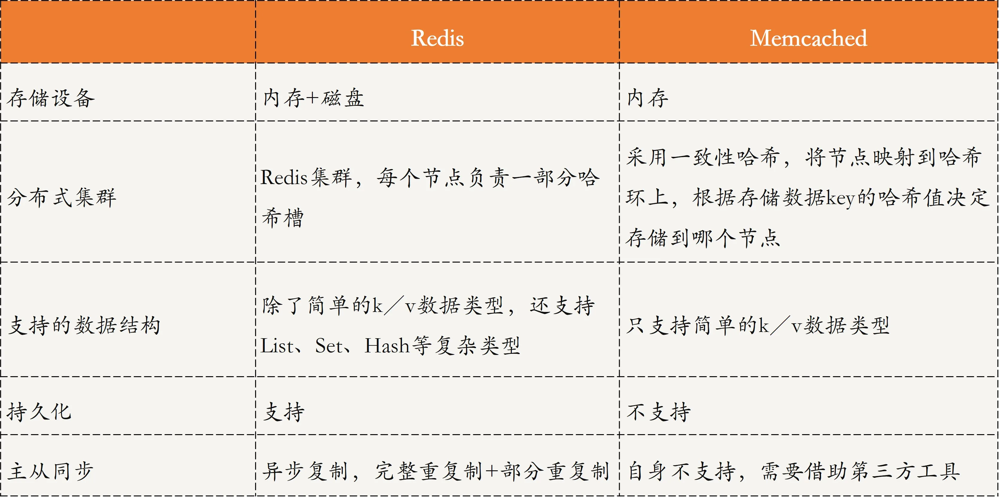
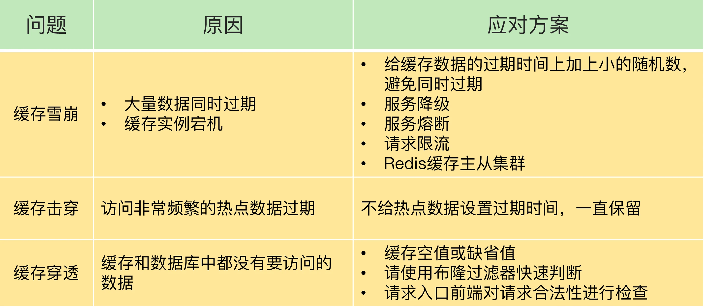
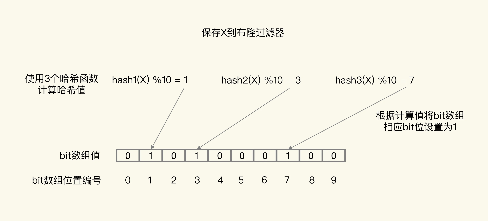

<!-- MarkdownTOC -->
- [缓存概述](#缓存概述)
  - [什么是缓存](#什么是缓存)
  - [何时使用缓存](#何时使用缓存)
  - [缓存加载时机](#缓存加载时机)
  - [缓存特征](#缓存特征)
    - [命中率](#命中率)
    - [最大元素（或最大空间）](#最大元素或最大空间)
    - [清空策略](#清空策略)
  - [缓存介质](#缓存介质)
  - [缓存使用不当导致的问题](#缓存使用不当导致的问题)
- [缓存分类和应用场景](#缓存分类和应用场景)
  - [本地缓存](#本地缓存)
    - [编程直接实现缓存](#编程直接实现缓存)
    - [Guava Cache](#guava-cache)
    - [Ehcache](#ehcache)
    - [Spring Cache](#spring-cache)
  - [分布式缓存](#分布式缓存)
    - [Memcached与Redis](#memcached与redis)
- [缓存风险](#缓存风险)
  - [缓存穿透](#缓存穿透)
  - [缓存击穿](#缓存击穿)
  - [缓存雪崩](#缓存雪崩)
- [参考资料](#参考资料)

<!-- /MarkdownTOC -->

# 缓存概述

## 什么是缓存

“缓存”一词可谓耳熟能详了，那么到底什么是缓存呢？缓存的本质是什么呢？

**缓存（cache）就是一个临时存放数据的地方。广义上来讲，缓存就是为了加速数据处理，让业务更快地访问而临时存放的冗余/副本数据**。

使用缓存后，当用户查询数据时，首先会去缓存中查找，如果找到了就直接使用；如果找不到，就再到数据的原始位置去寻找。所以说，缓存本质上是因为系统各级处理速度不匹配，导致我们需要利用**空间换时间**的技术，把读写速度【慢】的介质的数据保存在读写速度【快】的介质中，从而来提升数据的访问速度，减少时间消耗。

在实际的应用中，缓存无处不在，例如：

* 内存，就可以看做是 CPU 和 磁盘之间的缓存。
* CPU 与内存的处理速度也不一致，出现 L1&L2&L3 三级缓存。
* 网络处理，数据库引擎的各种 Buffer，都可以看做是缓存。

## 何时使用缓存

在实际开发中，要根据自己业务的实际数据类型，分析和评估出哪些数据访问对性能的影响比较大。如果按照数据的使用频率和方式分类，大致可以分为其中几类：

* 静态数据：一般不变，类似于字典表。
* 准静态数据：变化频率很低，类似部门结构设置，全国行政区划数据等。
* 中间状态数据：一些计算的可复用中间数据，变量副本，配置中心的本地副本。
* 热数据：使用频率高。
* `读写比`大的数据：读的频率>>写的数据。
* ... ...

按照上面的简介，为了提高数据访问速度，对于**热数据和`读写比`大的数据**，适合使用缓存来进行访问。

问题是，在互联网应用服务中，使用缓存技术的目的就只是为了提升访问速度吗？

* 不尽然。例如**在分布式系统中，缓存机制实际上是系统性能设计的一个重要权衡手段**。比如某个数据库的负载比较高，接近系统瓶颈时，我们就可以使用缓存技术。不过此时缓存的功能就是负载均衡而非提升访问速度了。

**缓存的有效性与数据同步相关问题**

* 为什么一般说变动频率大、一致性要求高的数据，不太适合用缓存？ 
  * 变化大，意味着内存缓存数据与原始数据库数据，一直存在差异；
  * 一致性要求高，意味着只有使用原始数据，甚至加了事务，才是保险的。

* 如何评价缓存的有效性？ 
  * **读写比（ N : 1 ）**：对数据的写操作导致数据变动，意味着维护成本。
  * **命中率（90%+ ）**：命中缓存意味着缓存数据被使用，意味着有价值。 

可见，对于 **数据一致性，性能，成本** 的综合衡量，是引入缓存的必须指标。

## 缓存加载时机

缓存加载时机主要分为**启动全量加载和懒加载**。

全局加载特点是全局有效，使用简单。而懒加载方式又细分为两类：

* 同步使用加载：先看缓存是否有数据，没有的话从数据库读取；读取的数据，先放到内存，然后返回给调用方 。

* 延迟异步加载：从缓存获取数据，不管是否为空直接返回。
  * （策略1异步）如果为空，则发起一个异步加载的线程，负责加载数据；
  * （策略2解耦）异步线程负责维护缓存的数据，定期或根据条件触发更新。

## 缓存特征

### 命中率

`命中率=返回正确结果数/请求缓存次数`，命中率问题是缓存中的一个非常重要的问题，它是衡量缓存有效性的重要指标。命中率越高，表明缓存的使用率越高。

### 最大元素（或最大空间）

缓存中可以存放的最大元素的数量，一旦缓存中元素数量超过这个值（或者缓存数据所占空间超过其最大支持空间），那么将会触发缓存启动**清空策略**根据不同的场景合理的设置最大元素值往往可以一定程度上提高缓存的命中率，从而更有效的时候缓存。

### 清空策略

如上所述，缓存的存储空间有限制，当缓存空间被用满时，如何保证在稳定服务的同时有效提升命中率？这就由缓存清空策略来处理，设计适合自身数据特征的清空策略能有效提升命中率。常见的一般策略有：

- **FIFO(first in first out)**

先进先出策略，最先进入缓存的数据在缓存空间不够的情况下（超出最大元素限制）会被优先被清除掉，以腾出新的空间接受新的数据。策略算法主要比较缓存元素的创建时间。在数据实效性要求场景下可选择该类策略，优先保障最新数据可用。

- **LFU(less frequently used)**

最少使用策略，无论是否过期，根据元素的被使用次数判断，清除使用次数较少的元素释放空间。策略算法主要比较元素的`hitCount`（命中次数）。在保证高频数据有效性场景下，可选择这类策略。

- **LRU(least recently used)**

最近最少使用策略，无论是否过期，根据元素最后一次被使用的时间戳，清除最远使用时间戳的元素释放空间。策略算法主要比较元素最近一次被get使用时间。在热点数据场景下较适用，优先保证热点数据的有效性。

除此之外，还有一些简单策略比如：

- 根据过期时间判断，清理过期时间最长的元素；
- 根据过期时间判断，清理最近要过期的元素；
- 随机清理；
- 根据关键字（或元素内容）长短清理等。

## 缓存介质

虽然从硬件介质上来看，无非就是内存和硬盘两种，但从技术上，可以分成内存、硬盘文件、数据库。

- **内存：**将缓存存储于内存中是最快的选择，无需额外的I/O开销，但是内存的缺点是没有持久化落地物理磁盘，一旦应用异常break down而重新启动，数据很难或者无法复原。
- **硬盘：**一般来说，很多缓存框架会结合使用内存和硬盘，在内存分配空间满了或是在异常的情况下，可以被动或主动的将内存空间数据持久化到硬盘中，达到释放空间或备份数据的目的。
- **数据库：**增加缓存的策略的目的之一就是为了减少数据库的I/O压力。像那些不支持SQL，只是简单的`key-value`存储结构的特殊数据库（如`Redis`），响应速度和吞吐量都远远高于我们常用的关系型数据库等。

## 缓存使用不当导致的问题

* **系统预热导致启动慢** ：试想一下，一个系统启动需要预热半个小时。 导致系统不能做到快速应对故障宕机等问题。

* **系统内存资源耗尽** ：只加入数据，不能清理旧数据。 旧数据处理不及时，或者不能有效识别无用数据。
* **提高了系统复杂度与维护成本**。

# 缓存分类和应用场景

在目前的应用服务框架中，缓存可分为local cache（本地缓存）和remote cache（分布式缓存）两大类：

- **本地缓存**：指的是在应用中的缓存组件，其最大的优点是应用和cache是在同一个进程内部，请求缓存非常快速，没有过多的网络开销等，在单应用不需要集群支持或者集群情况下各节点无需互相通知的场景下使用本地缓存较合适；同时，它的缺点也是应为缓存跟应用程序耦合，多个应用程序无法直接的共享缓存，各应用或集群的各节点都需要维护自己的单独缓存，对内存是一种浪费。常见的本地缓存技术有Guava Cache、Spring Cache、`Ehcache`等。
- **分布式缓存**：指的是与应用分离的缓存组件或服务，其最大的优点是自身就是一个独立的应用，与本地应用隔离，多个应用可直接的共享缓存。我们平时耳熟能详的`Memcached`、`Redis` 就是分布式缓存的典型例子。

目前各种类型的缓存都活跃在成千上万的应用服务中，还没有一种缓存方案可以解决一切的业务场景或数据类型，我们需要根据自身的特殊场景和背景，选择最适合的缓存方案。

## 本地缓存

### 编程直接实现缓存

个别场景下，我们只需要简单的缓存数据的功能（常用Hash Map），而无需关注更多存取、清空策略等深入的特性时，直接编程实现缓存则是最便捷和高效的。

**a. 成员变量或局部变量实现**

如下面的例子，以局部变量map结构缓存部分业务数据，减少频繁的重复数据库I/O操作。缺点是仅限于类的自身作用域内，类间无法共享缓存。

```java
	public void UseLocalCache(){
     // 一个本地的缓存变量
	Map<String, Object> localCacheStoreMap = new HashMap<String, Object>();
    
	List<Object> infosList = this.getInfoList();
	for(Object item:infosList){
        if(localCacheStoreMap.containsKey(item)){ //缓存命中 使用缓存数据
            // todo
        } else { // 缓存未命中  IO获取数据，结果存入缓存
            Object valueObject = this.getInfoFromDB();
            localCacheStoreMap.put(valueObject.toString(), valueObject);
		}
    }
}
// 示例
private List<Object> getInfoList(){
	return new ArrayList<Object>();
}
// 示例数据库IO获取
private Object getInfoFromDB(){
    return new Object();
}
```

**b. 静态变量实现**

最常用的单例实现静态资源缓存，代码示例如下：

```java
public class CityUtils {
    private static final HttpClient httpClient = ServerHolder.createClientWithPool();
    private static Map<Integer, String> cityIdNameMap = new HashMap<Integer, String>();
    private static Map<Integer, String> districtIdNameMap = new HashMap<Integer, String>();

    static {
        HttpGet get = new HttpGet("http://gis-in.sankuai.com/api/location/city/all");
        BaseAuthorizationUtils.generateAuthAndDateHeader(get,
                BaseAuthorizationUtils.CLIENT_TO_REQUEST_MDC,
                BaseAuthorizationUtils.SECRET_TO_REQUEST_MDC);
        try {
            String resultStr = httpClient.execute(get, new BasicResponseHandler());
            JSONObject resultJo = new JSONObject(resultStr);
            JSONArray dataJa = resultJo.getJSONArray("data");
            for (int i = 0; i < dataJa.length(); i++) {
                JSONObject itemJo = dataJa.getJSONObject(i);
                cityIdNameMap.put(itemJo.getInt("id"), itemJo.getString("name"));
            }
        } catch (Exception e) {
            throw new RuntimeException("Init City List Error!", e);
        }
    }
    static {
        HttpGet get = new HttpGet("http://gis-in.sankuai.com/api/location/district/all");
        BaseAuthorizationUtils.generateAuthAndDateHeader(get,
                BaseAuthorizationUtils.CLIENT_TO_REQUEST_MDC,
                BaseAuthorizationUtils.SECRET_TO_REQUEST_MDC);
        try {
            String resultStr = httpClient.execute(get, new BasicResponseHandler());
            JSONObject resultJo = new JSONObject(resultStr);
            JSONArray dataJa = resultJo.getJSONArray("data");
            for (int i = 0; i < dataJa.length(); i++) {
                JSONObject itemJo = dataJa.getJSONObject(i);
                districtIdNameMap.put(itemJo.getInt("id"), itemJo.getString("name"));
            }
        } catch (Exception e) {
            throw new RuntimeException("Init District List Error!", e);
        }
    }

    public static String getCityName(int cityId) {
        String name = cityIdNameMap.get(cityId);
        if (name == null) {
            name = "未知";
        }
        return name;
    }

    public static String getDistrictName(int districtId) {
        String name = districtIdNameMap.get(districtId);
        if (name == null) {
            name = "未知";
        }
        return name;
    }
}
```

O2O业务中常用的城市基础基本信息判断，通过静态变量一次获取缓存内存中，减少频繁的I/O读取，静态变量实现类间可共享，进程内可共享，缓存的实时性稍差。

> **这类缓存实现，优点是能直接在heap区内读写，最快也最方便；缺点同样是受heap区域影响，缓存的数据量非常有限，同时缓存时间受GC影响。主要满足单机场景下的小数据量缓存需求，同时对缓存数据的变更无需太敏感感知，如上一般配置管理、基础静态数据等场景。**

### Guava Cache

Guava Cache是Google开源的Java重用工具集库Guava里的一款缓存工具，其主要实现的缓存功能有：

- 自动将entry节点加载进缓存结构中；
- 当缓存的数据超过设置的最大值时，使用LRU算法移除；
- 具备根据entry节点上次被访问或者写入时间计算它的过期机制；
- 缓存的key被封装在`WeakReference`引用内；
- 缓存的Value被封装在`WeakReference`或`SoftReference`引用内；
- 统计缓存使用过程中命中率、异常率、未命中率等统计数据。

Guava Cache的架构设计灵感来源于`ConcurrentHashMap`，前面提到过，简单场景下可以自行编码通过`HashMap`来做少量数据的缓存，但是，如果结果可能随时间改变或者是希望存储的数据空间可控的话，自己实现这种数据结构还是有必要的。

Guava Cache继承了`ConcurrentHashMap`的思路，使用多个segments方式的细粒度锁，在保证线程安全的同时，支持高并发场景需求。Cache类似于Map，它是存储键值对的集合，不同的是它还需要处理evict、expire、dynamic load等算法逻辑，需要一些额外信息来实现这些操作。对此，根据面向对象思想，需要做方法与数据的关联封装。如图5所示cache的内存数据模型，可以看到，使用`ReferenceEntry`接口来封装一个键值对，而用`ValueReference`来封装Value值，之所以用Reference命令，是因为Cache要支持`WeakReference` Key和`SoftReference`、`WeakReference` value。

<div align="center">  

</div>

**`ReferenceEntry`**是对一个键值对节点的抽象，它包含了key和值的`ValueReference`抽象类，Cache由多个Segment组成，而每个Segment包含一个`ReferenceEntry`数组，每个`ReferenceEntry`数组项都是一条`ReferenceEntry`链，且一个`ReferenceEntry`包含key、hash、`valueReference`、next字段。除了在`ReferenceEntry`数组项中组成的链，在一个Segment中，所有`ReferenceEntry`还组成access链（`accessQueue`）和write链（`writeQueue`）（后面会介绍链的作用）。`ReferenceEntry`可以是强引用类型的key，也可以`WeakReference`类型的key，为了减少内存使用量，还可以根据是否配置了`expireAfterWrite`、`expireAfterAccess`、`maximumSize`来决定是否需要write链和access链确定要创建的具体`Reference：StrongEntry`、`StrongWriteEntry`、`StrongAccessEntry`、`StrongWriteAccessEntry`等。

**对于`ValueReference`**，因为Cache支持强引用的Value、`SoftReference` Value以及`WeakReference` Value，因而它对应三个实现类：`StrongValueReference、SoftValueReference、WeakValueReference`。为了支持动态加载机制，它还有一个`LoadingValueReference`，在需要动态加载一个key的值时，先把该值封装在`LoadingValueReference`中，以表达该key对应的值已经在加载了，如果其他线程也要查询该key对应的值，就能得到该引用，并且等待改值加载完成，从而保证该值只被加载一次，在该值加载完成后，将`LoadingValueReference`替换成其他`ValueReference`类型。`ValueReference`对象中会保留对`ReferenceEntry`的引用，这是因为在Value因为`WeakReference`、`SoftReference`被回收时，需要使用其key将对应的项从Segment的table中移除。

**`WriteQueue`和`AccessQueue` ：**为了实现最近最少使用算法，Guava Cache在Segment中添加了两条链：write链（`writeQueue`）和access链（`accessQueue`），这两条链都是一个双向链表，通过`ReferenceEntry`中的`previousInWriteQueue、nextInWriteQueue和previousInAccessQueue、nextInAccessQueue`链接而成，但是以Queue的形式表达。`WriteQueue`和`AccessQueue`都是自定义了offer、add（直接调用offer）、remove、poll等操作的逻辑，对offer（add）操作，如果是新加的节点，则直接加入到该链的结尾，如果是已存在的节点，则将该节点链接的链尾；对remove操作，直接从该链中移除该节点；对poll操作，将头节点的下一个节点移除，并返回。

**了解了cache的整体数据结构后，再来看下针对缓存的相关操作就简单多了：**

- Segment中的evict清除策略操作，是在每一次调用操作的开始和结束时触发清理工作，这样比一般的缓存另起线程监控清理相比，可以减少开销，但如果长时间没有调用方法的话，会导致不能及时的清理释放内存空间的问题。evict主要处理四个Queue：`1. keyReferenceQueue；2. valueReferenceQueue；3. writeQueue；4. accessQueue`。前两个queue是因为`WeakReference、SoftReference`被垃圾回收时加入的，清理时只需要遍历整个queue，将对应的项从`LocalCache`中移除即可，这里`keyReferenceQueue`存放`ReferenceEntry`，而`valueReferenceQueue`存放的是`ValueReference`，要从Cache中移除需要有key，因而`ValueReference`需要有对`ReferenceEntry`的引用，这个前面也提到过了。而对后面两个Queue，只需要检查是否配置了相应的expire时间，然后从头开始查找已经expire的Entry，将它们移除即可。
- Segment中的put操作：put操作相对比较简单，首先它需要获得锁，然后尝试做一些清理工作，接下来的逻辑类似`ConcurrentHashMap`中的rehash，查找位置并注入数据。需要说明的是当找到一个已存在的Entry时，需要先判断当前的`ValueRefernece`中的值事实上已经被回收了，因为它们可以是`WeakReference`、`SoftReference`类型，如果已经被回收了，则将新值写入。并且在每次更新时注册当前操作引起的移除事件，指定相应的原因：COLLECTED、REPLACED等，这些注册的事件在退出的时候统一调用Cache注册的`RemovalListener`，由于事件处理可能会有很长时间，因而这里将事件处理的逻辑在退出锁以后才做。最后，在更新已存在的Entry结束后都尝试着将那些已经expire的Entry移除。另外put操作中还需要更新`writeQueue`和`accessQueue`的语义正确性。
- Segment带`CacheLoader`的get操作：1. 先查找table中是否已存在没有被回收、也没有expire的entry，如果找到，并在`CacheBuilder`中配置了`refreshAfterWrite`，并且当前时间间隔已经操作这个事件，则重新加载值，否则，直接返回原有的值；2. 如果查找到的`ValueReference`是`LoadingValueReference`，则等待该`LoadingValueReference`加载结束，并返回加载的值；3. 如果没有找到entry，或者找到的entry的值为null，则加锁后，继续在table中查找已存在key对应的entry，如果找到并且对应的`entry.isLoading()`为true，则表示有另一个线程正在加载，因而等待那个线程加载完成，如果找到一个非null值，返回该值，否则创建一个`LoadingValueReference`，并调用`loadSync`加载相应的值，在加载完成后，将新加载的值更新到table中，即大部分情况下替换原来的`LoadingValueReference`。

Guava Cache提供Builder模式的`CacheBuilder`生成器来创建缓存的方式，十分方便，并且各个缓存参数的配置设置，类似于函数式编程的写法，可自行设置各类参数选型。它提供三种方式加载到缓存中。分别是：

1. 在构建缓存的时候，使用build方法内部调用`CacheLoader`方法加载数据；
2. callable 、callback方式加载数据；
3. 使用粗暴直接的方式，直接`Cache.put` 加载数据，但自动加载是首选的，因为它可以更容易的推断所有缓存内容的一致性。

build生成器的两种方式都实现了一种逻辑：从缓存中取key的值，如果该值已经缓存过了则返回缓存中的值，如果没有缓存过可以通过某个方法来获取这个值，不同的地方在于`cacheloader`的定义比较宽泛，是针对整个cache定义的，可以认为是统一的根据key值load value的方法，而callable的方式较为灵活，允许你在get的时候指定load方法。使用示例如下：

```java
   /**
    * CacheLoader
   */
   public void loadingCache() {
     LoadingCache<String, String> graphs =CacheBuilder.newBuilder()
         .maximumSize(1000).build(new CacheLoader<String, String>() {
            @Override
            public String load(String key) throws Exception {
                System.out.println("key:"+key);
                if("key".equals(key)){
                    return "key return result";
                }else{
                    return "get-if-absent-compute";
                }                   
            }
        });
   String resultVal = null;
   try {
       resultVal = graphs.get("key");
       } catch (ExecutionException e) {
         e.printStackTrace();
      }

    System.out.println(resultVal);
   }

   /**
    *
    * Callable
   */
   public void callablex() throws ExecutionException
    {
      Cache<String, String> cache = CacheBuilder.newBuilder()
        .maximumSize(1000).build();
      String result = cache.get("key", new Callable<String>()
       {
         public String call()
         {
          return "result";
         }
       });
     System.out.println(result);
    }
```

> **总体来看，Guava Cache基于`ConcurrentHashMap`的优秀设计借鉴，在高并发场景支持和线程安全上都有相应的改进策略，使用Reference引用命令，提升高并发下的数据……访问速度并保持了GC的可回收，有效节省空间；同时，write链和access链的设计，能更灵活、高效的实现多种类型的缓存清理策略，包括基于容量的清理、基于时间的清理、基于引用的清理等；编程式的build生成器管理，让使用者有更多的自由度，能够根据不同场景设置合适的模式。**

### Ehcache

`Ehcache`是现在最流行的纯Java开源缓存框架，配置简单、结构清晰、功能强大，是一个非常轻量级的缓存实现，我们常用的Hibernate里面就集成了相关缓存功能。

<div align="center">  

</div>

从图中我们可以了解到，`Ehcache`的核心定义主要包括：

- **cache manager：**缓存管理器，以前是只允许单例的，不过现在也可以多实例了。
- **cache：**缓存管理器内可以放置若干cache，存放数据的实质，所有cache都实现了`Ehcache`接口，这是一个真正使用的缓存实例；通过缓存管理器的模式，可以在单个应用中轻松隔离多个缓存实例，独立服务于不同业务场景需求，缓存数据物理隔离，同时需要时又可共享使用。
- **element：**单条缓存数据的组成单位。
- **system of record（SOR）：**可以取到真实数据的组件，可以是真正的业务逻辑、外部接口调用、存放真实数据的数据库等，缓存就是从SOR中读取或者写入到SOR中去的。

在上层可以看到，整个`Ehcache`提供了对JSR、JMX等的标准支持，能够较好的兼容和移植，同时对各类对象有较完善的监控管理机制。它的缓存介质涵盖堆内存（heap）、堆外内存（`BigMemory`商用版本支持）和磁盘，各介质可独立设置属性和策略。`Ehcache`最初是独立的本地缓存框架组件，在后期的发展中，结合Terracotta服务阵列模型，可以支持分布式缓存集群，主要有RMI、`JGroups`、JMS和Cache Server等传播方式进行节点间通信，如图3的左侧部分描述。

整体数据流转包括这样几类行为:

- Flush：缓存条目向低层次移动。
- Fault：从低层拷贝一个对象到高层。在获取缓存的过程中，某一层发现自己的该缓存条目已经失效，就触发了Fault行为。
- Eviction：把缓存条目除去。
- Expiration：失效状态。
- Pinning：强制缓存条目保持在某一层。

下图反映了数据在各个层之间的流转，同时也体现了各层数据的一个生命周期。

<div align="center">  

</div>

> L1:本地内存层；L2:Terracotta服务节点层

`Ehcache`的配置使用如下：

```java
<ehcache>
<!-- 指定一个文件目录，当Ehcache把数据写到硬盘上时，将把数据写到这个文件目录下 -->
<diskStore path="java.io.tmpdir"/>

<!-- 设定缓存的默认数据过期策略 -->
<defaultCache
        maxElementsInMemory="10000"
        eternal="false"
        overflowToDisk="true"
        timeToIdleSeconds="0"
        timeToLiveSeconds="0"
        diskPersistent="false"
        diskExpiryThreadIntervalSeconds="120"/>

<!--  设定具体的命名缓存的数据过期策略
    cache元素的属性：
        name：缓存名称
        maxElementsInMemory：内存中最大缓存对象数
        maxElementsOnDisk：硬盘中最大缓存对象数，若是0表示无穷大
        eternal：true表示对象永不过期，此时会忽略timeToIdleSeconds和timeToLiveSeconds属性，默认为			  false
        overflowToDisk：true表示当内存缓存的对象数目达到了maxElementsInMemory界限后，会把溢出的对象写		   到硬盘缓存中。注意：如果缓存的对象要写入到硬盘中的话，则该对象必须实现了Serializable接口才行。
        diskSpoolBufferSizeMB：磁盘缓存区大小，默认为30MB。每个Cache都应该有自己的一个缓存区。
        diskPersistent：是否缓存虚拟机重启期数据
        diskExpiryThreadIntervalSeconds：磁盘失效线程运行时间间隔，默认为120秒
        timeToIdleSeconds： 设定允许对象处于空闲状态的最长时间，以秒为单位。当对象自从最近一次被访问后，如		  	果处于空闲状态的时间超过了timeToIdleSeconds属性值，这个对象就会过期，EHCache将把它从缓存中清			  空。只有当eternal属性为false，该属性才有效。如果该属性值为0，则表示对象可以无限期地处于空闲状态
        timeToLiveSeconds：设定对象允许存在于缓存中的最长时间，以秒为单位。当对象自从被存放到缓存中后，如果			处于缓存中的时间超过了 timeToLiveSeconds属性值，这个对象就会过期，Ehcache将把它从缓存中清除。只		  有当eternal属性为false，该属性才有效。如果该属性值为0，则表示对象可以无限期地存在于缓存中。			  timeToLiveSeconds必须大于timeToIdleSeconds属性，才有意义
        memoryStoreEvictionPolicy：当达到maxElementsInMemory限制时，Ehcache将会根据指定的策略去清理			 内存。可选策略有：LRU（最近最少使用，默认策略）、FIFO（先进先出）、LFU（最少访问次数）。
-->
<cache name="CACHE1"
       maxElementsInMemory="1000"
       eternal="true"
       overflowToDisk="true"/>  

<cache name="CACHE2"
    maxElementsInMemory="1000"
    eternal="false"
    timeToIdleSeconds="200"
    timeToLiveSeconds="4000"
    overflowToDisk="true"/>
</ehcache>
```

> **整体上看，`Ehcache`的使用还是相对简单便捷的，提供了完整的各类API接口。需要注意的是，虽然`Ehcache`支持磁盘的持久化，但是由于存在两级缓存介质，在一级内存中的缓存，如果没有主动的刷入磁盘持久化的话，在应用异常down机等情形下，依然会出现缓存数据丢失，为此可以根据需要将缓存刷到磁盘，将缓存条目刷到磁盘的操作可以通过`cache.flush()`方法来执行，需要注意的是，对于对象的磁盘写入，前提是要将对象进行序列化。**

**主要特性：**

- 快速，针对大型高并发系统场景，`Ehcache`的多线程机制有相应的优化改善。
- 简单，很小的jar包，简单配置就可直接使用，单机场景下无需过多的其他服务依赖。
- 支持多种的缓存策略，灵活。
- 缓存数据有两级：内存和磁盘，与一般的本地内存缓存相比，有了磁盘的存储空间，将可以支持更大量的数据缓存需求。
- 具有缓存和缓存管理器的侦听接口，能更简单方便的进行缓存实例的监控管理。
- 支持多缓存管理器实例，以及一个实例的多个缓存区域。

> **注意：`Ehcache`的超时设置主要是针对整个cache实例设置整体的超时策略，而没有较好的处理针对单独的key的个性的超时设置（有策略设置，但是比较复杂，就不描述了），因此，在使用中要注意过期失效的缓存元素无法被GC回收，时间越长缓存越多，内存占用也就越大，内存泄露的概率也越大。**

### Spring Cache

Spring 3.1之后，引入了注解缓存技术，其本质上不是一个具体的缓存实现方案，而是一个对缓存使用的抽象，通过在既有代码中添加少量自定义的各种annotation，即能够达到使用缓存对象和缓存方法的返回对象的效果。Spring的缓存技术具备相当的灵活性，不仅能够使用`SpEL`（Spring Expression Language）来定义缓存的key和各种condition，还提供开箱即用的缓存临时存储方案，也支持和主流的专业缓存集成。其特点总结如下：

- 少量的配置annotation注释即可使得既有代码支持缓存；
- 支持开箱即用，不用安装和部署额外的第三方组件即可使用缓存；
- 支持Spring Express Language（`SpEL`），能使用对象的任何属性或者方法来定义缓存的key和使用规则条件；
- 支持自定义key和自定义缓存管理者，具有相当的灵活性和可扩展性。

和Spring的事务管理类似，Spring Cache的关键原理就是Spring AOP，通过Spring AOP实现了在方法调用前、调用后获取方法的入参和返回值，进而实现了缓存的逻辑。而Spring Cache利用了Spring AOP的动态代理技术，即当客户端尝试调用`pojo`的foo()方法的时候，给它的不是`pojo`自身的引用，而是一个动态生成的代理类。

<div align="center">  

</div>

如图所示，实际客户端获取的是一个代理的引用，在调用foo()方法的时候，会首先调用proxy的foo()方法，这个时候proxy可以整体控制实际的`pojo.foo()`方法的入参和返回值，比如缓存结果，比如直接略过执行实际的foo()方法等，都是可以轻松做到的。Spring Cache主要使用三个注释标签，即**@Cacheable、@CachePut和@CacheEvict**，主要针对方法上注解使用，部分场景也可以直接类上注解使用，当在类上使用时，该类所有方法都将受影响。我们总结一下其作用和配置方法，如表1所示。

| 标签类型    | 作用                                                                                                           | 主要配置参数说明                                                                                                                                                                                                                                                                                                                                                                                                                                                                                                                                                      |
| :---------- | :------------------------------------------------------------------------------------------------------------- | :-------------------------------------------------------------------------------------------------------------------------------------------------------------------------------------------------------------------------------------------------------------------------------------------------------------------------------------------------------------------------------------------------------------------------------------------------------------------------------------------------------------------------------------------------------------------- |
| @Cacheable  | 主要针对方法配置，能够根据方法的请求参数对其结果进行缓存                                                       | **value：**缓存的名称，在 Spring 配置文件中定义，必须指定至少一个； **key：**缓存的 key，可以为空，如果指定要按照 `SpEL` 表达式编写，如果不指定，则默认按照方法的所有参数进行组合； **condition：**缓存的条件，可以为空，使用 `SpEL` 编写，返回 true 或者 false，只有为 true 才进行缓存                                                                                                                                                                                                                                                                               |
| @CachePut   | 主要针对方法配置，能够根据方法的请求参数对其结果进行缓存，和 @Cacheable 不同的是，它每次都会触发真实方法的调用 | **value：**缓存的名称，在 spring 配置文件中定义，必须指定至少一个; **key：**缓存的 key，可以为空，如果指定要按照 `SpEL` 表达式编写，如果不指定，则默认按照方法的所有参数进行组合； **condition：**缓存的条件，可以为空，使用 `SpEL` 编写，返回 true 或者 false，只有为 true 才进行缓存                                                                                                                                                                                                                                                                                |
| @CacheEvict | 主要针对方法配置，能够根据一定的条件对缓存进行清空                                                             | **value：**缓存的名称，在 Spring 配置文件中定义，必须指定至少一个； **key：**缓存的 key，可以为空，如果指定要按照 `SpEL` 表达式编写，如果不指定，则默认按照方法的所有参数进行组合； **condition：**缓存的条件，可以为空，使用 `SpEL` 编写，返回 true 或者 false，只有为 true 才进行缓存； **`allEntries`：**是否清空所有缓存内容，默认为 false，如果指定为 true，则方法调用后将立即清空所有缓存； **`beforeInvocation`：**是否在方法执行前就清空，默认为 false，如果指定为 true，则在方法还没有执行的时候就清空缓存，默认情况下，如果方法执行抛出异常，则不会清空缓存 |

可扩展支持：Spring注解cache能够满足一般应用对缓存的需求，但随着应用服务的复杂化，大并发高可用性能要求下，需要进行一定的扩展，这时对其自身集成的缓存方案可能不太适用，该怎么办？Spring预先有考虑到这点，那么怎样利用Spring提供的扩展点实现我们自己的缓存，且在不改变原来已有代码的情况下进行扩展？是否在方法执行前就清空，默认为false，如果指定为true，则在方法还没有执行的时候就清空缓存，默认情况下，如果方法执行抛出异常，则不会清空缓存。

> **这基本能够满足一般应用对缓存的需求，但现实总是很复杂，当你的用户量上去或者性能跟不上，总需要进行扩展，这个时候你或许对其提供的内存缓存不满意了，因为其不支持高可用性，也不具备持久化数据能力，这个时候，你就需要自定义你的缓存方案了，还好，Spring也想到了这一点。**

我们先不考虑如何持久化缓存，毕竟这种第三方的实现方案很多，我们要考虑的是，怎么利用Spring提供的扩展点实现我们自己的缓存，且在不改原来已有代码的情况下进行扩展。这需要简单的三步骤，首先需要提供一个`CacheManager`接口的实现（继承至`AbstractCacheManager`），管理自身的cache实例；其次，实现自己的cache实例`MyCache`(继承至Cache)，在这里面引入我们需要的第三方cache或自定义cache；最后就是对配置项进行声明，将`MyCache`实例注入`CacheManager`进行统一管理。

> **总之，注释驱动的Spring Cache能够极大的减少我们编写常见缓存的代码量，通过少量的注释标签和配置文件，即可达到使代码具备缓存的能力，且具备很好的灵活性和扩展性。但是我们也应该看到，Spring Cache由于基于Spring AOP技术，尤其是动态的proxy技术，导致其不能很好的支持方法的内部调用或者非public方法的缓存设置，当然这些都是可以解决的问题。**

## 分布式缓存

### Memcached与Redis

`Remote Dictionary Server`（Redis，远程字典服务器）是一个由 `Salvatore Sanfilippo` 写的 `key-value` 存储系统 。`Redis` 是一个开源的使用 ANSI C 语言编写、遵守 BSD 协议、支持网络、可基于内存亦可持久化 的日志型、`Key-Value` 数据库，并提供多种语言的 API。 

`Memcached` 是以 `LiveJournal` 旗下 `Danga Interactive` 公司的 `Brad Fitzpatric` 为首开发的一款开源高性能，分布式内存对象缓存系统。

`Redis` 和 `Memcached` 这两个主流的分布式缓存区别：

<div align="center">  

</div>

# 缓存风险

缓存主要有缓存雪崩、击穿和穿透这三类异常问题。从问题成因来看，缓存雪崩和击穿主要是因为数据不在缓存中了，而缓存穿透则是因为数据既不在缓存中，也不在数据库中。所以，缓存雪崩或击穿时，一旦数据库中的数据被再次写入到缓存后，应用又可以在缓存中快速访问数据了，数据库的压力也会相应地降低下来，而缓存穿透发生时，缓存和数据库会同时持续承受请求压力。

<div align="center">  

</div>

## 缓存穿透

**缓存穿透是指要访问的数据既不在缓存中，也不在数据库中，导致请求在访问缓存时，发生缓存缺失，再去访问数据库时，发现数据库中也没有要访问的数据**。这样缓存就成了“空气摆设”一样，当大量请求访问数据时就会直接穿透缓存，给数据库带来巨大压力（注意是数据不存在，而不是数据为NULL）。 

缓存穿透一般发生在业务层误操作（缓存中数据和数据库中数据被误删）和恶意攻击（专门访问数据库中没有的数据）清情况下。一般有三种应对方案：

* **缓存空值或缺省值**

缓存一个空值或是和业务层协商确定的缺省值，那么下次访问就不会穿透了，保持了数据库的正常运行。

* **布隆过滤器快速判断数据是否存在，避免从数据库中查询数据是否存在，减轻数据库压力**

布隆过滤器由一个初值都为 0 的 bit 数组和 N 个哈希函数组成，可以用来快速判断某个数据是否存在。当我们想标记某个数据存在时（例如，数据已被写入数据库），布隆过滤器会通过三个操作完成标记：

* 首先，使用 N 个哈希函数，分别计算这个数据的哈希值，得到 N 个哈希值。
* 然后，我们把这 N 个哈希值对 bit 数组的长度取模，得到每个哈希值在数组中的对应位置。
* 最后，我们把对应位置的 bit 位设置为 1，这就完成了在布隆过滤器中标记数据的操作。

如果数据不存在（例如，数据库里没有写入数据），我们也就没有用布隆过滤器标记过数据，那么，bit 数组对应 bit 位的值仍然为 0。当需要查询某个数据时，我们就执行刚刚说的计算过程，先得到这个数据在 bit 数组中对应的 N 个位置。紧接着，我们查看 bit 数组中这 N 个位置上的 bit 值。只要这 N 个 bit 值有一个不为 1，这就表明布隆过滤器没有对该数据做过标记，所以，查询的数据一定没有在数据库中保存。

<div align="center">  

</div>

图中布隆过滤器是一个包含 10 个 bit 位的数组，使用了 3 个哈希函数，当在布隆过滤器中标记数据 X 时，X 会被计算 3 次哈希值，并对 10 取模，取模结果分别是 1、3、7。所以，bit 数组的第 1、3、7 位被设置为 1。当应用想要查询 X 时，只要查看数组的第 1、3、7 位是否为 1，只要有一个为 0，那么，X 就肯定不在数据库中。

正是基于布隆过滤器的快速检测特性，我们可以在把数据写入数据库时，使用布隆过滤器做个标记。当缓存缺失后，应用查询数据库时，可以通过查询布隆过滤器快速判断数据是否存在。如果不存在，就不用再去数据库中查询了。这样一来，即使发生缓存穿透了，大量请求只会查询缓存和布隆过滤器，而不会积压到数据库，也就不会影响数据库的正常运行。

* **请求入口的前端进行请求检测**：

缓存穿透的一个原因是有大量的恶意请求访问不存在的数据，所以，一个有效的应对方案是在请求入口前端，对业务系统接收到的请求进行合法性检测，把恶意的请求（例如请求参数不合理、请求参数是非法值、请求字段不存在）直接过滤掉，不让它们访问后端缓存和数据库。

## 缓存击穿

**缓存击穿是指，缓存中的某些热点数据忽然因为某种原因失效了，比如典型地由于超期而失效，恰巧此时有大量访问数据的请求，会直接发送到真实数据库，导致数据库压力剧增**。

我们通常可以采取这样两种办法：

* **加锁同步**

以请求该数据的 Key 值为锁，这样就只有第一个请求可以流入到真实的数据源中，其他线程采取阻塞或重试策略。如果是进程内缓存出现了问题，施加普通互斥锁就可以了；如果是分布式缓存中出现的问题，就施加分布式锁，这样数据源就不会同时收到大量针对同一个数据的请求了。

* **热点数据由代码来手动管理**

缓存击穿是只针对热点数据被自动失效才引发的问题，所以对于这类数据，我们可以直接通过代码来有计划地完成更新、失效，避免由缓存的策略自动管理。比如对于访问特别频繁的热点数据，我们就不设置过期时间了。

## 缓存雪崩

**缓存雪崩是指，缓存中有大量数据同时失效，导致大量的应用请求无法在缓存中进行处理而直接发送到数据库，导致数据库层的压力激增**。

可以看出，缓存雪崩与缓存击穿的区别在于，缓存击穿是针对单个热点数据失效，由大量请求击穿缓存而给真实数据源带来了压力。

一般来说，由于**更新策略、或者数据热点、缓存服务宕机等原因**，可能会导致缓存数据同一 个时间点大规模不可用，或者都更新。所以，需要我们的更新策略要在时间上合适，数据要均匀分散，缓存服务器要多台高可用。 

**缓存雪崩最好的预防方法就是事前预防**。比如：

* 使用的热数据尽量分散到不同的机器上。 
* 多台机器做主从复制或者多副本，实现高可用。
* 在数据原本的失效时间上加上一个随机值（”错峰失效“）。

当然我们也得有“事后诸葛亮”的兜底方案，即**在业务系统中实现服务熔断或请求限流机制**。

* 服务熔断，是指在发生缓存雪崩时，为了防止引发连锁的数据库雪崩，甚至是整个系统的崩溃，暂停业务应用对缓存系统的接口访问。再具体点说，就是业务应用调用缓存接口时，缓存客户端并不把请求发给缓存实例，而是直接返回，等到缓存实例重新恢复服务后，再允许应用请求发送到缓存系统。

* 请求限流，就是指，我们在业务系统的请求入口前端控制每秒进入系统的请求数，避免过多的请求被发送到数据库。

# 参考资料

* [缓存那些事儿](https://tech.meituan.com/2017/03/17/cache-about.html)
* [赫赫有名的双刃剑：缓存](https://time.geekbang.org/column/article/156886)
* [ 缓存异常（下）：如何解决缓存雪崩、击穿、穿透难题](https://time.geekbang.org/column/article/296586)
* [ 分布式缓存如何与本地缓存配合，提高系统性能？](https://time.geekbang.org/column/article/328981)

