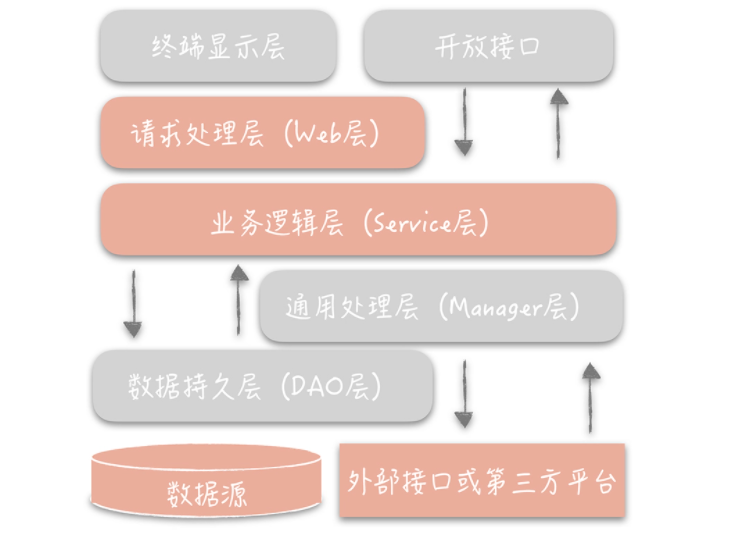
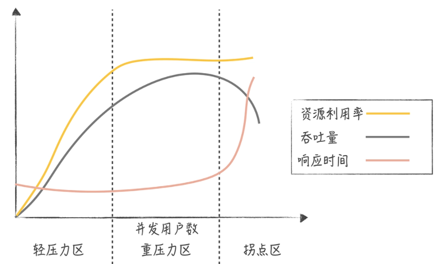
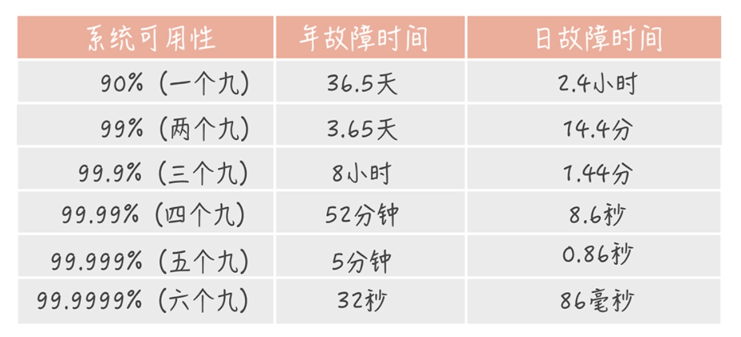

<!-- MarkdownTOC -->

- [高并发系统设计之基础篇](#高并发系统设计之基础篇)
  - [通用设计方法](#通用设计方法)
  - [架构分层](#架构分层)
  - [系统性能](#系统性能)
    - [高性能](#高性能)
    - [高可用](#高可用)
    - [可扩展](#可扩展)
  - [参考资料](#参考资料)

<!-- /MarkdownTOC -->

# 高并发系统设计之基础篇

## 通用设计方法

高并发意味着大流量。如果把巨大的流量冲击比作洪水，那么我们需要找到“抵御洪水”的方案，让流量更加平稳地被系统中的服务和组件处理。

这里归纳了三种方法：

**1、Scale-out**

“摩尔定律”是一种经验论，用来预处集成电路上可容纳的晶体管的数量约每隔两年会增加一倍，预计 18 个月会将芯片的性能提升一倍。到了21世纪，的芯片技术已经做到了 5nm 级别，工艺上可以突破的空间不大，摩尔定律逐渐失效。

因此，**纵向扩展 Scale-up**方案中通过提升硬件性能（如4核4G 变 8核8G）来提升并发处理能力是不可持续的，一般用于系统设计初期，毕竟方案足够简单。

随着系统并发超过单机极限，就需要用到**横向扩展 Scale-out**方案了，它将多个低性能的机器组成一个分布式集群来共同抵御高并发流量的冲击（如两台 4核4G）。这种分而治之的方式把流量分流开，让每个服务器都承担一部分并发和流量。

**2、缓存**

广义上来讲，缓存（cache）就是为了加速数据处理，让业务更快地访问而临时存放的冗余/副本数据。本质上讲，缓存是利用**空间换时间**的技术，把读写速度【慢】的介质的数据保存在读写速度【快】的介质中，从而来提升数据的访问速度，减少时间消耗。缓存的语义很丰富，我们可以将任何降低响应时间的中间存储都称为缓存。

使用缓存来提高系统的性能，就好比用“拓宽河道”的方式抵抗高并发大流量的冲击。

**3、异步**

与异步相对而言的是同步。以方法调用为例，**同步**调用代表调用方要阻塞等待被调用方法中的逻辑执行完成。这种方式下，当被调用方法响应时间较长时，会造成调用方长久的阻塞，在高并发下会造成整体系统性能下降甚至发生雪崩。

**异步**调用恰恰相反，调用方不需要等待方法逻辑执行完成就可以返回执行其他的逻辑，在被调用方法执行完毕后再通过回调、事件通知等方式将结果反馈给调用方。

异步就类似于水库先存储大量水，再想将水缓缓地排出去，以此提高下游的抗洪能力。

> 系统的演进应该是循序渐进，以解决系统中存在的问题为目的和驱动力的。不应该盲目追求分布式、微服务等系统架构，最简单的系统设计满足业务需求和流量现状，选择最熟悉的技术体系。
>
> 然后随着流量的增加和业务的变化修正架构中存在问题的点，如单点问题、横向扩展问题、性能无法满足需求的组件。当对架构的小修小补无法满足需求时，再考虑重构、重写等大的调整方式以解决现有的问题。

## 架构分层

软件架构分层在软件工程中是一种常见的设计方式，它是将整体系统拆分成 N 个层次，每个层次有独立的职责，多个层次协同提供完整的功能。常见的分层架构有：

- MVC架构，整体系统分成了 Model（模型），View（视图）和 Controller（控制器）三个层次，用户视图和业务处理隔离开，通过控制器连接起来，实现了表现和逻辑的解耦。
- 表现层、逻辑层和数据访问层，一般我们建立Web、Service 和 Dao三个目录与之对应。
- OSI 网络模型整个网络分成了七层，自下而上分别是物理层、数据链路层、网络层、传输层、会话层、表示层和应用层。TCP/IP 协议简化成了四层，即链路层、网络层、传输层和应用层。
- Linux 文件系统也是分层设计，最上层是虚拟文件系统（VFS），用来屏蔽不同的文件系统之间的差异，提供统一的系统调用接口。虚拟文件系统的下层是 Ext3、Ext4 等各种文件系统，再向下是为了屏蔽不同硬件设备的实现细节，抽象出来的单独的一层——通用块设备层，然后就是不同类型的磁盘。

为什么这么多系统一定要做分层的设计呢？

- 分层可以隔离关注点，简化系统设计，让不同的层专注做不同的事情，让不同的人专注做某一层次的事情。
- 分层之后可以做到很高的复用。
- 分层架构可以让我们更容易做横向扩展。

如何分层呢？参照阿里发布的《阿里巴巴 Java 开发手册 v1.4.0》，可以将原先的三层架构细化成下面的样子：

- 终端显示层：各端模板渲染并执行显示的层。当前主要是 Velocity 渲染，JS 渲染， JSP 渲染，移动端展示等。
- 开放接口层：将 Service 层方法封装成开放接口，同时进行网关安全控制和流量控制等。
- Web 层：主要是对访问控制进行转发，各类基本参数校验，或者不复用的业务简单处理等。
- Service 层：业务逻辑层。
- Manager 层：通用业务处理层。这一层主要有两个作用，其一，可以将原先 Service 层的一些通用能力下沉到这一层，比如与缓存和存储交互策略，中间件的接入；其二，也可以在这一层封装对第三方接口的调用，比如调用支付服务，调用审核服务等。它它与 Service 层的关系是：**Manager 层提供原子（最小功能）的服务接口，Service 层负责依据业务逻辑来编排原子接口**。
- DAO 层：数据访问层，与底层 MySQL、Oracle、HBase 等进行数据交互。
- 外部接口或第三方平台：包括其它部门 RPC 开放接口，基础平台，其它公司的 HTTP 接口。

  

## 系统性能

高并发系统设计的三大目标：高性能、高可用、可扩展。

### 高性能

**性能的度量指标**，一般而言，度量性能的指标是系统接口的响应时间，但是单次的响应时间是没有意义的。

- 平均值：这段时间所有请求的响应时间数据相加，再除以总请求数。平均值对于度量性能来说只能作为一个参考，不能真实反应性能。
- 最大值：这段时间内所有请求响应时间最长的值。
- 分位值：分位值有很多种，比如 90 分位、95 分位、75 分位。分位值排除了偶发极慢请求对于数据的影响，能够很好地反应这段时间的性能情况，分位值越大，对于慢请求的影响就越敏感。

响应时间究竟控制在多长时间比较合适呢？

- 响应时间在 200ms 之内，用户是感觉不到延迟的，就像是瞬时发生的一样。
- 接口的响应时间在 1s 之内时，虽然用户可以感受到一些延迟，但却是可以接受的
- 超过 1s 之后用户就会有明显等待的感觉，等待时间越长，用户的使用体验就越差。

所以，**健康系统的 99 分位值的响应时间通常需要控制在 200ms 之内**，而不超过 1s 的请求占比要在 99.99% 以上。

高并发下的性能优化有两种思路：

**1、提高系统的处理核心数**

提高系统的处理核心数就是增加系统的并行处理能力，这个思路是优化性能最简单的途径。

计算机领域的阿姆达尔定律（Amdahl’s law）描述了并发进程数与响应时间之间的关系，含义是在固定负载下，并行计算的加速比，也就是并行化之后效率提升情况，可以用公式来表示：`(Ws + Wp) / (Ws + Wp/s)`

> Ws 表示任务中的串行计算量，Wp 表示任务中的并行计算量，s 表示并行进程数。

从这个公式我们可以推导出另外一个公式：`1/(1-p+p/s)`

> s 还是表示并行进程数，p 表示任务中并行部分的占比。

当 p 为 1 时，也就是完全并行时，加速比与并行进程数相等；当 p 为 0 时，即完全串行时，加速比为 1，也就是说完全无加速；当 s 趋近于无穷大的时候，加速比就等于 1/(1-p)，你可以看到它完全和 p 成正比。特别是，当 p 为 1 时，加速比趋近于无穷大。

然而，随着并发进程数的增加，并行的任务对于系统资源的争抢也会愈发严重。在某一个临界点上继续增加并发进程数，反而会造成系统性能的下降，这就是性能测试中的拐点模型。

  

并发用户数处于轻压力区时，响应时间平稳，吞吐量和并发用户数线性相关。而当并发用户数处于重压力区时，系统资源利用率到达极限，吞吐量开始有下降的趋势，响应时间也会略有上升。这个时候，再对系统增加压力，系统就进入拐点区，处于超负荷状态，吞吐量下降，响应时间大幅度上升。

所以我们在评估系统性能时通常需要做压力测试，目的就是找到系统的“拐点”，从而知道系统的承载能力，也便于找到系统的瓶颈，持续优化系统性能。

**2、减少单次任务响应时间**

**CPU 密集型系统**中，需要处理大量的 CPU 运算，那**选用更高效的算法或者减少运算次数**就是这类系统重要的优化手段。比方说，如果系统的主要任务是计算 Hash 值，那么这时选用更高性能的 Hash 算法就可以大大提升系统的性能。发现这类问题的主要方式，是通过一些 Profile 工具来找到消耗 CPU 时间最多的方法或者模块，比如 Linux 的 perf、eBPF 等。

**IO 密集型系统**指的是系统的大部分操作是在等待 IO 完成，这里 IO 指的是磁盘 IO 和网络 IO。我们熟知的系统大部分都属于 IO 密集型，比如数据库系统、缓存系统、Web 系统。这类系统的性能瓶颈可能出在系统内部，也可能是依赖的其他系统，而发现这类性能瓶颈的手段主要有两类。

- 工具：Linux 的工具集很丰富可以满足优化需要，比如网络协议栈、网卡、磁盘、文件系统、内存，等等。
- 监控：对任务的每一个步骤做分时的统计，从而找到任务的哪一步消耗了更多的时间。

找到了系统的瓶颈点，我们要如何优化呢？优化方案会随着问题的不同而不同。比方说：

- 数据库访问慢，那么就要看是不是有锁表的情况、是不是有全表扫描、索引加的是否合适、是否有 JOIN 操作、需不需要加缓存，等等；
- 网络的问题，就要看网络的参数是否有优化的空间，抓包来看是否有大量的超时重传，网卡是否有大量丢包等。

### 高可用

**高可用性（High Availability，HA）**指的是系统具备较高的无故障运行的能力。可用性的度量有MTBF 和 MTTR。

- **MTBF**（Mean Time Between Failure）平均故障间隔，代表两次故障的间隔时间，也就是系统正常运转的平均时间。这个时间越长，系统稳定性越高。
- **MTTR**（Mean Time To Repair）故障的平均恢复时间，也可以理解为平均故障时间。这个值越小，故障对于用户的影响越小。

可用性可以用公式表示它们之间的关系：`Availability = MTBF / (MTBF + MTTR)`。比例代表着系统的可用性：

  

一般而言，核心业务系统的可用性，需要达到四个九，非核心系统的可用性最多容忍到三个九。

一个成熟系统的可用性需要从系统设计和系统运维两方面来做保障，两者共同作用，缺一不可。

**1、系统设计**

“Design for failure”是做高可用系统设计时秉持的第一原则。在承担百万 QPS 的高并发系统中，集群中机器的数量成百上千台，单机的故障是常态，几乎每一天都有发生故障的可能。在做系统设计的时候，要把发生故障作为一个重要的考虑点，预先考虑如何自动化地发现故障，发生故障之后要如何解决。

- **failover（故障转移）**
  - 完全对等的节点之间做 failover：访问一个节点失败，随机访问另外一个节点就好了。
  - 不对等的节点之间，即系统中存在主节点也存在备节点：”心跳“机制检测主备机器是否故障，采用一种分布式一致性算法比方说 Paxos，Raft等进行“选主”，实现主从切换。

- **超时控制**：请求超时则让请求失败，牺牲了少量的请求却保证了整体系统的可用性。如何设置超时时间呢？建议收集系统之间的调用日志，统计比如说 99% 的响应时间是怎样的，然后依据这个时间来指定超时时间。
- **降级**：保证核心服务的稳定而牺牲非核心服务的做法（有损）。
- **限流**：对并发的请求进行限速来保护系统（有损）。

**2、系统运维**

我们可以从灰度发布、故障演练两个方面来考虑如何提升系统的可用性。

- **灰度发布**：系统的变更不是一次性地推到线上的，而是按照一定比例逐步推进的。
- **故障演练**：对系统进行一些破坏性的手段，观察在出现局部故障时，整体的系统表现是怎样的，从而发现系统中存在的，潜在的可用性问题。故障演练和流行的“混沌工程”的思路如出一辙。

### 可扩展

**拆分**是提升系统扩展性最重要的一个思路，它会把庞杂的系统拆分成独立的，有单一职责的模块。相对于大系统来说，考虑一个一个小模块的扩展性当然会简单一些。**将复杂的问题简单化**，这就是我们的思路。

假如你要设计一个社区，那么社区会有几个模块呢？可能有 5 个模块。

- 用户：负责维护社区用户信息，注册，登陆等；
- 关系：用户之间关注、好友、拉黑等关系的维护；
- 内容：社区发的内容，就像朋友圈或者微博的内容；
- 评论、赞：用户可能会有的两种常规互动操作；
- 搜索：用户的搜索，内容的搜索。

部署方式按照最简单的三层部署架构，负载均衡-> 应用服务器 -> 数据库。负载均衡负责请求的分发，应用服务器负责业务逻辑的处理，数据库负责数据的存储落地。

**1、存储层的扩展性**

存储拆分首先考虑的维度是**业务维度**，将上面每个模块单独建立一个数据库，社区系统就有了用户库、内容库、评论库、点赞库和关系库，某一个库“挂了”不会影响到其它的数据库。

为超越单机的限制，针对数据库做**水平拆分**。因为增加节点就需要手动地迁移数据，成本很高。基于长远的考虑，最好一次性增加足够的节点以避免频繁的扩容。

当数据库按照业务和数据维度拆分之后，尽量不要使用事务。

**2、业务层的扩展性**

一般会从三个维度考虑业务层的拆分方案，它们分别是：**业务维度，重要性维度和请求来源维度**。

- 把相同业务的服务拆分成单独的业务池。比方说上面的社区系统中，可以按照业务的维度拆分成用户池、内容池、关系池、评论池、点赞池和搜索池（池子就是一组机器组成的集群）。
- 根据业务接口的重要程度，把业务分为核心池和非核心池。优先保证核心池的性能，当整体流量上升时优先扩容核心池，降级部分非核心池的接口，从而保证整体系统的稳定性。
- 根据接入客户端类型的不同做业务池的拆分。比如说，服务于客户端接口的业务可以定义为外网池，服务于小程序或者 HTML5 页面的业务可以定义为 H5 池，服务于内部其它部门的业务可以定义为内网池。

## 参考资料

- [高并发系统设计40问](https://time.geekbang.org/column/intro/230) 
