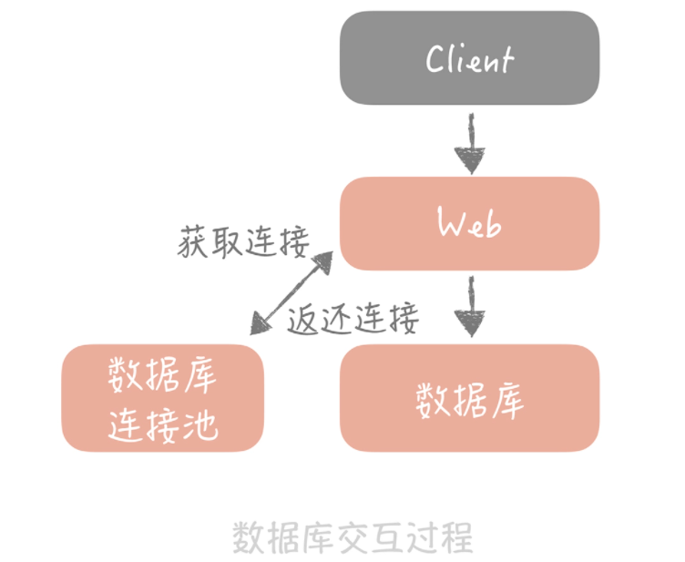
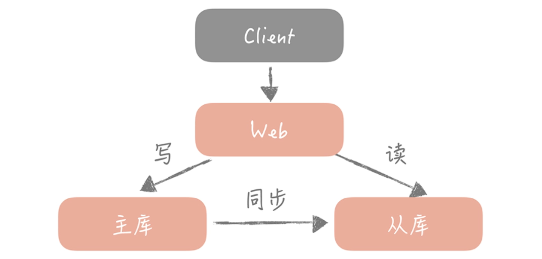
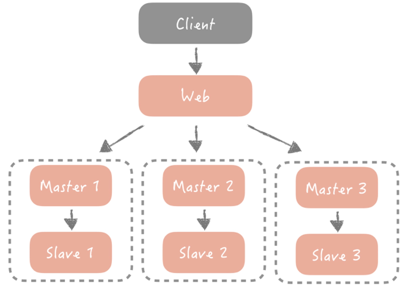
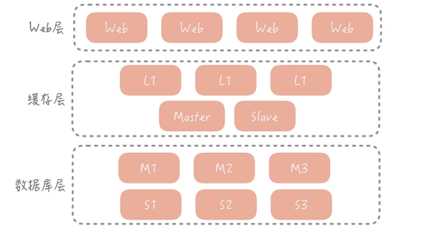
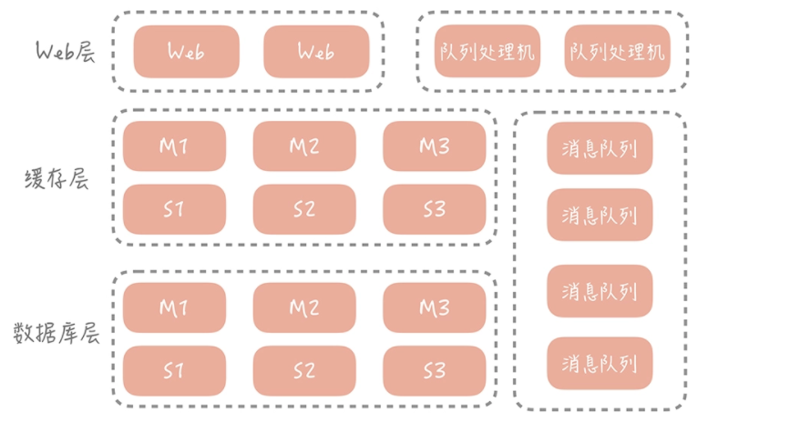

# 数据库篇

> 一天，公司 CEO 把你叫到会议室，告诉你公司看到了一个新的商业机会，希望你能带领一位兄弟，迅速研发出一套面向某个垂直领域的电商系统。
>
> 在人手紧张，时间不足的情况下，为了能够完成任务，你毫不犹豫地采用了最简单的架构：前端一台 Web 服务器运行业务代码，后端一台数据库服务器存储业务数据。系统架构为：`Client -> Web -> 数据库`。

## 池化技术

> 系统一开始上线之后，虽然用户量不大，但运行平稳。不过 CEO 觉得用户量太少了，所以紧急调动运营同学做了一次全网的流量推广。这一推广很快带来了一大波流量，但这时，系统的访问速度开始变慢。
>
> 分析程序的日志之后，发现系统慢的原因出现在和数据库的交互上。因为数据库的调用方式是先获取数据库的连接，然后依靠这条连接从数据库中查询数据，最后关闭连接释放数据库资源。这种调用方式下，每次执行 SQL 都需要重新建立连接，频繁地建立数据库连接耗费时间长导致了访问慢的问题。
>
> 查询发现，1s 只能执行 200 次数据库的查询，而数据库建立连接的时间占了其中 4/5。

针对上面这个问题，我们可以采用**池化技术**来解决。池化技术的核心思想是**空间换时间**，期望使用预先创建好的对象来减少频繁创建对象的性能开销，同时还可对对象进行统一的管理，降低了对象的使用的成本。

**1、用连接池预先建立数据库连接**

只要使用连接池将数据库连接预先建立好，这样在使用的时候就不需要频繁地创建连接了。调整之后，你发现 1s 就可以执行 1000 次的数据库查询，查询性能大大提升了。

对于数据库连接池，根据	经验，一般在线上我建议最小连接数控制在 10 左右，最大连接数控制在 20～30 左右即可。

此外，启动一个线程来定期检测连接池中的连接是否可用，使用连接发送“select 1”的命令给数据库看是否会抛出异常，如果抛出异常则将这个连接从连接池中移除，并且尝试关闭。

> CEO 又提出了一个新的需求。你分析了一下这个需求，发现在一个非常重要的接口中，需要访问 3 次数据库。根据经验判断，你觉得这里未来肯定会成为系统瓶颈。

**2、用线程池预先创建线程**

JDK 1.5 中引入的 ThreadPoolExecutor 就是一种线程池的实现，**JDK实现的线程池适用于CPU密集型任务**。

但是，平时的Web 系统通常都有大量的 IO 操作，比方说查询数据库、查询缓存等等。所以说，在**I/O 密集型任务**中，线程在处理 I/O 的时间段内不会占用 CPU 来处理，这时就可以将 CPU 交出给其它线程使用。这时如果增加执行任务的线程数而不是把任务暂存在队列中，就可以在单位时间内执行更多的任务，大大提高了任务执行的吞吐量。

因此将核心线程数量设置为 8，缓冲队列使用`ArrayBlockingQueue`，拒绝策略设置为默认的`AbortPolicy`。

> 理解了线程池的关键要点，你在系统里加上了这个特性，至此，系统稳定，你圆满完成了公司给你的研发任务。系统架构图如下：
>
> 
  
> 
> 

## 主从分离

> 在上面，我们在Web 工程和数据库之间增加了数据库连接池，减少了频繁创建连接的成本，性能上可以提升 80%。
>
> 但是数据库还是单机部署，依据一些云厂商的 Benchmark 的结果，在 4 核 8G 的机器上运行 MySQL 5.7 时，大概可以支撑 500 的 TPS 和 10000 的 QPS。
>
> > QPS：每秒查询数，针对读请求的；TPS是每秒执行事务数，针对于写请求。
>
> 这时，运营负责人说正在准备双十一活动，并且公司层面会继续投入资金在全渠道进行推广，这无疑会引发查询量骤然增加的问题。

大部分系统的访问模型是读多写少，读写请求量的差距可能达到几个数量级。因此，这里优先考虑数据库如何抵抗更高的查询请求，那么需要把读写流量区分开，因为这样才方便针对读流量做单独的扩展，这就是所谓的主从读写分离。

业界有很多的方案可以屏蔽主从分离之后数据库访问的细节，让开发人员像是访问单一数据库一样，包括有像 TDDL、Sharding-JDBC 这样的嵌入应用内部的方案，也有像 Mycat 这样的独立部署的代理方案。

不过，引入主从复制技术，需要考虑两个**问题**：

- 主从的一致性和写入性能的权衡
- 主从的延迟问题

总之，依靠主从复制的技术使得数据库实现了数据复制为多份，增强了抵抗大量并发读请求的能力，提升了数据库的查询性能的同时，也提升了数据的安全性。当某一个数据库节点，无论是主库还是从库发生故障时，我们还有其他的节点中存储着全量的数据，保证数据不会丢失。架构图变成如下：

  

## 分库分表

> 公司 CEO 突然传来一个好消息，运营推广持续带来了流量，你所设计的电商系统的订单量突破了五千万。订单数据都是单表存储的，你的压力倍增，因为无论是数据库的查询还是写入性能都在下降，数据库的磁盘空间也在报警。
>
> - 注册的用户、产生的订单越来越多，数据库中存储的数据也越来越多，单个表的数据量超过了千万甚至到了亿级别。即使使用了索引，索引占用的空间也随着数据量的增长而增大，数据库就无法缓存全量的索引信息，那么就需要从磁盘上读取索引数据，就会影响到查询的性能了**。那么这时要如何提升查询性能呢**？
> - 数据量的增加也占据了磁盘的空间，数据库在备份和恢复的时间变长，**如何让数据库系统支持如此大的数据量呢**？
> - 不同模块的数据，比如用户数据和用户关系数据，全都存储在一个主库中，一旦主库发生故障，所有的模块都会受到影响，**那么如何做到不同模块的故障隔离呢**？
> - 在4核8G的云服务器上对MySQL 5.7做Benchmark，大概可支撑 500TPS 和 10000QPS，可以看到数据库对于写入性能要弱于数据查询的能力，那么随着系统写入请求量的增长，**数据库系统如何来处理更高的并发写入请求呢**？

上述问题可以归纳成，数据库的写入请求量大造成的性能和可用性方面的问题。要解决这些问题，所采取的措施就是对数据进行分片，分摊数据库的读写压力，突破单机的存储瓶颈。而常见的一种方式是对数据库做“分库分表”。

分库分表是一种常见的将数据分片的方式，它的基本思想是依照某一种策略将数据尽量平均地分配到多个数据库节点或者多个表中。

- **垂直拆分**：将数据库的表拆分到多个不同的数据库中。垂直拆分的原则一般是按照业务类型来拆分，核心思想是专库专用，将业务耦合度比较高的表拆分到单独的库中。
- **水平拆分**：水平拆分指的是将单一数据表按照某一种规则拆分到多个数据库和多个数据表中，关注点在数据的特点。（根据某个字段的hash值拆分/根据某个字段的区间或范围拆分）

分库分表会引入的问题：

- 引入了分库分表键，也叫做分区键，也就是我们对数据库做分库分表所依据的字段。
- 一些数据库的特性在实现时可能变得很困难。

上面了解了分布式存储两个核心问题：数据冗余和数据分片，以及在传统关系型数据库中是如何解决的。当我们面临高并发的查询数据请求时，可以使用主从读写分离的方式，部署多个从库分摊读压力；当存储的数据量达到瓶颈时，我们可以将数据分片存储在多个节点上，降低单个存储节点的存储压力，此时架构变成了下面这个样子：

  

# 缓存篇

  

# 消息队列篇

  

# 参考资料

- [高并发系统设计40问](https://time.geekbang.org/column/intro/230) 