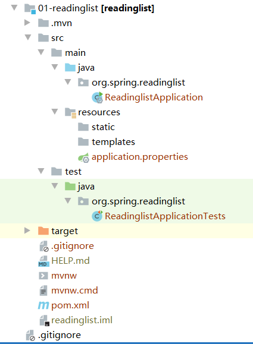

> 参考：《SpringBoot实战》

## 安装 Spring Boot CLI

- 下载 [spring-boot-cli-2.4.0](https://repo.spring.io/release/org/springframework/boot/spring-boot-cli/2.4.0/)
- 解压到任意目录
- 将 bin 目录添加到环境变量中
- 查看安装结果

```
#输入
spring --version
#输出
Spring CLI v2.4.0
```

## 使用Spring Initializr 初始化 Spring Boot 项目

**Spring Initializr 的几种用法**

- 通过Web 界面使用
- 通过Spring Tool Suite 使用
- 通过 Intellij IDEA 使用
- 通过 Spring Boot CLI 使用

## 使用 Spring Boot CLI 初始化 Spring Boot项目

```
spring init
```

- init 命令会生成一个 demo.zip 文件。
- 解压后会看到一个典型的项目结构，包含一个Maven 的pom.xml构建描述文件。

**构建一个Web应用，使用JPA实现数据持久化，使用Spring Security 进行安全加固。**

- 使用--dependencies 或 -d来指定初始依赖

```
# 使用Maven 在pom.xml里增加了Spring Boot的Web、jpa和security起步依赖
spring init -dweb,jpa,security
# 使用Gradle
spring init -dweb,jpa,security --build gradle

# 官网手册 构建web应用，并使用data-jpa，生成文件夹myapp
  spring init --dependencies=web,data-jpa myapp
& spring init --dweb,data-jpa myapp
```

> 注意：-d和依赖之间没有空格，否则就变成 了下载一个ZIP文件，文件名是web,data-jpa。

## spring init 相关命令

- -d 或 --dependencies，指定依赖

```
spring init -dweb,jpa,security
```

- -p 或--packaging, 指定构建的包

```
spring init -dweb,jpa,security --build gradle -p war
```

- -x 或 --extract ,指定用于生成项目的解压目录

```
spring init -dweb,jpa,security --build gradle -p jar -x
```

- help 查看有哪些可选参数

```
spring help init
```

- -l 或 --list ，查看支持Initializr 支持的参数

```
spring init --list
```

常见参数：

| 参数         | 说明                                                         | 默认值                       |
| ------------ | ------------------------------------------------------------ | ---------------------------- |
| name         | 项目名                                                       | demo                         |
| package-name | 项目包名                                                     | com.example.demo             |
| description  | 项目描述                                                     | Demo project for Spring Boot |
| artifactId   | 项目的唯一的标识符，实际对应项目的名称                       | demo                         |
| groupId      | 项目组织                                                     | com.example                  |
| javaVersion  | Java语言版本                                                 | 1.8                          |
| packaging    | 项目打包类型                                                 | jar                          |
| type         | 项目类型，可选择gradle-build、gradle-project、<br/>maven-build、maven-project。 | maven-project                |

例如，要创建一个readinglist项目：

```shell
$ spring init --name readinglist --artifactId readinglist --groupId org.spring --language java --boot-version 2.4.1.RELEASE --type maven-project --dependencies web,thymeleaf,devtools --extract 01-readinglist
```

最终会生成这样的项目结构：

<div align="center">  

</div>

