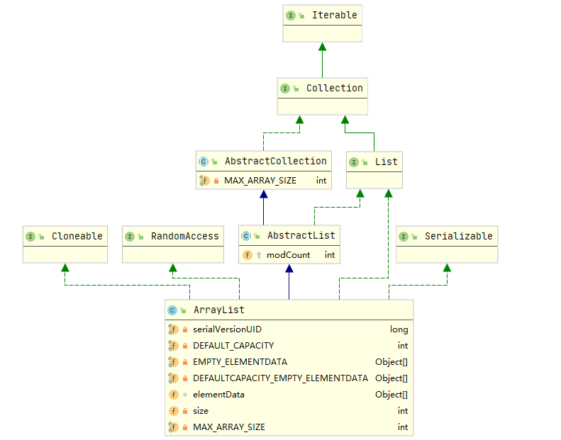

- [1. ArrayList简介](#1-arraylist简介)
- [2. ArrayList源码简析（JDK 1.8）](#2-arraylist源码简析jdk-18)
  - [2.1 成员属性](#21-成员属性)
  - [2.2 构造方法](#22-构造方法)
  - [2.3 添加元素](#23-添加元素)
  - [2.4 删除元素](#24-删除元素)
  - [2.5 ArrayList扩容机制](#25-arraylist扩容机制)
    - [2.5.1 `ensureCapacityInternal()` 和 `ensureExplicitCapacity()`](#251-ensurecapacityinternal-和-ensureexplicitcapacity)
    - [2.5.2 `grow()`](#252-grow)
  - [2.6 `ensureCapacity`](#26-ensurecapacity)
- [3 遍历](#3-遍历)
- [4 fail-fast机制](#4-fail-fast机制)
- [参考](#参考)
## 1. ArrayList简介

`java.util.ArrayList` 是一个**数组队列**，相当于 **动态数组**。与J数组相比，它具有**容量能动态增长、元素增删慢、查找快**的特点。



`ArrayList`继承于 **`AbstractList`**，实现了 **`List`**、 **`RandomAccess`**、 **`Cloneable`**、**`java.io.Serializable`** 接口。

```java
public class ArrayList<E> extends AbstractList<E>
        implements List<E>, RandomAccess, Cloneable, java.io.Serializable{
		--- omit ---
  }
```

- `ArrayList` 继承了`AbstractList`抽象方法，实现了List接口，提供了相关的**添加、删除、修改、遍历**等功能。
- `RandomAccess` 是一个标志接口，表明实现这个这个接口的 List 集合是支持**快速随机访问**的。在 `ArrayList` 中，我们即可以通过元素的序号快速获取元素对象，这就是快速随机访问。在 `Collections.binarySearch()` 方法中，它要判断传入的list 是否 `RamdomAccess` 的实例，如果是，调用 `Collections.indexedBinarySearch(list, key)` 方法，如果不是，那么调用 `Collections.iteratorBinarySearch(list, key)` 方法。
- `ArrayList` 实现了 `Cloneable` 接口，可以调用 `Object.clone()` 方法返回该对象的浅拷贝。
- `ArrayList` 实现了` java.io.Serializable `接口，这意味着`ArrayList`支持序列化，能通过序列化去传输。

> Tips：**`ArrayList`中的操作不是线程安全的**！建议在单线程中才使用`ArrayList`，多线程中选择使用Vector或者`CopyOnWriteArrayList`。

## 2. ArrayList源码简析（JDK 1.8）

### 2.1 成员属性

```java
// 默认容量大小
private static final int DEFAULT_CAPACITY = 10;

// ArrayList空实例共享的一个空数组
private static final Object[] EMPTY_ELEMENTDATA = {};

// ArrayList空实例共享的一个空数组，用于默认大小的空实例。
// 与EMPTY_ELEMENTDATA分开，这样就可以了解当添加第一个元素时需要创建多大的空间。
private static final Object[] DEFAULTCAPACITY_EMPTY_ELEMENTDATA = {};

// 真正存储ArrayList中的元素的数组
transient Object[] elementData;

// ArrayList 所包含的元素个数，注意并不是elementData的长度
private int size;

// 数组的最大长度
private static final int MAX_ARRAY_SIZE = Integer.MAX_VALUE - 8;
```

`AbstractList`抽象类中唯一属性：

```java
// 表示elementData被修改的次数，每次add或者remove它的值都会加1
protected transient int modCount = 0;
```

**为什么size不是用来标记elementData数组的长度呢？**

在Java中，一般来说：

-  `length`属性是针对数组而言的，比如下面源码中`elementData.length`表示`elementData`数组的长度。
-  `length()` 方法是针对字符串而言的，可以调用 `length()` 获取字符串长度。
-  `size()` 方法是针对泛型集合而言的，可以调用`size()`来获取集合中保存的元素个数。

这样，就很好理解为什么size不是ArrayList的长度了，不易记混。

### 2.2 构造方法

ArrayList有三种初始化方式：

```java
    /**
     * 有参的构造函数
     */    
	public ArrayList(int initialCapacity) {
        if (initialCapacity > 0) {
            // 初始化容量大于0，创建initialCapacity大小的数组
            this.elementData = new Object[initialCapacity];
        } else if (initialCapacity == 0) {
            // 初始化容量等于0，创建空数组
            this.elementData = EMPTY_ELEMENTDATA;
        } else {
            throw new IllegalArgumentException("Illegal Capacity: "+
                                               initialCapacity);
        }
    }

    /**
     * 默认无参构造函数（未指定初始化容量大小），使用初始容量10构造一个空列表。
     */
    public ArrayList() {
        this.elementData = DEFAULTCAPACITY_EMPTY_ELEMENTDATA;
    }

    /**
     * 使用Collection集合来初始化ArrayList
     */
    public ArrayList(Collection<? extends E> c) {
        // 将集合转换为数组
        elementData = c.toArray();
        // 如果集合size/数组长度 不等于0
        if ((size = elementData.length) != 0) {
            // 如果返回的不是Object类型数据
            if (elementData.getClass() != Object[].class)
                // 重新创建一个size大小的数组。
                // 并将原来不是Object[]数组的内容，Copy给新的是Object[]的数组
                elementData = Arrays.copyOf(elementData, size, Object[].class);
        } else {
            // 用空数组代替
            this.elementData = EMPTY_ELEMENTDATA;
        }
    }
```

可见，`ArrayList`的初始化分三种情况：

* 无参构造函数初始化时，直接内部把数组初始化为`DEFAULTCAPACITY_EMPTY_ELEMENTDATA`空数组。在第一次添加元素时，再初始化为默认容量是 `10` 的数组。
* 指定容量大小进行初始化时，容量大于`0`则初始化成指定容量的数组；如果容量等于0则初始化为默认空数组`EMPTY_ELEMENTDATA`。否则则抛出异常。
* 如果使用`Collection`实例来初始化，容量不为空则调用`toArray()` 方法来初始化 `elementData`；如果为空则初始化为默认空数组`EMPTY_ELEMENTDATA`。

从上面的分析中可以看出**EMPTY_ELEMENTDATA**与**DEFAULTCAPACITY_EMPTY_ELEMENTDATA**的区别：

* `EMPTY_ELEMENTDATA`表示实例化对象时指定了容量为0，当添加1个元素后，那么`elementData.length=1`。
* `DEFAULTCAPACITY_EMPTY_ELEMENTDATA`表示实例化时是无参构造，未指定容量，在调用add方法添加第1个元素后会默认扩容容量为10，即`elementData.length=10`。

>  `ArrayList`中所有添加元素的方法（详见 2.3），都调用了`ensureCapacityInternal() `方法，查看源码：

```java
    private void ensureCapacityInternal(int minCapacity) {
        ensureExplicitCapacity(calculateCapacity(elementData, minCapacity));
    }
    
    private static int calculateCapacity(Object[] elementData, int minCapacity) {
        if (elementData == DEFAULTCAPACITY_EMPTY_ELEMENTDATA) {
            return Math.max(DEFAULT_CAPACITY, minCapacity);// DEFAULT_CAPACITY == 10
        }
        return minCapacity;
    }
```

### 2.3 添加元素

```java
    /**
     * 直接将元素添加到数组末尾。
     */
    public boolean add(E e) {
        ensureCapacityInternal(size + 1);  // Increments modCount!!
        elementData[size++] = e;
        return true;
    }

    /**
     * 将元素添加到指定index位置。
     */
    public void add(int index, E element) {
        // 对index进行界限检查
        rangeCheckForAdd(index);

        ensureCapacityInternal(size + 1);  // Increments modCount!!
        // native静态方法，原elementData数组的index（包含）之后的数据，复制到目标elementData数组的index + 1之后位置
        System.arraycopy(elementData, index, elementData, index + 1,
                         size - index);
        // 将从index开始之后的所有成员后移一个位，将element插入到index位置。
        elementData[index] = element;
        // 最后size+1
        size++;
    }

    /**
     * 将指定集合中的所有元素追加到此列表的末尾。
     */
    public boolean addAll(Collection<? extends E> c) {
        Object[] a = c.toArray();
        int numNew = a.length;
        ensureCapacityInternal(size + numNew);  // Increments modCount
        System.arraycopy(a, 0, elementData, size, numNew);
        size += numNew;
        return numNew != 0;
    }

    /**
     * 从指定的位置开始，将指定集合中的所有元素插入到此列表中。
     */
    public boolean addAll(int index, Collection<? extends E> c) {
        rangeCheckForAdd(index);

        Object[] a = c.toArray();
        int numNew = a.length;
        ensureCapacityInternal(size + numNew);  // Increments modCount

        int numMoved = size - index;
        if (numMoved > 0)
            System.arraycopy(elementData, index, elementData, index + numNew,
                             numMoved);

        System.arraycopy(a, 0, elementData, index, numNew);
        size += numNew;
        return numNew != 0;
    }
```

可以看出，在指定位置添加元素，实际就是将指定坐标位置以及右侧所有元素向后移动一位，腾出空间存放新元素；向 `ArrayList` 中添加集合实例，则是集合示例转化成数组，然后利用`arraycopy()`数组拷贝的方式来高效完成添加工作。

> `arraycopy()`方法，其具体使用可以参考[由 System.arraycopy 引发的巩固：对象引用 与 对象 的区别](https://juejin.im/post/6844903502901149703)一文。

### 2.4 删除元素

```java
    /**
     * 删除列表中指定位置的元素。将任何后续元素移动到左侧（从其索引中减1）。
     */
    public E remove(int index) {
        rangeCheck(index);

        modCount++;
        E oldValue = elementData(index);

        int numMoved = size - index - 1;
        if (numMoved > 0)
            System.arraycopy(elementData, index+1, elementData, index,
                             numMoved);
        elementData[--size] = null;
      	// 从列表中删除的元素
        return oldValue;
    }

    /**
     * 从列表中删除指定元素。
     */
    public boolean remove(Object o) {
        // 如果列表不包含该元素，则它不会更改。
        if (o == null) {
            for (int index = 0; index < size; index++)
                if (elementData[index] == null) {
                    fastRemove(index);
                    return true;
                }
        } else {
            for (int index = 0; index < size; index++)
                // 返回true，此列表包含指定的元素
                if (o.equals(elementData[index])) {
                    fastRemove(index);
                    return true;
                }
        }
        return false;
    }

	// 它跳过边界检查而不返回移除的值。
    private void fastRemove(int index) {
        modCount++;
        int numMoved = size - index - 1;
        if (numMoved > 0)
            System.arraycopy(elementData, index+1, elementData, index,
                             numMoved);
        elementData[--size] = null;
    }

    /**
     * 从列表中删除所有元素。
     */
    public void clear() {
        modCount++;

        // 把数组中所有的元素的值设为null
        for (int i = 0; i < size; i++)
            elementData[i] = null;

        size = 0;
    }

    /**
     * 从此列表中删除所有索引为fromIndex （包含）和toIndex之间的元素。
     */
    protected void removeRange(int fromIndex, int toIndex) {
        modCount++;
        int numMoved = size - toIndex;
        System.arraycopy(elementData, toIndex, elementData, fromIndex,
                         numMoved);

        int newSize = size - (toIndex-fromIndex);
        for (int i = newSize; i < size; i++) {
            elementData[i] = null;
        }
        size = newSize;
    }

    /**
     * 从此列表中删除指定集合中包含的所有元素。
     */
    public boolean removeAll(Collection<?> c) {
        Objects.requireNonNull(c);
        // 如果此列表被修改则返回true
        return batchRemove(c, false);
    }
```

### 2.5 ArrayList扩容机制

2.2 已经提到过，ArrayList添加元素时，都会调用ensureCapacityInternal方法。

以add(E e)方法为例：

```java
    /**
     * 直接将元素添加到数组末尾。
     */
    public boolean add(E e) {
        // 检查是否需要扩容
        ensureCapacityInternal(size + 1);  // Increments modCount!!
        elementData[size++] = e;
        return true;
    }
```

#### 2.5.1 `ensureCapacityInternal()` 和 `ensureExplicitCapacity()` 

查看ensureCapacityInternal()方法：

```java
    // 获取到满足需求的最小容量
	private void ensureCapacityInternal(int minCapacity) {
        ensureExplicitCapacity(calculateCapacity(elementData, minCapacity));
    }
	
	private static int calculateCapacity(Object[] elementData, int minCapacity) {
        // elementData是空列表
        if (elementData == DEFAULTCAPACITY_EMPTY_ELEMENTDATA) {
             // 扩容数组到DEFAULT_CAPACITY(10)
            return Math.max(DEFAULT_CAPACITY, minCapacity);
        }
        // return size+1
        return minCapacity;
    }

	// 判断是否需要扩容
    private void ensureExplicitCapacity(int minCapacity) {
        modCount++;

        if (minCapacity - elementData.length > 0)
            // 调用grow方法进行真正地扩容
            grow(minCapacity);
    }
```

假定我们调用无参构造函数初始化，直接内部把数组初始化为`DEFAULTCAPACITY_EMPTY_ELEMENTDATA`空数组。

* 当添加第1个元素到 ArrayList 中时，minCapacity 为size+1=1，elementData还是`DEFAULTCAPACITY_EMPTY_ELEMENTDATA`空数组，elementData.length=0 ，所有会执行`return Math.max(DEFAULT_CAPACITY, minCapacity)`，minCapacity变为10。此时，`minCapacity - elementData.length > 0`成立，所以会进入 `grow(minCapacity)` 方法真正扩容。

* 当添加第2个元素时，minCapacity 为 size+1 =2，由于elementData.length在添加第一个元素后已经扩容成10了。此时，`minCapacity - elementData.length > 0` 不成立，不会执行`grow(minCapacity)` 方法，即不会扩容。

* 添加第 3、4、5......到第10个元素时，依然不会扩容，数组容量还是为10。

直到添加第11个元素，`minCapacity - elementData.length > 0` 成立，执行grow 方法进行扩容。

#### 2.5.2 `grow()` 

grow方法是`ArrayList`扩容的核心：

```java
    private void grow(int minCapacity) {//11
        // oldCapacity为旧容量
        int oldCapacity = elementData.length;//10
        // 位移运算符比普通运算符的运算快很多。>>表示将oldCapacity右移一位，(oldCapacity >> 1)相当于oldCapacity /2
        // 将新容量更新为旧容量的1.5倍
        int newCapacity = oldCapacity + (oldCapacity >> 1);
        // 若新容量还是小于最小需求容量
        if (newCapacity - minCapacity < 0)
            // 直接最小需求容量当作数组的新容量
            newCapacity = minCapacity;
       //如果minCapacity大于最大容量，则新容量则为`Integer.MAX_VALUE`;否则，新容量大小则为 MAX_ARRAY_SIZE 即为 `Integer.MAX_VALUE - 8`。
        // 新容量大于MAX_ARRAY_SIZE,
        if (newCapacity - MAX_ARRAY_SIZE > 0)
            // 执行hugeCapacity()方法
            newCapacity = hugeCapacity(minCapacity);
		// minCapacity is usually close to size, so this is a win:
        elementData = Arrays.copyOf(elementData, newCapacity);
    }

	// 比较minCapacity和MAX_ARRAY_SIZE
    private static int hugeCapacity(int minCapacity) {
        if (minCapacity < 0)
            throw new OutOfMemoryError();

        // minCapacity > MAX_ARRAY_SIZE，新数组的大小为Integer.MAX_VALUE
        // 否则，新数组的大小为MAX_ARRAY_SIZE
        // MAX_ARRAY_SIZE = Integer.MAX_VALUE - 8;
        return (minCapacity > MAX_ARRAY_SIZE) ?
            Integer.MAX_VALUE :
            MAX_ARRAY_SIZE;
    }
```

由此可知，ArrayList默认扩容大小是原大小的**1.5倍左右**（oldCapacity为偶数肯定是 1.5 倍，为奇数肯定就是等于1.5倍左右）。

* 如果扩容后的newCapacity仍小于minCapacity，那么就将数组大小调整为minCapacity大小。

* 如果minCapacity的值在MAX_ARRAY_SIZE和Integer.MAX_VALUE之间，那么新数组分配Integer.MAX_VALUE大小，否则分配MAX_ARRAY_SIZE。

> ">>"（右移运算符）：”>>1“表示右移1位；右移n位相当于除以2的n次方。

### 2.6 `ensureCapacity`

从上面源码分析，在使用ArrayList初始化容量时，就会通过一系列逻辑判断后再进行扩容。如果数据量很大，运行效率岂不是很低。

而`ensureCapacity()`方法，就是让我们预先设置ArrayList的大小，这样就可以大大提高初始化速度了。 

```java
    public void ensureCapacity(int minCapacity) {
        // 以此来判断我们实例化时是否调用无参构造函数。如果不是，minExpand=0；如果是，minExpand=10。
        int minExpand = (elementData != DEFAULTCAPACITY_EMPTY_ELEMENTDATA)
            // any size if not default element table
            ? 0
            // larger than default for default empty table. It's already
            // supposed to be at default size.
            : DEFAULT_CAPACITY;

        // 我们设置的minCapacity大于minExpand才进行扩容
        if (minCapacity > minExpand) {
            ensureExplicitCapacity(minCapacity);
        }
    }
```

**最好在 add 大量元素之前用 `ensureCapacity` 方法，以减少增量重新分配的次数**。

下面测试一下使用`ensureCapacity`前后的区别：

```java
public class EnsureCapacityTest {
    public static void main(String[] args) {
        
        ArrayList<Object> list = new ArrayList<Object>();
        final int minCapacity = 10000000;
        long startTime = System.currentTimeMillis();
        for (int i = 0; i < minCapacity; i++) {
            list.add(i);
        }
        long endTime = System.currentTimeMillis();
        System.out.println("不使用ensureCapacity耗时：" + (endTime - startTime));

        list = new ArrayList<Object>();
        long startTime1 = System.currentTimeMillis();
        list.ensureCapacity(minCapacity);
        for (int j = 0; j < minCapacity; j++) {
            list.add(j);
        }
        long endTime1 = System.currentTimeMillis();
        System.out.println("使用ensureCapacity耗时：" + (endTime1 - startTime1));
    }
}
```

运行结果：

```java
不使用ensureCapacity耗时：2590
使用ensureCapacity耗时：289
```

## 3 遍历

ArrayList主要支持三种遍历方式：

- foreach循环遍历

```java
Integer value = null;
for (Integer integ:list) {
    value = integ;
}
```

- 迭代器遍历

```java
Integer value = null;
Iterator iter = list.iterator();
while (iter.hasNext()) {
    value = (Integer)iter.next();
}
```

- 随机访问，通过索引值去遍历

由于ArrayList实现了RandomAccess接口，它支持通过索引值去随机访问元素。

```java
Integer value = null;
int size = list.size();
for (int i=0; i<size; i++) {
    value = (Integer)list.get(i);        
}
```

## 4 fail-fast机制

**快速失败(fail-fast)** 是 Java 集合中的一种错误检测机制。它的特性就是在遍历Java集合时，不允许进行值的修改，否则会抛出`ConcurrentModificationException`异常。

例如在**多线程**开发中，线程A正在通过iterator遍历某集合，线程B恰巧对该集合的内容进行了修改，那么线程A继续遍历集合就会抛出`ConcurrentModificationException`异常，产生fail-fast事件。

查看AbstractList源码：

```java
public abstract class AbstractList<E> extends AbstractCollection<E> implements List<E> {
    ... ...

    // 用来记录List修改的次数：每修改一次(添加/删除等操作)，将modCount+1
    protected transient int modCount = 0;

    // 返回List对应迭代器。实际上，是返回Itr对象。
    public Iterator<E> iterator() {
        return new Itr();
    }

    // Itr是Iterator(迭代器)的实现类
    private class Itr implements Iterator<E> {
        int cursor = 0;

        int lastRet = -1;

        // 修改数的记录值。
        // 每次新建Itr()对象时，都会保存新建该对象时对应的modCount。
        int expectedModCount = modCount;

        public boolean hasNext() {
            return cursor != size();
        }

        public E next() {
            checkForComodification();
			--- omit ---
        }

        public void remove() {
            if (lastRet == -1)
                throw new IllegalStateException();
            checkForComodification();
			--- omit ---
        }

        final void checkForComodification() {
            // 每次遍历List中的元素的时候，都会比较expectedModCount和modCount是否相等。
        	// 若不相等，则抛出ConcurrentModificationException异常，产生fail-fast事件。
            if (modCount != expectedModCount)
                throw new ConcurrentModificationException();
        }
    }
 	... ...   
}
```

可见，ArrayList在添加或者删除元素时，无论是调用add()、remove()还是clear()等其他方法，只要涉及到修改集合中的元素个数时，都会改变modCount的值。

而每当迭代器遍历下一个元素之前，都会检测 `modCount` 变量是否为 `expectedModCount` 值。如果在集合被遍历期间修改 `modCount` 的值，那么 `modCount != expectedModCount` ，进而抛出 `ConcurrentModificationException` 异常。

因此，在多线程开发中，建议使用`java.util.concurrent`包下的线程安全类去取代`java.util`包下的线程不安全类。比如`ArrayList`对应的线程安全类为`CopyOnWriteArrayList`。

特别注意的是，并不是只有在多线程中才会出现fail-fast事件。**在单线程下，如果遍历过程中对集合对象的内容进行了修改的话也会触发 fail-fast 机制**。

> foreach循环也是借助迭代器进行遍历的。

应该避免写出类似这样的代码：

```java
        List<String> list = new ArrayList<>();
        list.add("a");
        list.add("b");
        for (String str : list) {
            if("b".equals(str)){
                list.remove(str);
            }
        }
```

## 参考

* [ArrayList源码解析](https://juejin.im/post/6844903758334279693)

* [由 System.arraycopy 引发的巩固：对象引用 与 对象 的区别](https://juejin.im/post/6844903502901149703)

* [Java 集合系列03之 ArrayList详细介绍(源码解析)和使用示例](https://www.cnblogs.com/skywang12345/p/3308556.html)

* [Java 集合系列04之 fail-fast总结(通过ArrayList来说明fail-fast的原理、解决办法)](https://www.cnblogs.com/skywang12345/p/3308762.html)