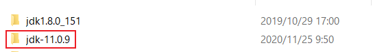
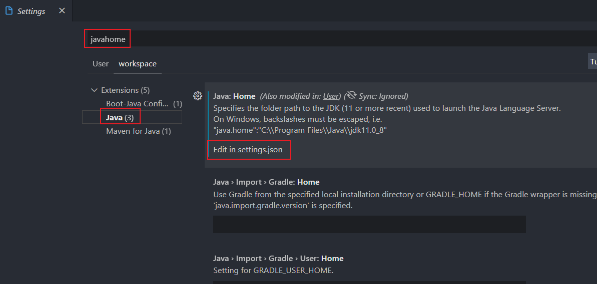
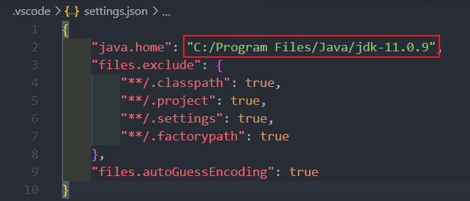
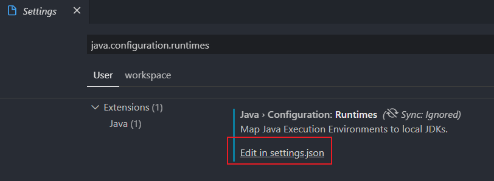
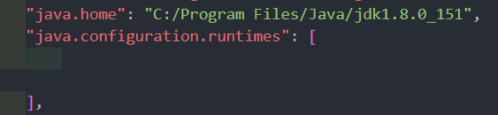

==Vs Code显示"Java 11 or more recent is required to run the java extension"==。

这是因为`VSCode for Java`依赖于Eclipse JDT.LS服务器，由于[Eclipse平台决定](https://github.com/redhat-developer/vscode-java/wiki/JDK-Requirements#jdk11.requirement)将Java 11作为其2020年9月版本的最低要求，因此需要升级Java 11。

* 下载JDK 11。

Java 11 升级是为了运行 VS Code for Java，更具体地说，它是运行 Language Server for Java 扩展的要求。但这不意味项目也需要升级到 Java 11 。也就是说可以继续使用 1.5 或更高版本开发项目。项目使用的 JDK 和运行 VS Code for Java 的 JDK 是分别通过 java.configuration.runtimes和 java.home 来进行配置的。

* 打开Vs Code打开“设置”并搜索 `javahome`。

* 编辑`workspace`下的`settings.json`。

* 重启Vs Code，会看到：

> Security Warning! Do you allow this workspace to set the java.home variable? java.home: C://Program Files//Java//jdk-11.0.9.

点击允许就解决问题了。

* 打开java.configuration.runtimes配置项目JDK。

查看`User`下的`setting.json`：

也就是说，**用户设置**jdk仍是jdk 8，它应用于所有打开的任何VS Code 项目，即所有项目仍默认使用Java 8编译项目。

而最上面的**工作区设置** 存储在 `.vscode` 文件夹中，jdk设置为jdk 11，它仅在此项目所打开的工作区适用，用于运行`VsCode For Java`。