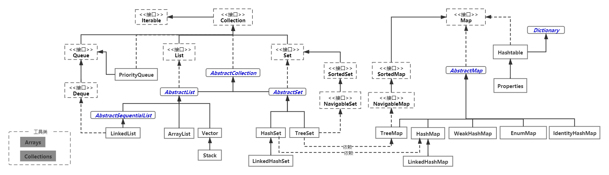
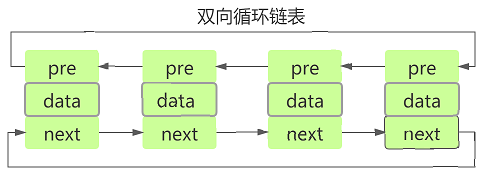
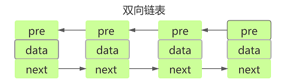
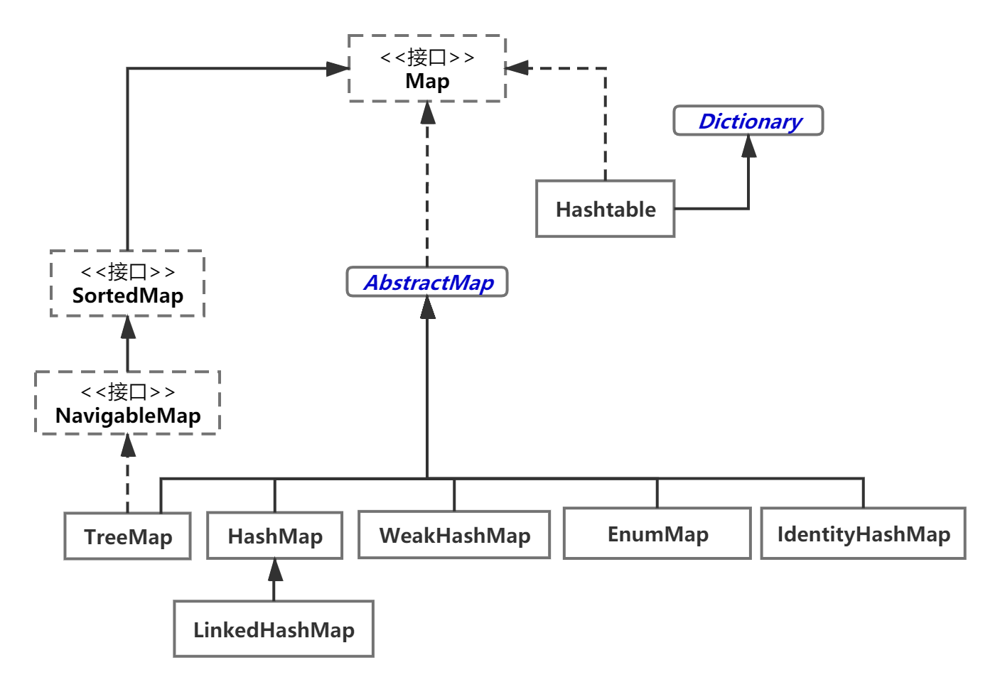
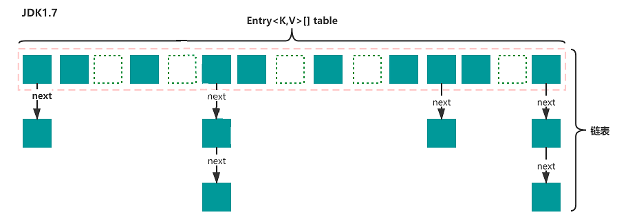
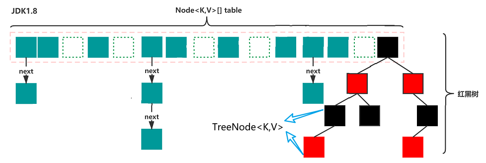
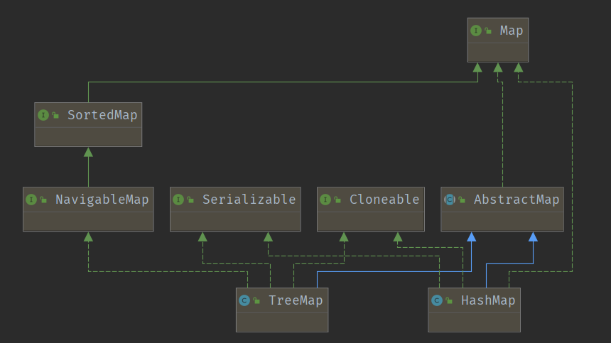
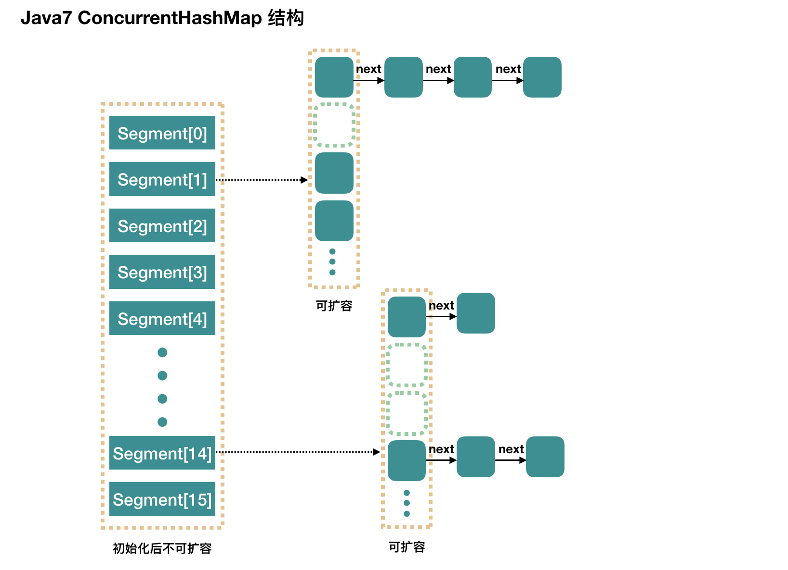

<!-- MarkdownTOC -->
- [谈谈你对集合框架的理解](#谈谈你对集合框架的理解)
  - [List、Set与Map区别](#listset与map区别)
  - [有哪些集合是线程不安全的？怎么解决呢？](#有哪些集合是线程不安全的怎么解决呢)
- [Collection子接口之List](#collection子接口之list)
  - [ArrarList](#arrarlist)
    - [ArrayList实现了序列化接口，为什么很多字段还被transient修饰？](#arraylist实现了序列化接口为什么很多字段还被transient修饰)
    - [ArrayList扩容机制](#arraylist扩容机制)
    - [ArrayList和Vector区别](#arraylist和vector区别)
    - [Array与ArrayList区别](#array与arraylist区别)
  - [LinkedList](#linkedlist)
    - [LinkedList为什么采用双向链表](#linkedlist为什么采用双向链表)
  - [ArrayList与LinkedList区别](#arraylist与linkedlist区别)
- [Collection子接口之Set](#collection子接口之set)
  - [HashSet、TreeSet与LinkedHashSet区别](#hashsettreeset与linkedhashset区别)
  - [HashSet是如何保证数据不重复](#hashset是如何保证数据不重复)
- [Map接口](#map接口)
  - [HashMap底层实现](#hashmap底层实现)
    - [JDK1.7之前](#jdk17之前)
    - [JDK1.8之后](#jdk18之后)
  - [tableSizeFor(int cap)初始化容量时，为什么计算式为`cap - 1`](#tablesizeforint-cap初始化容量时为什么计算式为cap---1)
  - [为什么大部分 hashcode 方法使用 31](#为什么大部分-hashcode-方法使用-31)
  - [HashMap为什么使用扰动函数](#hashmap为什么使用扰动函数)
  - [HashMap的长度为什么是 2 的幂次方](#hashmap的长度为什么是-2-的幂次方)
  - [HashMap的put方法处理流程是什么](#hashmap的put方法处理流程是什么)
  - [HashMap的resize方法的执行过程](#hashmap的resize方法的执行过程)
  - [HashMap多线程操作导致死循环问题](#hashmap多线程操作导致死循环问题)
  - [HashMap有哪几种常见的遍历方式](#hashmap有哪几种常见的遍历方式)
  - [HashMap与HashSet区别](#hashmap与hashset区别)
  - [HashMap与TreeMap区别](#hashmap与treemap区别)
  - [HashMap与Hashtable区别](#hashmap与hashtable区别)
  - [ConcurrentHashMap底层实现](#concurrenthashmap底层实现)
    - [JDK1.7](#jdk17)
    - [JDK1.8](#jdk18)
  - [ConcurrentHashMap的put方法流程？](#concurrenthashmap的put方法流程)
  - [ConcurrentHashMap的put方法如何保证线程安全？](#concurrenthashmap的put方法如何保证线程安全)
  - [ConcurrentHashMap的扩容流程？](#concurrenthashmap的扩容流程)
  - [ConcurrentHashMap与Hashtable区别](#concurrenthashmap与hashtable区别)
  - [不同的Map使用场景与特点](#不同的map使用场景与特点)
- [其他](#其他)
  - [Iterator 怎么使用？有什么特点？](#iterator-怎么使用有什么特点)
  - [Arrays.sort与Collections.sort使用算法](#arrayssort与collectionssort使用算法)
  - [Comparable和Comparator异同](#comparable和comparator异同)
  - [fail-fast机制](#fail-fast机制)
  - [fail-safe机制](#fail-safe机制)

<!-- /MarkdownTOC -->
# 谈谈你对集合框架的理解

什么是集合呢？在数学中，集合就是“由若干个确定的原宿所构成的整体”。例如：

* 有限集合：一个班所有同学构成的集合；
* 无限集合：所有自然数集合（1，2，3，......）

计算机中的集合也就是为了方便处理一组类似的数据。如果一个Java对象能容纳其他Java对象，并对外提供访问接口，那我们就把这个Java对象称为集合。

广义上来说，数组也是一种集合：

```java
String[] ss = new String[10]; // 可以持有10个String对象
ss[0] = "Hello"; // 可以放入String对象
String first = ss[0]; // 可以获取String对象
```

但是，数组在存储数据时，有明显的局限性：

* 数组的长度是固定的。
* 数组只能存储同一类型的基本数据类型值。
* 数组只能按索引顺序存取

因此，Java中提供了集合类（又称容器类）来保存、盛装各种类型的数据。

<div align="center"></div>

> 虚线框为接口，蓝色框为抽象类，黑色实线框为具体实现类。

Collection与Map接口是所有集合框架的父接口，它们常用子接口及其实现类有：

**（1）List**

* `Arraylist`： `Object[]`数组。
* `Vector`：`Object[]`数组。
* `LinkedList`： 双向链表（JDK1.6 之前为循环链表，JDK1.7 取消了循环）。

**（2）Set**

* `HashSet`（无序，唯一）: 基于 `HashMap` 实现的。
* `LinkedHashSet`：`HashSet` 的子类，底层是数组 + 单链表 + 红黑树 + 双向链表的数据结构，内部是通过 `LinkedHashMap` 来实现的。
* `TreeSet`（有序，唯一）： 红黑树（自平衡的排序二叉树），基于`TreeMap`实现的。

**（3）Queue** 

* LinkedList：可以用它来实现双向队列。 
* PriorityQueue：基于堆结构实现，可以用它来实现优先队列。

**（4）Map**

* `HashMap`：散列表，主要存放键值对。底层是数组+链表+红黑树（JDK1.8增加了红黑树部分）的数据结构。
* `LinkedHashMap`： `LinkedHashMap` 继承自 `HashMap`，底层仍然是基于拉链式散列结构。另外，`LinkedHashMap` 在上面结构的基础上，增加了一条双向链表，使得上面的结构能够做到按照插入顺序或者访问顺序进行迭代。
* `Hashtable`： 散列表，主要存放键值对映射。数组+链表组成的，数组是`Hashtable`的主体，链表主要为了解决哈希冲突而存在，能够支持线程同步。
* `TreeMap`： 红黑树（自平衡的排序二叉树）。

## List、Set与Map区别

`List`：存储的元素有序，可重复，List查询快，增删慢。

`Set`：存储的元素无序，不可重复，Set增删快，查询慢。

`Map`：存储键/值对（`key-value`）映射，一个键最多映射一个值。其中key是无序、不可重复的，value是无序、可重复的。

## 有哪些集合是线程不安全的？怎么解决呢？

线程不安全的集合有：`ArrayList、LinkedList、HashMap、HashSet、TreeSet、TreeMap、PriorityQueue`... ...

当要求线程安全时，可以使用 `java.util.concurrent` 包中并发容器替代：

* `ConcurrentHashMap`: 可以看作是线程安全的 `HashMap`。
* `CopyOnWriteArrayList`：可以看作是线程安全的 `ArrayList`，在读多写少的场合性能非常好，远远好于 `Vector`。
* `ConcurrentLinkedQueue`：高效的并发队列，使用链表实现。它可以看做一个线程安全的 `LinkedList`，是一个非阻塞队列。
* `BlockingQueue`: 这是一个接口，JDK 内部通过链表、数组等方式实现了这个接口。表示阻塞队列，非常适合用于作为数据共享的通道。
* `ConcurrentSkipListMap` ：跳表的实现。这是一个`Map`，使用跳表的数据结构进行快速查找。

# Collection子接口之List

## ArrarList

### ArrayList实现了序列化接口，为什么很多字段还被transient修饰？

ArrayList 属性主要由数组长度 size、对象数组 elementData、初始化容量 default_capacity 等组成， 其中初始化容量默认大小为 10。

```java
    //默认初始化容量
    private static final int DEFAULT_CAPACITY = 10;
    //对象数组
    transient Object[] elementData; 
    //数组长度
    private int size;
```

transient 关键字修饰该字段则表示该属性不会被序列化，但 ArrayList 其实是实现了序列化接口，这到底是怎么回事呢？

* 由于 ArrayList 基于数组实现，可以动态扩容，所以并不是所有被分配的内存空间都存储了数据。如果采用外部序列化法实现数组的序列化，会序列化整个数组。ArrayList 为了避免这些没有存储数据的内存空间被序列化，内部提供了两个私有方法 **writeObject 以及 readObject** 来自我完成序列化与反序列化，就可以保证只序列化实际存储的那些元素，而不是整个数组，从而在序列化与反序列化数组时节省了空间和时间。
* 因此使用 transient 修饰数组，是防止对象数组被其他外部方法序列化。

### ArrayList扩容机制

* 有参构造函数
  * 参数等于0，初始化一个容量为0的空数组（`EMPTY_ELEMENTDATA`）；
  * 参数大于0，初始化一个容量为传入参数大小的空数组。
* 无参构造函数
  * 初始化一个未指定容量的空数组（`DEFAULTCAPACITY_EMPTY_ELEMENTDATA`），当调用`add()`方法添加第一个元素，才会将空数组容量扩容至`DEFAULT_CAPACITY=10`；
  * 继续添加元素，当添加元素数量大于10后，调用`grow()`方法进行扩容；
  * `ArrayList`默认扩容大小是原大小的**1.5倍左右**，如果扩容后的容量仍小于最小需求容量，就将数组大小直接调整为最小需求容量大小；如果最小需求容量的值在`MAX_ARRAY_SIZE`和`Integer.MAX_VALUE`之间，那么新数组分配`Integer.MAX_VALUE`大小，否则分配`MAX_ARRAY_SIZE`。

```java
    private void grow(int minCapacity) {//11
        // oldCapacity为旧容量
        int oldCapacity = elementData.length;//10
        // 位移运算符比普通运算符的运算快很多。>>表示将oldCapacity右移一位
        // (oldCapacity >> 1)相当于oldCapacity /2
        // 将新容量更新为旧容量的1.5倍
        int newCapacity = oldCapacity + (oldCapacity >> 1);
        // 若新容量还是小于最小需求容量
        if (newCapacity - minCapacity < 0)
            // 直接最小需求容量当作数组的新容量
            newCapacity = minCapacity;
        // 如果minCapacity大于最大容量，则新容量则为 Integer.MAX_VALUE，
        // 否则，新容量大小则为 MAX_ARRAY_SIZE 即为 Integer.MAX_VALUE - 8。
        // 新容量大于MAX_ARRAY_SIZE,
        if (newCapacity - MAX_ARRAY_SIZE > 0)
            // 执行hugeCapacity()方法
            newCapacity = hugeCapacity(minCapacity);

        elementData = Arrays.copyOf(elementData, newCapacity);
    }

	// 比较minCapacity和MAX_ARRAY_SIZE
    private static int hugeCapacity(int minCapacity) {
        if (minCapacity < 0)
            throw new OutOfMemoryError();

        // minCapacity > MAX_ARRAY_SIZE，新数组的大小为Integer.MAX_VALUE
        // 否则，新数组的大小为MAX_ARRAY_SIZE
        // MAX_ARRAY_SIZE = Integer.MAX_VALUE - 8;
        return (minCapacity > MAX_ARRAY_SIZE) ?
            Integer.MAX_VALUE :
            MAX_ARRAY_SIZE;
    }
```

从上面的分析中可以看出**EMPTY_ELEMENTDATA**与**DEFAULTCAPACITY_EMPTY_ELEMENTDATA**的区别：

* `EMPTY_ELEMENTDATA`表示实例化对象时指定了容量为0，当添加1个元素后，那么`elementData.length=1`。
* `DEFAULTCAPACITY_EMPTY_ELEMENTDATA`表示实例化时是无参构造，未指定容量，在调用add方法添加第1个元素后会默认扩容容量为10，即`elementData.length=10`。

> 上面仅简述了`ArrayList`的扩容机制，详细分析见[`ArrayList`源码分析](https://blog.csdn.net/KAIZ_LEARN/article/details/109555269)

### ArrayList和Vector区别

* 相同点：都是List接口的实现类，底层都使用Object[] 数组存储元素，都能实现动态数组。
* 不同点：`ArrayList`线程不安全，`Vector`线程安全（同步性不一样）；`Vector `在数据满时（加载因子1）增长为原来的两倍（扩容增量：原容量的 2 倍），而 `ArrayList `在数据量达到容量的一半时（加载因子 0.5）增长为原容量的 (1.5倍) 个空间（数据增长不同）。

### Array与ArrayList区别

* **存储数据**：`Array` 可以包含基本类型和引用类型，而`ArrayList` 只能包含引用类型，使用时经常涉及装箱拆箱，对性能有一定损耗。
* **存储容量**：`Array` 大小是固定的，`ArrayList` 可以动态扩容（原先数组1.5倍）。
* **支持操作**：`ArrayList` 最大的优势就是可以将很多数组操作的细节封装起来，比如：`addAll()、removeAll()、iterator()` 等等。
* **使用建议**：对于平时的业务开发，直接使用`ArrayList`就足够了，省事省力。如果是非常底层的开发，比如开发网络框架，这个时候首选数组。

## LinkedList

### LinkedList为什么采用双向链表

JDK1.6 之前LinkedList为双向循环链表；JDK1.7 取消了循环，成了双向链表，其定义了一个 Node 结构，Node 结构中包含了 3 个部分：元素内容 data、前指针 prev 以及后指针 nex

**双向循环链表：** 最后一个节点的 next 指向 head，而 head 的 prev 指向最后一个节点，构成一个环。

<div align="center"> </div>

**双向链表：** 包含两个指针，一个 prev 指向前一个节点，一个 next 指向后一个节点。

<div align="center"> </div>

在 JDK1.7 之后，LinkedList 做了很大的改动，对链表进行了优化。链表的 Entry 结构换成了 Node，内部组成基本没有改变，但 LinkedList 里面的 header 属性去掉了，新增了一个 Node 结构的 first 属性和一个 Node 结构的 last 属性。这样做有以下几点好处：

* first/last 属性能更清晰地表达链表的链头和链尾概念；
* first/last 方式可以在初始化 LinkedList 的时候节省 new 一个 Entry；
* first/last 方式最重要的性能优化是链头和链尾的插入删除操作更加快捷了。

## ArrayList与LinkedList区别

| 异同                           | `ArrayList`                                    | `LinkedList`                                                                      |
| ------------------------------ | ---------------------------------------------- | --------------------------------------------------------------------------------- |
| 是否线程安全                   | 否                                             | 否                                                                                |
| 插入和删除是否受元素位置的影响 | 是                                             | 否                                                                                |
| 是否支持快速随机访问           | 是                                             | 否                                                                                |
| 是否实现了`RandomAccess`接口   | 是                                             | 否                                                                                |
| 底层数据结构                   | 实现了 List 接口，动态Object[] 数组            | 实现了 List 和 Deque 接口，是双向链表（JDK1.6 之前为循环链表，JDK1.7 取消了循环） |
| 内存空间占用                   | 扩容机制导致List列表的结尾会预留一定的容量空间 | 每一个元素都需额外消耗存放后继/前驱的空间                                         |

查看源码我们发现实际上 `RandomAccess` 接口中没有任何方法与定义。可以把`RandomAccess` 接口理解为一个标识， **标识实现这个接口的类具有随机访问功能**。  

```java
public interface RandomAccess {
}
```

这里为什么只有`ArrayList`实现了`RandomAccess`接口呢？主要和它们底层数据结构具体实现相关。

`ArrayList` 底层是数组，而 `LinkedList` 底层是链表。数组天然支持随机访问，时间复杂度为 O(1)，所以称为快速随机访问。链表需要遍历到特定位置才能访问特定位置的元素，时间复杂度为 O(n)，所以不支持快速随机访问。`ArrayList` 实现了 `RandomAccess` 接口，就表明了他具有快速随机访问功能。 `RandomAccess` 接口**只是标识**，并不是说 `ArrayList` 实现 `RandomAccess` 接口才具有快速随机访问功能的！

`LinkedList`采取的是顺序访问方式，iterator中的next()方法，采用的即是顺序访问方法，因此在`LinkedList`中，使用iterator的速度较快。而Iterator 适合访问链式存储结构，因为迭代器是通过next()来定位的，但它也可以访问顺序存储结构的集合。

需要==注意==的是，**ArrayList 的增删未必就是比 LinkedList 要慢**：

* 如果增删都是在末尾来操作（每次调用的都是 `remove()` 和 `add()`），此时 ArrayList 就不需要移动和复制数组来进行操作了。如果数据量有百万级的时，速度是会比 LinkedList 要快的。 
* 如果删除操作的位置是在中间。由于 LinkedList 的消耗主要是在遍历上，ArrayList 的消耗主要是在移动和复制上（底层调用的是 arrayCopy() 方法，是 native 方法）。LinkedList 的遍历速度是要慢于 ArrayList 的复制移动速度的如果数据量有百万级的时，还是 ArrayList 要快。

# Collection子接口之Set

## HashSet、TreeSet与LinkedHashSet区别

* `HashSet `是 Set 接口的主要实现类 ，`HashSet` 的底层是 `HashMap`，线程不安全的，可以存储 null 值；

* `LinkedHashSet` 是 `HashSet `的子类，能够按照添加的顺序遍历；

* `TreeSet` 底层使用红黑树，能够按照添加元素的顺序进行遍历，排序的方式有自然排序和定制排序。

## HashSet是如何保证数据不重复

查看`HashSet`源码，发现`HashSet`的底层其实就是`HashMap`：

```java
    private transient HashMap<E,Object> map;

    // Dummy value to associate with an Object in the backing Map
    private static final Object PRESENT = new Object();

	public boolean add(E e) {
        return map.put(e, PRESENT)==null;
    }
```

上面`集合框架小结`一节中提到，Map中key是无序、不可重复的，value是无序、可重复的。也就是说`HashSet`正是利用了`HashMap`的key不可重复性来保证插入数据的不重复。

那么问题来了，Map又是如何保证数据不重复的呢？查看`HashMap`中添加元素的源码：

```java
    public V put(K key, V value) {
        return putVal(hash(key), key, value, false, true);
    }

    static final int hash(Object key) {
        int h;
        return (key == null) ? 0 : (h = key.hashCode()) ^ (h >>> 16);
    }

    final V putVal(int hash, K key, V value, boolean onlyIfAbsent,
                       boolean evict) {
        Node<K,V>[] tab; Node<K,V> p; int n, i;
        // 步骤1：桶数组未初始化或者长度为0，进行扩容
        if ((tab = table) == null || (n = tab.length) == 0)
            n = (tab = resize()).length;
        // 步骤2：指定桶为空，新生成结点直接放入
        // (n - 1) & hash 计算元素在哪个桶中
        if ((p = tab[i = (n - 1) & hash]) == null)
            tab[i] = newNode(hash, key, value, null);
        // 指定位置已经存在元素
        else {
            Node<K,V> e; K k;
            // 步骤3： 如果桶中第一个元素的key与待插入元素的key相同，保存到e中用于后续修改value值
            if (p.hash == hash &&
                ((k = p.key) == key || (key != null && key.equals(k))))
                    // 将第一个元素赋值给e，用e来记录
                    e = p;
        --- omit ---
    } 
```

> 详细分析可见——[HashMap源码浅析](https://blog.csdn.net/KAIZ_LEARN/article/details/109610942)一文。

上面有两段重要的代码：

片段1：` if ((p = tab[i = (n - 1) & hash]) == null)`

这段代码主要是通过hash计算元素的位置，如果桶中不包含该元素，则直接插入元素，否则返回null。

片段2： `if (p.hash == hash && ((k = p.key) == key || (key != null && key.equals(k)))) e = p;` 

这段代码主要利用`hashcode`与equals进行判断桶中元素是否重复，如果重复则覆盖元素从而保证元素的不重复性。这里的细节是先是左侧用` hashcode` 值作比较，如果发现有相同`hashcode`值的对象，这时再调用`equals()`方法来检查`hashcode`相等的对象是否真的相同。这也再一次提醒我们，当重写`equals()`方法时，一定也要重写`hashCode()`方法。

> `equals()`与`hashcode()`方法的联系可参考—— [==、equals()与hashcode()的区别和联系](https://blog.csdn.net/KAIZ_LEARN/article/details/113704826)一文。

# Map接口

<div align="center"> </div>

## HashMap底层实现

### JDK1.7之前

JDK1.7  `HashMap` 底层是 **数组和链表** 结合在一起使用也就是 **链表散列**。`HashMap` 通过 key 的 `hashCode` 经过扰动函数处理过后得到 hash 值，然后通过 `(n - 1) & hash `判断当前元素存放的位置（这里的 n 指的是数组的长度），如果当前位置存在元素的话，就判断该元素与要存入的元素的 hash 值以及 key 是否相同，如果相同的话，直接覆盖，不相同就通过拉链法解决冲突。`HashMap`桶的初始容量为16，加载因子为0.75，桶中链表结构转化为红黑树对应的数组的最小容量为64。

所谓 **“拉链法”** 就是：将链表和数组相结合。也就是说创建一个链表数组，数组中每一格就是一个链表。若遇到哈希冲突，则将冲突的值加到链表中即可。

<div align="center"> </div>

### JDK1.8之后

众所周知，数组的查询效率为O(1)，链表的查询效率是O(n)，红黑树的查询效率是O(log n)，n为桶中的元素个数。

所有当位于链表中的结点过多，显然通过key值依次查找效率就太低了。因此JDK 1.8在解决哈希冲突时有了较大的变化，**当链表长度大于阈值（默认为8）时，将链表转化为红黑树**，以提高查询效率（将链表转换成红黑树前会判断，如果当前数组的长度小于 64，那么会选择先进行数组扩容，而不是转换为红黑树）。

也就是说，JDK 1.8之后，`HashMap`底层数据结构是**数组+链表+红黑树**。

<div align="center"> </div>

> `TreeMap`、`TreeSet` 以及 JDK1.8 之后的 `HashMap`底层都用到了红黑树。红黑树就是为了解决二叉查找树的缺陷，因为二叉查找树在某些情况下会退化成一个线性结构。

## tableSizeFor(int cap)初始化容量时，为什么计算式为`cap - 1`

> 下面的分析都默认为JDK 1.8

`tableSizeFor(int cap)` 静态方法是用来**计算合理的初始容量，返回大于等于参数 cap的最小 2 次幂**。

```java
// 返回大于cap的最小的二次幂数值
static final int tableSizeFor(int cap) {
    int n = cap - 1;
    //  >>> 无符号右移，忽略符号位，空位都以0补齐。对于正数移位来说等同于：>>。
    n |= n >>> 1;
    n |= n >>> 2;
    n |= n >>> 4;
    n |= n >>> 8;
    n |= n >>> 16;
    // n<0返回1
    // n>最大容量，返回最大容量MAXIMUM_CAPACITY
    // 否则返回n+1
    return (n < 0) ? 1 : (n >= MAXIMUM_CAPACITY) ? MAXIMUM_CAPACITY : n + 1;
}
```

**这里为什么` cap - 1`呢？**先来分析有关n位操作部分：

假设n的二进制为01xxx...xxx。

对n右移1位：001xx...xxx，再位或：011xx...xxx（1 与 `0 或1 `位或的结果都为 1）

对n右移2为：00011...xxx，再位或：01111...xxx

... ...

同理，如果有8个1，右移8位肯定会让后八位也为1。综上可得，该算法让最高位的1后面的位全变为1。

最后再让结果n+1，即得到了2的整数次幂的值了。

回过头再来看`int n = cap - 1;`，就明白用`cap-1`赋值给n是**为了找出大于或等于原值的目标值**。

例如，二进制数0100，即4。如果不进行减1操作，通过运算会等到1000，即8，直接翻倍了，不符合结果。进行减1操作后，二进制数为0011，再进行运算会得到0100，即4。

## 为什么大部分 hashcode 方法使用 31

之所以使用 31， 是因为他是一个奇素数。如果乘数是偶数，并且乘法溢出的话，信息就会丢失，因为与2相乘等价于移位运算（低位补0）。选择质数的优势并不是特别的明显，但这是一个传统。 同时，数字31有个很好的性能，即用移位和减法来代替乘法，可以得到更好的性能： `31 * i == (i << 5）- i`， 现代的 JVM 可以自动完成这种优化。

此外，选择系数的时候要选择尽量长的系数并且让乘法尽量不要溢出的系数，因为如果计算出来的hash地址越大，所谓的“冲突”就越少，查找起来效率也会提高。使用31的原因可能是为了更好的分配hash地址，并且31只占用`5bits`！在java乘法中如果数字相乘过大会导致溢出的问题，从而导致数据的丢失，而31则是素数（质数）而且不是很长的数字，最终它被选择为相乘的系数的原因。

## HashMap为什么使用扰动函数

HashMap先是通过**扰动函数**`hash(Object key)`处理key的`hashCode`而得到其hash 值，然后通过**桶下标计算公式** `(n - 1) & hash` 判断当前元素存放的位置（这里的 n 指的是数组的长度）。

所谓扰动函数指的就是 `HashMap` 的 `hash` 方法。使用 hash 方法也就是扰动函数是为了防止一些实现比较差的 `hashCode() `方法，换句话说使用扰动函数之后可以减少碰撞。

**JDK 1.8 HashMap 的hash方法源码:**

JDK 1.8 的 hash 方法 相比于 JDK 1.7 hash 方法更加简化，但是原理不变。

```java
    // 通过位运算减少 Hash 冲突  
	static final int hash(Object key) {
        int h;
        // key.hashCode()  传入key的散列值
		// 按位异或^，如果相对应位值相同，则结果为0，否则为1        	
        // h ^ (h >>> 16)  高位参与运算
        return (key == null) ? 0 : (h = key.hashCode()) ^ (h >>> 16);
```

对比一下 JDK1.7 的 `HashMap` 的 hash 方法源码.

```java
static int hash(int h) {
    // This function ensures that hashCodes that differ only by
    // constant multiples at each bit position have a bounded
    // number of collisions (approximately 8 at default load factor).

    h ^= (h >>> 20) ^ (h >>> 12);
    return h ^ (h >>> 7) ^ (h >>> 4);
}
```

相比于 JDK1.8 的 hash 方法 ，JDK 1.7 的 hash 方法的性能会稍差一点点，因为毕竟扰动了 4 次。

`key.hashCode()`函数调用的是key键值类型自带的哈希函数`public native int hashCode();`，返回的`hashcode`是`int`类型。如果直接拿散列值做数组下标，那么索引范围就是`‑2147483648`到`2147483648`，前后加起来大概40亿的映射空间，很难出现碰撞。问题是默认的初始容量最大才16，这就说明散列值是不能直接用来访问。

在**JDK1.7**中，散列值使用前需要**对数组长度取模运算**，到的余数才能用来访问数组下标。源码中模运算是在这个`indexFor( )`函数里完成。

```java
bucketIndex = indexFor(hash, table.length);

static int indexFor(int h, int length) {
    // 散列值和数组长度做一个“与”操作
    return h & (length-1);
}
```

位与运算符`&`运算规则是只有**二进制位同时为 1，那么计算结果才为 1，否则为 0**。所有说，“与”操作的结果就是将散列值的高位全部归0，只保留低位值用来做数组下标访问。

以初始长度8为例，8-1=7。2进制表示为00000000 00000000 00000111。与某散列值做“与”操作，结果就是截取了最低4位。

```java
		10100101 11000100 00100101
&		00000000 00000000 00000111
----------------------------------	
		00000000 00000000 00000101
```

在**JDK1.8**中，**putVal()** 中寻址部分如下，原理跟上面一样。

```java
tab[i = (n - 1) & hash]
```

问题来了，就算散列值再松散，总是截取最后几位，碰撞还是会很严重。比如初始长度为16，16-1=15。与某散列值做“与”操作结果跟之前是一样的。**也就是说，`(n - 1) & hash`就是截取hash的最低`m`位（n=2的m次幂）**。

```java
		11110101 10000101 00110100
&		00000000 00000000 00001111
----------------------------------	
		00000000 00000000 00000101
```

这时候，”扰动函数“的价值就体现出来了。

<div align="center">  

</div>

右位移16位，正好是32的一半，自己的高半区与低半区做异或，就是**为了混合原始哈希码的高位与低位，以此来加大低位随机性**。而混合后的低位参杂了高位部分特征，高位信息也参入了寻址计算（进行扰动）。

## HashMap的长度为什么是 2 的幂次方

`HashMap`的长度为什么是 2 的幂次方是为了**减少哈希冲突**以及**加快哈希计算**。

为了能让 `HashMap` 存取高效，尽量较少碰撞，也就是要尽量把数据分配均匀。hash值的范围值`-2147483648` 到 `2147483647`，前后加起来大概 40 亿的映射空间，只要哈希函数映射得比较均匀松散，一般应用是很难出现碰撞的。但问题是一个 40 亿长度的数组，内存是放不下的。所以这个散列值是不能直接拿来用的。用之前还要先做对数组的长度取模运算，得到的余数才能用来要存放的位置也就是对应的数组下标。这个数组下标的计算方法是“ `(n - 1) & hash`”。（n 代表数组长度）。这也就解释了`HashMap`的长度为什么是 2 的幂次方。

我们都知道为了找到 KEY 的位置在哈希表的哪个槽里面，需要计算 **hash(KEY) % 数组长度**，但是**取余(%)操作中如果除数是 2 的幂次则等价于与其除数减一的与(&)操作（也就是说 hash%length==hash&(length-1)的前提是 length 是 2 的 n 次方），同时二进制位操作 &，相对于%运算符运算更快**。还有一个问题是如果采用 % 计算方式，如果hash表length变化那么会导致计算出来的 hash 桶的位置不断变化，数据一致在漂移，影响性能！！这里也同样解释了`HashMap`的长度为什么是 2 的幂次方。

## HashMap的put方法处理流程是什么

put方法中调用了`putVal`方法，传递的参数是hash()方法计算key的hash值，主要逻辑写在`putVal`方法中。

HashMap插入中一个数据插入的整体流程，包括了：计算下标、何时扩容、何时链表转红黑树等，大致如下：

1. 首先进行哈希值的扰动，获取一个新的哈希值。` (key == null) ? 0 : (h = key.hashCode()) ^ (h >>> 16);`

2. 判断tab 桶是否为空或者长度是否为0，如果是则进行扩容操作。

3. 根据哈希值计算下标，如果桶中对应的下标没有存放数据，直接插入即可；如果对应桶中存在数据且与插入数据key相等，则直接覆盖（hash值相等key相等）。`tab[i = (n - 1) & hash]`

4. 如果桶中堆的下标存放数据但与插入的数据key不相同（hash 值相等key不等），则判断桶中 tab[i]是否是一个树节点。如果是树节点，就调用`putTreeVal()`方法将节点插入树中；如果不是树节点，则在链表的尾步插入元素。

5. 如果链表中插入节点的时候，首先需要判断链表长度是否**>=**8，是的话则调用`treeifyBin(tab, hash)`方法把链表转换为红黑树。

   并不是所有链表长度为8后就会转成树，还需要判断存放key值的数组桶长度是否小于`MIN_TREEIFY_CAPACITY=64`，如果小于则优先扩容 tab桶，扩容后链表上的数据会被拆分散列的对应的桶节点上，也就把链表的长度缩短了。

6. 每当插入元素后，HashMap中实际键值对数量 size 都会 `+1`操作，如果`++size > 阈值threshold`，则会再次扩容。

## HashMap的resize方法的执行过程

进行扩容，会伴随着一次重新hash分配，并且会遍历hash表中所有的元素，是非常耗时的。在编写程序中，要尽量避免resize。

有两种情况会调用 resize 方法：

* **table初始化时**。如果使用默认构造方法，则第一次插入元素时初始化为默认值，**容量为16，扩容门槛为12**；如果使用的是非默认构造方法，则第一次插入元素时初始化容量等于扩容门槛，扩容门槛在构造方法里为大于传入容量的**最小2的n次幂**。 
* 当table中元素size > threshold（扩容门槛） 时，table 数组大小翻倍，则**新容量等于旧容量的2倍**。只要不超过最大容量2的30次方，新扩容门槛为旧扩容门槛的2倍。

**每次扩容都会新建一个table，新建的table的大小为原大小的2倍**。

==问题==在于，table扩容后重新计算hash值，往往伴随着链表拆分，这里如何进行的呢？

针对链表的拆分，首先需要明确的是：

* oldCap一定是2的整数次幂, 这里假设是2^m^

* newCap是oldCap的两倍, 则会是2^(m+1)^

* hash对数组大小取模`(n - 1) & hash` 其实就是取hash的低`m`位（上面扰动函数有讲到）

以容量oldCap=16扩展为newCap=32为例：

假如在桶的14位置上有两个hash值：

```java
hash1 =  0000 0000 1101 0000 0000 0000 0000 1110
hash2 =  0000 0000 0000 0000 0000 1111 0001 1110
```

未扩容前桶中位置为：

```java
						16-1  =  0000 0000 0000 0000 0000 0000 0000 1111
 			            hash1 =  0000 0000 1101 0000 0000 0000 0000 1110
(n - 1) & hash          hash2 =  0000 0000 0000 0000 0000 1111 0001 1110
 ------------------------------------------------------------------------
            	  (16-1)&hash1 = 0000 0000 0000 0000 0000 0000 0000 1110
        		  (16-1)&hash2 = 0000 0000 0000 0000 0000 0000 0000 1110 
```

扩容后在桶中位置为：

```java
						32-1  =  0000 0000 0000 0000 0000 0000 0001 1111
 			            hash1 =  0000 0000 1101 0000 0000 0000 0000 1110
(n - 1) & hash          hash2 =  0000 0000 0000 0000 0000 1111 0001 1110
 ------------------------------------------------------------------------
            	  (32-1)&hash1 = 0000 0000 0000 0000 0000 0000 0000 1110 // 1110
        		  (32-1)&hash2 = 0000 0000 0000 0000 0000 0000 0001 1110 // 1110 + 10000 
```

可见，在扩充 HashMap 的时候，不需要重新计算 hash值，只需要检查二进制 hash 中与二进制桶下标中新增的有效位的位置相同的那个位（简称“新增位”）是0还是1即可，是0的话索引没变，是1的话索引变成“原索引+oldCap”。

至于新增位是0还是1，可以认为是随机的，这样就均匀的把之前碰撞的节点分散到新旧桶中。

<div align="center">  

</div>


也就是说，HashMap在扩容时，会将原table中的节点re-hash到新的table中，但节点在新旧table中的位置存在一定联系，**要么下标相同，要么相差一个`oldCap`(原table的大小)**。这里也体现了 HashMap 中容量⼀定的是 2 的整数次幂带来的好处。

## HashMap多线程操作导致死循环问题

> 另外一种问法：为什么HashMap插入元素从头插法改为尾插法？

JDK1.7中，**HashMap采用头插法插入数据，在于并发下的 扩容rehash时会造成元素之间会形成一个循环链表（死链）**。JDK 1.8 后解决了这个问题（变成了尾插法），但是还是不建议大家在多线程下使用 `HashMap`，因为多线程下使用 `HashMap` 还是会存在其他问题比如数据丢失。并发环境下推荐使用 `ConcurrentHashMap `。

实际上，`ConcurrentHashMap` 也会有死循环，不要在`mappingFunction`中再对当前`map`进行更新操作。

>  可参考——[疫苗：JAVA HASHMAP的死循环](https://coolshell.cn/articles/9606.html)一文。

## HashMap有哪几种常见的遍历方式

HashMap 遍历从大的方向来说，可分为以下 4 类：

* 迭代器（Iterator）方式遍历；
* For Each 方式遍历；
* Lambda 表达式遍历（JDK 1.8+）；
* Streams API 遍历（JDK 1.8+）。

但每种类型下又有不同的实现方式，因此具体的遍历方式又可以分为以下 7 种：

1. 使用迭代器（Iterator）EntrySet 的方式进行遍历；
2. 使用迭代器（Iterator）KeySet 的方式进行遍历；
3. 使用 For Each EntrySet 的方式进行遍历；
4. 使用 For Each KeySet 的方式进行遍历；
5. 使用 Lambda 表达式的方式进行遍历；
6. 使用 Streams API 单线程的方式进行遍历；
7. 使用 Streams API 多线程的方式进行遍历。

除了 Stream 的并行循环，其他几种遍历方法的性能差别不大，但从简洁性和优雅性上来看，Lambda 和 Stream 无疑是最适合的遍历方式。从安全性来讲，我们应该使用迭代器提供的 `iterator.remove()` 方法来进行删除，这种方式是安全的在遍历中删除集合的方式，或者使用 Stream 中的 `filter` 过滤掉要删除的数据再进行循环，也是安全的操作方式。

> 可参考——[HashMap 的 7 种遍历方式与性能分析！](https://mp.weixin.qq.com/s/Zz6mofCtmYpABDL1ap04ow)一文。

## HashMap与HashSet区别

`HashSet`底层就是基于`HashMap`实现的。（`HashSet`的源码非常非常少，因为除了 `clone()`、`writeObject()`、`readObject()`是 `HashSet` 自己不得不实现之外，其他方法都是直接调用 `HashMap`中的方法。

| 异同           | `HashMap`                     | `HashSet`                                                                                                |
| -------------- | ----------------------------- | -------------------------------------------------------------------------------------------------------- |
| 实现接口       | 实现了 Map 接口               | 实现 Set 接口                                                                                            |
| 存储对象       | 存储键值对                    | 仅存储对象                                                                                               |
| 获取`hashcode` | 使用键（Key）计算 `hashcode`  | 使用成员对象来计算`hashcode`，对于两个对象来说`hashcode` 可能相同，所以 equals()方法用来判断对象的相等性 |
| 如何添加元素   | 调用 `put()`向 map 中添加元素 | 调用 `add()`方法向 Set 中添加元素                                                                        |

## HashMap与TreeMap区别

`TreeMap` 和`HashMap` 都继承自`AbstractMap` ，但是需要注意的是`TreeMap`它还实现了`NavigableMap`接口和`SortedMap` 接口。

<div align="center"> </div>

实现 `NavigableMap` 接口让 `TreeMap` 有了对集合内元素的搜索的能力，实现`SortMap`接口让 `TreeMap` 有了对集合中的元素根据键排序的能力，**默认是按键值的升序排序**，也可以指定排序的比较器，当用Iterator遍历TreeMap时，得到的记录是排过序的。也就是说，**相比于`HashMap`来说 `TreeMap` 主要多了对集合中的元素根据键排序的能力以及对集合内元素的搜索的能力**。

在使用TreeMap时，key必须实现Comparable接口或者在构造TreeMap传入自定义的Comparator，否则会在运行时抛出`java.lang.ClassCastException`类型的异常。底层数据结构是红黑树。

## HashMap与Hashtable区别

| 异同                         | `HashMap`                                                                                                                                        | `Hashtable`                                                                                                             |
| ---------------------------- | ------------------------------------------------------------------------------------------------------------------------------------------------ | ----------------------------------------------------------------------------------------------------------------------- |
| 线程是否安全                 | 否                                                                                                                                               | 是，内部的方法基本都经过`synchronized` 修饰。                                                                           |
| 效率                         | 稍微比`Hashtable`高一点                                                                                                                          | 效率低                                                                                                                  |
| 对null key和null value的支持 | 可以存储 null 的 key 和 value，但null作为键只能有一个，null作为值可以有多个。                                                                    | 不允许有 null 键和 null 值，否则会抛出`NullPointerException`。                                                          |
| 始容量大小和每次扩充容量大小 | 创建时指定容量大小：扩充为大于指定值的最小 2 的幂次方大小。<br/>创建时不指定容量大小：默认的初始化大小为 16。之后每次扩充，容量变为原来的 2 倍。 | 创建时指定容量大小：扩充为指定值大小。<br/>创建时不指定容量大小：默认的初始大小为 11，之后每次扩充，容量变为原来的 2n+1 |

## ConcurrentHashMap底层实现

### JDK1.7

<div align="center"> </div>

Java 7 中 `ConcurrentHashMap` 的存储结构如上图，`ConcurrnetHashMap` 由很多个 Segment  组合，而每一个 Segment 是一个类似于` HashMap` 的结构，是一种数组和链表结构，可以进行扩容。一个Segment里包含一个 `HashEntry`数组，每个`HashEntry`是一个链表结构的元素，每个Segment 守护着一个`HashEntry`数组里的元素，当对`HashEntry`数组的数据进行修改时，必须首先获得与它对应的**Segment锁**。但是 Segment 的个数一旦**初始化就不能改变**，默认 Segment 的个数是 16 个，可以认为 `ConcurrentHashMap` 默认支持最多 16 个线程并发。

Segment 实现了` ReentrantLock`，以 Segment 是一种可重入锁，扮演锁的角色。`HashEntry` 用于存储键值对数据。

```java
static class Segment<K,V> extends ReentrantLock implements Serializable {
}
```

### JDK1.8

<div align="center"> </div>

可以发现 Java8 的` ConcurrentHashMap ` 相对于 Java7 来说变化比较大，不再是之前的 **Segment 数组 + HashEntry 数组 + 链表**，而是 **Node 数组 + 链表 / 红黑树**。当其中链表长度超过一定阈值（8）时将链表（寻址时间复杂度为 O(N)）转换为红黑树（寻址时间复杂度为 O(log(N))）。

`ConcurrentHashMap `取消了 Segment 分段锁，**采用 CAS 和 synchronized** 来保证并发安全。数据结构跟 HashMap1.8 的结构类似，数组+链表/红黑二叉树。synchronized 只锁定当前链表或红黑二叉树的首节点，这样只要 hash 不冲突，就不会产生并发，效率又提升 N 倍。

## ConcurrentHashMap的put方法流程？

1. key为null或者value为null，抛出空指针异常；
2. for死循环，为了实现CAS的无锁化更新。如果table为null或者table的长度为0，则初始化table，调用initTable()方法（第一次put数据，调用默认参数实现，其中重要的sizeCtl参数）。
3. 计算hash值，计算索引值。
4. 通过tableAt()方法找到位置`tab[i]`的Node，当Node为null时为没有hash冲突的话，使用casTabAt()方法CAS操作将元素插入到Hash表中，ConcurrentHashmap使用CAS无锁化操作，这样在高并发hash冲突低的情况下，性能良好。
5. 发生hash冲突，也没有扩容的情况下，synchronized锁住Node，遍历链表，如果是红黑树就插入红黑树。
6. 放置结束后，退出synchronized。
7. 检查binCount，如果大于`TREEIFY_THRESHOLD = 8`则进行treeifyBin操作尝试将该链表转换为红黑树。
8. addCount方法决定是否扩容。

## ConcurrentHashMap的put方法如何保证线程安全？

1. 第一次put的时候，调用initTable方法，使用sizeCtl参数作为控制标志的作用，当在插入元素时，才会初始化Hash表。
   * 如果sizeCtl<0，说明有现成初始化，当前线程便放弃初始化操作；
   * 否则讲sizeCtl置为`-1`，Hash表进行初始化。

2. 不存在hash冲突的时候，直接CAS去操作结点；
3. 存在hash冲突的时候，先把当前节点使用关键字`synchronized`加锁，然后再使用`tabAt()`原子操作判断下有没有线程对数组进行了修改，最后再进行其他操作。

> sizeCtl的作用：
>
> - 多线程之间，以volatile的方式读取sizeCtl属性，来判断ConcurrentHashMap当前所处的状态。（初始化和扩容状态）
>
> - 通过cas设置sizeCtl属性，告知其他线程ConcurrentHashMap的状态变更。
>
> get的流程不需要上锁：
>
> * 因为值和next结点都是volatile修饰的，具有可见性，并且读数据不会影响扩容，因为不需要加锁。

## ConcurrentHashMap的扩容流程？

1. 线程执行put操作，发现容量已经达到扩容阈值，需要进行扩容操作，例如此时`transferindex=tab.length=32`；
2. 扩容线程A以CAS的方式修改`transferindex=31-16=16` ，然后按照降序迁移table[31]至table[16]这个区间的hash桶(逆序遍历扩容)
3. 迁移hash桶时，如果不是null和占位符，需要上锁synchronized，会将桶内的链表或者红黑树，按照一定算法（`hash值>`0为链表，等于`-2`为红黑树），拆分成2份，将其插入`nextTable[i]`和`nextTable[i+n]`（n是table数组的长度） 迁移完毕的hash桶，会被设置成`ForwardingNode`节点，以此告知访问此桶的其他线程，此节点已经迁移完毕。
4. 此时线程2访问到了`ForwardingNode`节点，如果线程2执行的put或remove等写操作，那么就会先帮其扩容。如果线程2执行的是get等读方法，则会调用`ForwardingNode`的find方法，去nextTable里面查找相关元素。

## ConcurrentHashMap与Hashtable区别

`ConcurrentHashMap`和 `Hashtable`的区别主要体现在实现线程安全的方式上不同。

- **底层数据结构：** JDK1.7 的 `ConcurrentHashMap` 底层采用 **分段的数组+链表** 实现，JDK1.8 采用的数据结构跟 HashMap1.8 的结构一样，数组+链表/红黑二叉树。`Hashtable`和 JDK1.8 之前的 `HashMap `的底层数据结构类似都是采用 **数组+链表** 的形式，数组是 `HashMap` 的主体，链表则是主要为了解决哈希冲突而存在的；
- **实现线程安全的方式（重要）：** ① **在 JDK1.7 的时候，`ConcurrentHashMap`（分段锁）** 对整个桶数组进行了分割分段(Segment)，每一把锁只锁容器其中一部分数据，多线程访问容器里不同数据段的数据，就不会存在锁竞争，提高并发访问率。 **到了 JDK1.8 的时候已经摒弃了 Segment 的概念，而是直接用 Node 数组+链表+红黑树的数据结构来实现，并发控制使用 synchronized 和 CAS 来操作。（JDK1.6 以后 对 synchronized 锁做了很多优化）** 整个看起来就像是优化过且线程安全的 HashMap，虽然在 JDK1.8 中还能看到 Segment 的数据结构，但是已经简化了属性，只是为了兼容旧版本；② **Hashtable(同一把锁)** :使用 synchronized 来保证线程安全，效率非常低下。当一个线程访问同步方法时，其他线程也访问同步方法，可能会进入阻塞或轮询状态，如使用 put 添加元素，另一个线程不能使用 put 添加元素，也不能使用 get，竞争会越来越激烈效率越低。

> 虽然 ConcurrentHashMap 的整体性能要优于 Hashtable，但在某些场景中，ConcurrentHashMap 依然不能代替 Hashtable。例如，在强一致的场景中 ConcurrentHashMap 就不适用，原因是 ConcurrentHashMap 中的 get、size 等方法没有用到锁，ConcurrentHashMap 是弱一致性的，因此有可能会导致某次读无法马上获取到写入的数据。

## 不同的Map使用场景与特点

| 类                | 介绍                                                                                                                          | 应用场景                         |
| ----------------- | ----------------------------------------------------------------------------------------------------------------------------- | -------------------------------- |
| Hashtable         | 线程安全的Map，通过synchronized实现线程安全                                                                                   | 基本不使用，除非需要保证强一致性 |
| ConcurrentHashMap | 线程安全的Map，通过在synchronized + CAS实现线程安全                                                                           | 需要保证线程安全的场景下使用     |
| LinkedHashMap     | 能记录访问顺序或插入顺序的Map，通过head、tail属性维护有序双向链表，通过Entry的after、before属性维护节点顺序                   | 需要记录访问顺序或插入顺序       |
| TreeMap           | 通过实现Comparator实现自定义顺序的Map，如果没有指定Comparator则会按key的升序排序，key如果没有实现Comparable接口，则会抛出异常 | 需要自定义排序                   |
| HashMap           | 最通用的Map，非线程安全、无序                                                                                                 | 无特殊需求可使用                 |

# 其他

## Iterator 怎么使用？有什么特点？

迭代器是⼀种设计模式，它是⼀个对象，它可以遍历并选择序列中的对象，而开发⼈员不需要了解该序列的底层结构。迭代器通常被称为“轻量级”对象，因为创建它的代价小。Java 中的 Iterator 功能比简单，并且只能单向移动：　　 

1. 使用方法 iterator() 要求容器返回⼀个 Iterator。第⼀次调用 Iterator 的 next() 方法时，它返回序列的第⼀个元素。注意：iterator() 方法是 java.lang.Iterable 接口，被 Collection 继承。　　
2. 使用 next() 获得序列中的下⼀个元素。　
3. 使用 hasNext() 检查序列中是否还有元素。　　
4. 使用 remove() 将迭代器新返回的元素删除。　

**Iterator 和 ListIterator 有什么区别？** 

Iterator 可用来遍历 Set 和 List 集合，但是 ListIterator 只能用来遍历 List。Iterator 对集合只能是前向遍历， ListIterator 既可以前向也可以后向。ListIterator 实现了 Iterator 接口，并包含其他的功能，⽐如：增加元素，替 换元素，获取前⼀个和后⼀个元素的索引等等。

**Iterator 和 Enumeration 接口的区别？** 

与 Enumeration 相比，Iterator 更加安全，因为当⼀个集合正在被遍历的时候，它会阻⽌其它线程去修改集合。 否则会抛出 ConcurrentModificationException 异常。这其实就是 fail-fast 机制。具体区别有三点：

1. Iterator 的方法名比 Enumeration 更科学；
2. Iterator 有 fail-fast 机制，比 Enumeration 更安全； 
3. Iterator 能够删除元素，Enumeration 并不能删除元素。

## Arrays.sort与Collections.sort使用算法

`Collections.sort`方法底层就是调用的`Arrays.sort`方法。`Arrays.Sort`方法所用的排序算法主要涉及以下三种：双轴快速排序（`DualPivotQuicksort`）、归并排序（`MergeSort`)和`TimSort`，也同时包含了一些非基于比较的排序算法：计数排序。其**具体最终使用哪一种排序算法通常根据类型以及输入长度来动态抉择**。

- 输入数组类型为基础类型时，采用**双轴快速排序，辅以计数排序**；

- 输入数组类型为包装类型时，采用**归并排序或TimSort**（除非经过特殊的配置，否则默认采用TimSort）

Java在实现`DualPivotQuickSort`时，并未盲目使用双轴快速排序，而是**基于输入长度选取排序算法**。

（1）针对**int、long、float、double四种类型**，跟据长度选取的排序算法如下：

- 当待排序数目小于**47**，采用**插入排序**
- 当待排序数目小于**286**，采用**双轴快排**
- 当待排序数目大于**286**，采用**归并排序**

（2）针对**short、char两种类型**，根据长度选取的排序算法如下：

- 当待排序数目小于**3200**，采用**标准双轴快排**
- 当待排序数目大于**3200**，采用**计数排序（CountingSort）**

（3）针对**byte类型**，根据长度选取的排序算法如下：

- 当待排序数目小于**29**，采用**插入排序**；
- 当待排序数目大于**29**，采用**计数排序（CountingSort）**

## Comparable和Comparator异同

Comparable是排序接口，若一个类实现了Comparable接口，就意味着“该类支持排序”；而Comparator是比较器，我们若需要控制某个类的次序，可以建立一个“该类的比较器”来进行排序。

不难发现：**Comparable相当于“内部比较器”，而Comparator相当于“外部比较器”**。

| 比较     | Comparable                             | Comparator                           |
| -------- | -------------------------------------- | ------------------------------------ |
| 排序逻辑 | 排序逻辑必须在待排序类中实现，自然排序 | 排序逻辑在待排序类外部实现，定制排序 |
| 排序方法 | `public int compareTo(T o);`           | `int compare(T o1, T o2);`           |
| 包       | `java.lang`                            | `java.util`                          |
| 优点     | 实现简单                               | 耦合性好，易维护                     |

## fail-fast机制

**快速失败(fail-fast)** 是 Java 集合的一种错误检测机制。**在使用迭代器对集合进行遍历的时候，我们在多线程下操作非安全失败(fail-safe)的集合类可能就会触发 fail-fast 机制，导致抛出 `ConcurrentModificationException` 异常。**

举个例子：多线程下，如果线程 1 正在对集合进行遍历，此时线程 2 对集合进行修改（增加、删除、修改），或者线程 1 在遍历过程中对集合进行修改，都会导致线程 1 抛出 `ConcurrentModificationException` 异常。

**为什么呢？**

每当迭代器使用 `hashNext()`/`next()`遍历下一个元素之前，都会检测 `modCount` 变量是否为 `expectedModCount` 值，是的话就返回遍历；否则抛出异常，终止遍历。

如果我们在集合被遍历期间对其进行修改的话，就会改变 `modCount` 的值，进而导致 `modCount != expectedModCount` ，进而抛出 `ConcurrentModificationException` 异常。

> 注：通过 `Iterator` 的方法修改集合的话会修改到 `expectedModCount` 的值，所以不会抛出异常。

```java
final void checkForComodification() {
    if (modCount != expectedModCount)
        throw new ConcurrentModificationException();
}
```

特别注意的是，并不是只有在多线程中才会出现fail-fast事件。**在单线程下，如果遍历过程中对集合对象的内容进行了修改的话也会触发 fail-fast 机制**。

> 注：增强 for 循环也是借助迭代器进行遍历。

阿里巴巴手册有相关规定：不要在 `foreach` 循环里进行元素的`remove/add`操作。remove 元素请使用 Iterator方式，如果并发操作，需要对 Iterator 对象加锁。

```java
	// 正例
	List<String> list = new ArrayList<>(); 
	list.add("1"); 
	list.add("2"); 
	Iterator<String> iterator = list.iterator(); 
	while (iterator.hasNext()) { 
		String item = iterator.next(); 
		if (删除元素的条件) { 
			iterator.remove(); 
		} 
	}

	// 反例
	for (String item : list) { 
		if ("1".equals(item)) { 
			list.remove(item); 
		} 
	}
```

## fail-safe机制

明白了快速失败(fail-fast)之后，安全失败(fail-safe)就很好理解了。采用安全失败机制的集合容器，在遍历时不是直接在集合内容上访问的，而是先复制原有集合内容，在拷贝的集合上进行遍历。所以，在遍历过程中对原集合所作的修改并不能被迭代器检测到，故不会抛 `ConcurrentModificationException` 异常。
