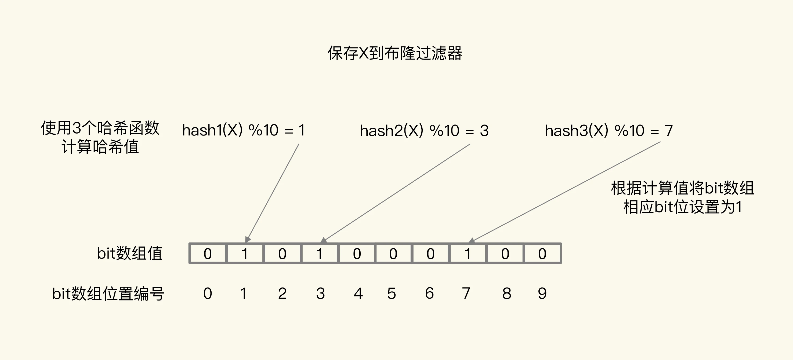

<!-- MarkdownTOC -->

- [Redis 基础](#redis-基础)
  - [什么是 Redis ？](#什么是-redis-)
  - [Redis 有什么优缺点？](#redis-有什么优缺点)
  - [Redis 与 Memcached 异同？](#redis-与-memcached-异同)
  - [Redis 为什么这么快？](#redis-为什么这么快)
  - [Redis 应用场景？](#redis-应用场景)
  - [Redis 支持的 Java 客户端都有哪些？](#redis-支持的-java-客户端都有哪些)
  - [Redis 底层数据结构有哪些？](#redis-底层数据结构有哪些)
    - [String](#string)
    - [List](#list)
    - [Hash](#hash)
    - [Set](#set)
    - [Sorted Set](#sorted-set)
  - [Redis 为什么把整数数组/压缩列表作为底层数据结构？](#redis-为什么把整数数组压缩列表作为底层数据结构)
  - [Redis 高级数据结构有哪些？](#redis-高级数据结构有哪些)
  - [Redis Hash冲突如何解决？](#redis-hash冲突如何解决)
  - [Redis 线程模型？](#redis-线程模型)
  - [Redis 单线程模型为什么能么快？](#redis-单线程模型为什么能么快)
  - [Redis 单线程模型的阻塞应对方式？](#redis-单线程模型的阻塞应对方式)
- [Redis 进阶](#redis-进阶)
  - [宕机了，Redis 如何避免数据丢失与实现快速恢复？](#宕机了redis-如何避免数据丢失与实现快速恢复)
    - [AOF 日志](#aof-日志)
    - [RDB 快照](#rdb-快照)
  - [Redis 持久化方式的选择？](#redis-持久化方式的选择)
  - [Redis 主从库如何实现数据一致？](#redis-主从库如何实现数据一致)
  - [Redis 主库挂了怎么办？](#redis-主库挂了怎么办)
  - [Redis 哨兵挂了怎么办?](#redis-哨兵挂了怎么办)
  - [Redis 主从同步与故障切换有哪些坑？](#redis-主从同步与故障切换有哪些坑)
  - [Redis 淘汰策略有哪些？](#redis-淘汰策略有哪些)
  - [如何解决缓存和数据库不一致问题？](#如何解决缓存和数据库不一致问题)
  - [什么是缓存穿透、击穿、雪崩？](#什么是缓存穿透击穿雪崩)
    - [如果避免缓存”穿透”的问题？](#如果避免缓存穿透的问题)
    - [如果避免缓存”击穿”的问题？](#如果避免缓存击穿的问题)
    - [如何避免缓存”雪崩”的问题？](#如何避免缓存雪崩的问题)
- [Redis 实践](#redis-实践)
  - [Redis 如何应对并发访问？](#redis-如何应对并发访问)
  - [如何用 Redis 实现消息队列？](#如何用-redis-实现消息队列)
  - [如何使用 Redis 实现分布式锁？](#如何使用-redis-实现分布式锁)
  - [Redis 能实现ACID属性(事务)吗？](#redis-能实现acid属性事务吗)
  - [什么是 Redis 分区？](#什么是-redis-分区)
  - [Redis 集群都有哪些方案？](#redis-集群都有哪些方案)
    - [纵向扩展 VS 横向扩展](#纵向扩展-vs-横向扩展)
    - [Redis Cluster方案](#redis-cluster方案)
    - [Codis 方案](#codis-方案)
    - [Redis Cluster VS Codis](#redis-cluster-vs-codis)
  - [Redis 主从集群发生脑裂怎么办？](#redis-主从集群发生脑裂怎么办)

<!-- /MarkdownTOC -->
# Redis 基础

## 什么是 Redis ？

REmote DIctionary Server（Redis）是一个由 Salvatore Sanfilippo 写的 key-value 存储系统 。Redis 是一个开源的使用 ANSI C 语言编写、遵守 BSD 协议、支持网络、可基于内存亦可持久化 的日志型、Key-Value 数据库，并提供多种语言的 API。

## Redis 有什么优缺点？

Redis的优点有：

* 速度快：Redis 本质上是一个 Key-Value 类型的内存数据库，每秒可以处理超过 10 万次读写操作。
* 支持丰富数据类型：支持 String ，List，Set，Sorted Set，Hash 五种基础的数据结构，在基础的数据结构之上，还提供 Bitmap、HyperLogLog、GEO等高级的数据结构。

* 具有丰富的特性：订阅发布 Pub / Sub 功能、Key 过期策略、事务、支持多个 DB... ...
* 持久化存储：Redis 提供 RDB 和 AOF 两种数据的持久化存储方案。
* 高可用：内置 Redis Sentinel ，提供高可用方案，实现主从故障自动转移；内置 Redis Cluster ，提供集群方案，实现基于槽的分片方案，从而支持更大的 Redis 规模。
* ... ...

Redis 可能存在的“缺点”：

* 由于 Redis 是内存数据库，所以单台机器、存储的数据量跟机器本身的内存大小。虽然 Redis 本身有 Key 过期策略，但是还是需要提前预估和节约内存。如果内存增长过快，需要定期删除数据。
* 如果进行完整重同步，由于需要生成 RDB 文件，并进行传输，会占用主机的 CPU ，并会消耗现网的带宽。不过 Redis2.8 版本，已经有部分重同步的功能，但是还是有可能有完整重同步的。比如，新上线的备机。
* 修改配置文件，进行重启，将硬盘中的数据加载进内存，时间比较久。在这个过程中，Redis 不能提供服务。

## Redis 与 Memcached 异同？

现在公司一般都是用 Redis 来实现缓存，而且 Redis 自身也越来越强大了！不过，了解 Redis 和 Memcached 的区别和共同点，有助于我们在做相应的技术选型的时候，能够做到有理有据！

**共同点** ：

1. 都是基于内存的数据库，一般都用来当做缓存使用。
2. 都有过期策略。
3. 两者的性能都非常高。

**区别** ：

1. **Redis 支持更丰富的数据类型（支持更复杂的应用场景）**。Redis 不仅仅支持简单的 k/v 类型的数据，同时还提供 list，set，zset，hash 等数据结构的存储。Memcached 只支持最简单的 k/v 数据类型。
2. **Redis 支持数据的持久化，可以将内存中的数据保持在磁盘中，重启的时候可以再次加载进行使用,而 Memecache 把数据全部存在内存之中。**
3. **Redis 有灾难恢复机制。** 因为可以把缓存中的数据持久化到磁盘上。
4. **Redis 在服务器内存使用完之后，可以将不用的数据放到磁盘上。但是，Memcached 在服务器内存使用完之后，就会直接报异常。**
5. **Memcached 没有原生的集群模式，需要依靠客户端来实现往集群中分片写入数据；但是 Redis 目前是原生支持 cluster 模式的.**
6. **Memcached 是多线程，非阻塞 IO 复用的网络模型；Redis 使用单线程的多路 IO 复用模型。** （Redis 6.0 引入了多线程 IO ）
7. **Redis 支持发布订阅模型、Lua 脚本、事务等功能，而 Memcached 不支持。并且，Redis 支持更多的编程语言。**
8. **Memcached过期数据的删除策略只用了惰性删除，而 Redis 同时使用了惰性删除与定期删除。**

## Redis 为什么这么快？

1. 绝大部分操作是纯粹的内存操作，非常快速； 
2. 使用全局哈希表存储键-值，可以存储丰富的数据结构。例如，压缩表对短数据进行压缩存储，跳表使用有序的数据结构加快读取的速度；
3. 网络IO和键值读写 采用单线程方式，避免了多线程的频繁上下文切换问题；
4. 使用多路 I/O 复用模型，非阻塞 IO，实现高吞吐率。

## Redis 应用场景？

**1. 业务数据缓存**（经典用法）

* 通用数据缓存，string，int，list，map 等；
* 实时热数据，最新500条数据；
* 会话缓存，token 缓存等。

**2. 业务数据处理**

* 非严格一致性要求的数据：评论，点击等
* 业务数据去重：订单处理的幂等校验等
* 业务数据排序：排名，排行榜等。

**3. 全局一致计数**

* 全局流控计数
* 秒杀的库存计算
* 抢红包
* 全局 ID 生成

**4. 高效统计计数**

* id 去重，记录访问 ip 等全局 bitmap 操作
* UV、PV 等访问量==>非严格一致性要求

**5. 发布订阅与 Stream**

* Pub-Sub 模拟队列。
* Redis Stream 是 Redis 5.0 版本新增加的数据结构。Redis Stream 主要用于消息队列（MQ，Message Queue。

**6. 分布式锁**（原子性、互斥、超时）

* 获取锁--单个原子性操作：`SET dlock my_random_value NX PX 30000`。
* 释放锁--lua脚本-保证原子性+单线程，从而具有事务性。

```shell
if redis.call("get",KEYS[1]) == ARGV[1] then
  return redis.call("del",KEYS[1])
else
  return 0
end
```

... ...

## Redis 支持的 Java 客户端都有哪些？

使用比较广泛的有三个 Java 客户端：

Redisson：是一个高级的分布式协调 Redis 客服端，基于 Netty NIO，API 线程安全。能帮助用户在分布式环境中轻松实现一些 Java 的对象，有大量丰富的分布式功能特性，比如 JUC 的线程安全集合和工具的分布式版本，分布式的基本数据类型和锁等。

Jedis： Redis 的 Java 实现的客户端，其 API 提供了比较全面的 Redis 命令的支持。Redisson 实现了分布式和可扩展的 Java 数据结构，和 Redisson相比，Jedis 功能较为简单。

Lettuce：可伸缩线程安全的 Redis 客户端。多个线程可以共享同一个 RedisConnection 。它利用优秀 Netty NIO 框架来高效地管理多个连接。

Redis 官方推荐使用 Redisson 或 Jedis 。Spring Boot 2.x 内置支持 Jedis 和 Lettuce 。一般情况下，建议：

- 使用 Spring Data Redis ，提供了透明使用 Jedis 和 Lettuce 的封装。也就是说，大多数时候，我们可以通过配置使用 Jedis 或 Lettuce 进行 Redis 的操作，而上层使用 Spring Data Redis 提供的统一 API 。
- 从目前来说，Jedis 会比 Lettuce 更加流行，并且更加稳定。虽然说 Jedis 有一段时间，不再进行更新，但是突然又开始更新，可能是诈尸了。
- 如果想要更加丰富的特性，例如说分布式锁，布隆过滤器，可以考虑研究下 Redisson 。

## Redis 底层数据结构有哪些？

Redis为何如此突出呢？一方面是因为它是内存数据库，所有操作都在内存上完成，内存的访问速度本身就很快；另一方面，这要归功于它的高效的数据结构。

Redis数据保存方式（即键值对中值）主要有String（字符串）、List（列表）、Hash（哈希）、Set（集合）和 Sorted Set（有序集合）几种类型，这些数据结构的底层数据结构可以由**简单动态字符串、双向链表、压缩列表、哈希表、跳表和整数数组**实现。

<div align="center"> </div>

可以看到，String 类型的底层实现只有一种数据结构，也就是简单动态字符串。而 List、Hash、Set 和 Sorted Set 这四种数据类型，都有两种底层实现结构。通常情况下，我们会把这四种类型称为集合类型，它们的特点是一**个键对应了一个集合的数据**。

底层数据结构的查找时间复杂度如下表：

| 名称     | 时间复杂度 |
| -------- | ---------- |
| 哈希表   | O(1)       |
| 跳表     | O(logN)    |
| 双向链表 | O(N)       |
| 压缩列表 | O(N)       |
| 整数数组 | O(N)       |

集合常见操作的复杂度可总结为：

**单元素操作基本为O(1)**，指每一种集合类型对单个数据实现的增删改查操作。

* Hash 类型的 HGET、HSET 和 HDEL，Set 类型的 SADD、SREM、SRANDMEMBER 等。这些操作的复杂度由集合采用的数据结构决定，例如，HGET、HSET 和 HDEL 是对哈希表做操作，所以它们的复杂度都是 O(1)；Set 类型用哈希表作为底层数据结构时，它的 SADD、SREM、SRANDMEMBER 复杂度也是 O(1)。

**范围操作一般为O(N)**，指集合类型中的遍历操作，可以返回集合中的所有数据。

* 比如 Hash 类型的 HGETALL 和 Set 类型的 SMEMBERS，或者返回一个范围内的部分数据，比如 List 类型的 LRANGE 和 ZSet 类型的 ZRANGE。这类操作的复杂度一般是 O(N)，比较耗时，我们应该尽量避免。

**统计操作只有O(1)**，指集合类型对集合中所有元素个数的记录。

* 例如 LLEN 和 SCARD。这类操作复杂度只有 O(1)，这是因为当集合类型采用压缩列表、双向链表、整数数组这些数据结构时，这些结构中专门记录了元素的个数统计，因此可以高效地完成相关操作。

**例外情况为O(1)**，指某些数据结构的特殊记录，例如压缩列表和双向链表都会记录表头和表尾的偏移量。

* 对于 List 类型的 LPOP、RPOP、LPUSH、RPUSH 这四个操作来说，它们是在列表的头尾增删元素，这就可以通过偏移量直接定位，所以它们的复杂度也只有 O(1)，可以实现快速操作。

------

### String

**介绍**：string 数据结构是简单的 key-value 类型。虽然 Redis 是用 C 语言写的，但是 Redis 并没有使用 C 的字符串表示，而是自己构建了一种 **简单动态字符串**（simple dynamic string，**SDS**）， 简单来说就是三种：`int、string、byte[]`。相比于 C 的原生字符串，Redis 的 SDS 不光可以保存文本数据还可以保存二进制数据，并且获取字符串长度复杂度为 O(1)（C 字符串为 O(N)），除此之外，Redis 的 SDS API 是安全的，不会造成缓冲区溢出。

* 字符串类型是 Redis 中最为基础的数据存储类型，它在 Redis 中是二进制安全的，这便意味着该 类型可以接受任何格式的数据，如 JPEG 图像数据或 json 对象描述信息等。在 Redis 中字符串类 型的 value 最多可以容纳的数据长度是512M

**常用命令**： `set/get/getset/del/exists/append、incr/decr/incrby/decrby` 等等。

**应用场景** ：一般常用在需要计数的场景，比如用户的访问次数、热点文章的点赞转发数量等等。

**注意**：（1）字符串 append：会使用更多的内存（2）整数共享：如果能使用整数，就尽量使用整数，限制了 redis 内存+LRU（3）整数精度问题：redis 大概能保证16~，，17-18位的大整数就会丢失精确。

### List

**介绍** ：**list** 即是 **列表**。链表是一种非常常见的数据结构，特点是易于数据元素的插入和删除并且且可以灵活调整链表长度，但是链表的随机访问困难。许多高级编程语言都内置了链表的实现比如 Java 中的 **LinkedList**，但是 C 语言并没有实现链表，所以 Redis 实现了自己的链表数据结构。Redis 的 list 的实现为一个 **双向链表**，即可以支持反向查找和遍历，更方便操作，不过带来了部分额外的内存开销。

**常用命令:** `lpush/rpush/lrange/lpop/rpop` 等。

**应用场景:** 发布与订阅或者说消息队列、慢查询、FIFO队列。

### Hash

**介绍** ：hash 类似于 JDK1.8 前的 HashMap，内部实现也差不多(数组 + 链表)。不过，Redis 的 hash 做了更多优化。另外，hash 是一个 string 类型的 field 和 value 的映射表，**特别适合用于存储对象**，后续操作的时候，你可以直接仅仅修改这个对象中的某个字段的值。 比如我们可以 hash 数据结构来存储用户信息，商品信息等等。

**常用命令：** `hset/hget/hmset/hmget/hgetall/hdel/hincrby、hexists/hlen/hkeys/hvals` 等。

**应用场景:** 系统中对象数据的存储。

### Set

**介绍 ：** set 类似于 Java 中的 `HashSet` 。Redis 中的 set 类型是一种无序集合，集合中的元素没有先后顺序。当你需要存储一个列表数据，又不希望出现重复数据时，set 是一个很好的选择，并且 set 提供了判断某个成员是否在一个 set 集合内的重要接口，这个也是 list 所不能提供的。可以基于 set 轻易实现交集、并集、差集的操作。比如：你可以将一个用户所有的关注人存在一个集合中，将其所有粉丝存在一个集合。Redis 可以非常方便的实现如共同关注、共同粉丝、共同喜好等功能。这个过程也就是求交集的过程。

**常用命令：** `sadd/srem/smembers/sismember ~ set.add, remove`、` contains,sdiff/sinter/sunion ~ 集合求差集，求交集，求并集` 等。

**应用场景**： 需要存放的数据不能重复以及需要获取多个数据源交集和并集等场景。

### Sorted Set(Zset)

**介绍：** 和 set 相比，sorted set 增加了一个**权重参数 score，使得集合中的元素能够按 score 进行有序排列**，还可以通过 score 的范围来获取元素的列表。有点像是 Java 中 HashMap 和 TreeSet 的结合体。sortedset 中分数是可以重复的。

**常用命令：** `zadd/zcard/zscore/zrange/zrevrange/zrem` 等。

**使用案例**：`zadd key score member score2 member2...` : 将成员以及该成员的分数存放到 sortedset 中

* `zscore key member` : 返回指定成员的分数；
* `zcard key` : 获取集合中成员数量；
* `zrem key member [member...]` : 移除集合中指定的成员，可以指定多个成员； 
* `zrange key start end [withscores]` : 获取集合中脚注为 start-end 的成员，[withscores]参数表 明返回的成员包含其分数； 
* `zrevrange key start stop [withscores]` : 按照分数从大到小的顺序返回索引从 start 到 stop 之间 的所有元素（包含两端的元素） ；
* `zremrangebyrank key start stop` : 按照排名范围删除元素；

**应用场景：** 需要对数据根据某个权重进行排序的场景。比如在直播系统中，实时排行信息包含直播间在线用户列表，各种礼物排行榜，弹幕消息（可以理解为按消息维度的消息排行榜）等信息。

## Redis 为什么把整数数组/压缩列表作为底层数据结构？

**压缩列表**

压缩列表实际上类似于一个数组，数组中的每一个元素都对应保存一个数据。和数组不同的是，压缩列表在表头有三个字段 zlbytes、zltail 和 zllen，分别表示列表长度、列表尾的偏移量和列表中的 entry 个数；压缩列表在表尾还有一个 zlend，表示列表结束。

<div align="center"> </div>

查找定位第一个元素和最后一个元素，可通过表头三个字段的长度直接定位，复杂度是 O(1)；查找其他元素时，复杂度就是 O(N) 。

**引出问题：整数数组和压缩列表在查找时间复杂度方面并没有很大的优势，那为什么 Redis 还会把它们作为底层数据结构呢？**

（1）**内存利用率**：整数数组和压缩列表内存利用紧凑，比链表占用内存小。Redis是内存数据库，大量数据存到内存中，此时需要做尽可能的优化，提高内存的利用率。

（2）**数组对CPU高速缓存支持更友好**。Redis在设计时，集合数据元素较少情况下，默认采用内存紧凑排列的方式存储，同时利用CPU高速缓存不会降低访问速度。当数据元素超过设定阈值后，避免查询时间复杂度太高，转为哈希和跳表数据结构存储，保证查询效率。

## Redis 高级数据结构有哪些？

Redis 还提供了 3 种扩展数据类型，分别是 Bitmap、HyperLogLog 和 GEO。

**Bitmap**：`setbit/getbit/bitop/bitcount/bitpos`

* Bitmap 本身是用 String 类型作为底层数据结构实现的一种统计二值状态的数据类型。String 类型是会保存为二进制的字节数组，所以，Redis 就把字节数组的每个 bit 位利用起来，用来表示一个元素的二值状态。你可以把 Bitmap 看作是一个 bit 数组。由于strings 是二进制安全的 blob，并且它们的最大长度是512m，所以bitmaps能最大设置2^32个不同的 bit。 
* 记录海量数据时，Bitmap 能够有效地节省内存空间。

**HyperLogLog**：`pfadd/pfcount/pfmerge`

* 在 redis 的实现中，您使用标准错误小于1％的估计度量结束。这个算法的神奇在于不再需要与需要统计的项相对应的内存，取而代之，使用的内存一直恒定不变。最坏的情况下只需要12k，就可 以计算接近2^64个不同元素的基数。 
* 是一种用于统计基数的数据集合类型，它的最大优势就在于，当集合元素数量非常多时，它计算基数所需的空间总是固定的，而且还很小。

**Set、Sorted Set、Hash、List、Bitmap、HyperLogLog 的支持情况和优缺点**

<div align="center"> </div>

**GEO**：`geoadd/geohash/geopos/geodist/georadius/georadiusbymember`

* Redis 的 GEO 特性在 Redis3.2版本中推出，这个功能可以将用户给定的地理位置（经度和纬度） 信息储存起来，并对这些信息进行操作。

## Redis Hash冲突如何解决？

**Redis使用了一个哈希表来保存所有的键值对**。一个哈希表，其实就是一个数组，数组的每个元素称为一个哈希桶，每个哈希桶中元素保存的并不是值本身，而是指向具体值的指针。哈希桶中的 entry 元素中保存了`*key`和`*value`指针，分别指向了实际的键和值。

因为这个哈希表保存了所有的键值对，所以，我也把它称为**全局哈希表**，可以用 O(1) 的时间复杂度来快速查找到键值对。

<div align="center"> </div>

当你往哈希表中写入数据越多，两个 key 的哈希值和哈希桶计算对应关系时落在了同一个哈希桶中，这就是所谓的**哈希冲突**。

**解决方法：链式哈希**

跟Java中HashMap存储类似，链式哈希就是指**同一个哈希桶中的多个元素用一个链表来保存，它们之间依次用指针连接**。

> **产生问题**：希冲突链上的元素只能通过指针逐一查找再操作，元素越多查询越慢。

**继续解决：rehash**

rehash 也就是增加现有的哈希桶数量，让逐渐增多的 entry 元素能在更多的桶之间分散保存，减少单个桶中的元素数量，从而减少单个桶中的冲突。

Redis 默认使用了**两个全局哈希表**：哈希表 1 和哈希表 2。一开始，当你刚插入数据时，默认使用哈希表 1，此时的哈希表 2 并没有被分配空间。随着数据逐步增多，Redis 开始执行 rehash，这个过程分为三步：

* 给哈希表 2 分配更大的空间，例如是当前哈希表 1 大小的两倍；
* 把哈希表 1 中的数据重新映射并拷贝到哈希表 2 中；
* 释放哈希表 1 的空间。

> **产生问题**：涉及大量数据拷贝，一次性拷贝完容易造成线程阻塞。

**继续解决：渐进式 rehash**

渐进式 rehash 把一次性大量拷贝的开销，分摊到了多次处理请求的过程中，避免了耗时操作，保证了数据的快速访问。

简单来说就是在第二步拷贝数据时，Redis 仍然正常处理客户端请求，每处理一个请求时，从哈希表 1 中的第一个索引位置开始，顺带着将这个索引位置上的所有 entries 拷贝到哈希表 2 中；等处理下一个请求时，再顺带拷贝哈希表 1 中的下一个索引位置的 entries。

<div align="center"> </div>

> 渐进式rehash执行时，除了根据键值对的操作来进行数据迁移，Redis本身还会有一个定时任务在执行rehash，如果没有键值对操作时，这个定时任务会周期性地（例如每100ms一次）搬移一些数据到新的哈希表中，这样可以缩短整个rehash的过程。

## Redis 线程模型？

**Redis 是单线程，主要是指 Redis 的网络 IO 和键值对读写是由一个线程来完成的，这也是 Redis 对外提供键值存储服务的主要流程**。但 Redis 的其他功能，比如持久化、异步删除、集群数据同步等，其实是由额外的线程执行的。

对于一个系统而言，在在有合理的资源分配的情况下，可以尝试增加线程数量，进而增加系统吞吐率，或是可以增加系统扩展性。那为什么Redis还要采用单线程操作网络IO和键值对读写呢？

* 多线程开发一般会引入同步原语来保护共享资源的并发访问，这也会降低系统代码的易调试性和可维护性，同时会影响系统吞吐率。

> 这是一个线程编程模式面临的共享资源的并发访问控制问题。系统中通常会存在被多线程同时访问的共享资源，比如一个共享的数据结构。为了保证共享资源的正确性，就需要额外的机制进行保证。例如只是简单地采用一个粗粒度互斥锁，即使增加了线程，大部分线程也在等待获取访问共享资源的互斥锁，并行变串行，系统吞吐率并没有随着线程的增加而增加。

## Redis 单线程模型为什么能么快？

Linux 中的 IO 多路复用机制是指一个线程处理多个 IO 流，就是我们经常听到的 select/epoll 机制。简单来说，在 Redis 只运行单线程的情况下，该机制允许内核中，**同时存在多个监听套接字和已连接套接字**。内核会一直监听这些套接字上的连接请求或数据请求。一旦有请求到达，就会交给 Redis 线程处理，这就实现了一个 Redis 线程处理多个 IO 流的效果。

下图就是基于多路复用的 Redis IO 模型。Redis 网络框架调用 epoll 机制，让内核监听这些套接字。此时，Redis 线程不会阻塞在某一个特定的监听或已连接套接字上，也就是说，不会阻塞在某一个特定的客户端请求处理上。正因为此，Redis 可以同时和多个客户端连接并处理请求，从而提升并发性。

<div align="center"> </div>

> FD——多个套接字

为了在请求到达时能通知到 Redis 线程，select/epoll 提供**了基于事件的回调机制，即针对不同事件的发生，调用相应的处理函数**。

* select/epoll 一旦监测到 FD 上有请求到达时，就会触发相应的事件。
* 事件会放进事件队列，Redis 单线程对该事件队列不断进行处理（避免轮询，避免CPU资源浪费）。同时，事件队列中的事件处理时，调用相应的处理函数，实现了基于事件的回调。

**Redis 是单线程的，如何提高多核 CPU 的利用率？**

可以在同一个服务器部署多个 Redis 的实例，并把他们当作不同的服务器来使用。在某些时候，无论如何一个服务器是不够的，如果你想使用多个 CPU ，你可以考虑一下分区。

## Redis 单线程模型的阻塞应对方式？

Redis操作的阻塞点有：

* 集合全量查询和聚合操作（HGETALL、SMEMBERS，以及集合的聚合统计操作，例如求交、并和差集）；
* bigkey 删除操作（释放掉的内存块插入一个空闲内存块的链表，以便后续进行管理和再分配）；
* 清空数据库（FLUSHDB 和 FLUSHALL 操作）；
* AOF 日志同步写（写回策略对数据做落盘保存）；
* 从库加载 RDB 文件（使用 FLUSHDB 命令清空当前数据库）；

那么哪些组赛点可以异步操作呢？

如果一个操作能被异步执行，就意味着，它并不是 Redis 主线程的关键路径上的操作。而**读操作是典型的关键路径操作**。

所以，除了“集合全量查询和聚合操作”和“从库加载 RDB 文件”，其他三个阻塞点涉及的操作都不在关键路径上，所以可以使用 Redis 的异步子线程机制来实现 bigkey 删除，清空数据库，以及 AOF 日志同步写。

**异步的子线程机制**

Redis 主线程启动后，会使用操作系统提供的 `pthread_create` 函数创建 3 个子线程，分别由它们负责 AOF 日志写操作、键值对删除以及文件关闭的异步执行。

主线程通过一个链表形式的任务队列和子线程进行交互。当收到键值对删除和清空数据库的操作时，主线程会把这个操作封装成一个任务，放入到任务队列中，然后给客户端返回一个完成信息，表明删除已经完成。但实际上，这个时候删除还没有执行，等到后台子线程从任务队列中读取任务后，才开始实际删除键值对，并释放相应的内存空间。

因此，我们把这种异步删除也称为**惰性删除**（lazy free）。此时，删除或清空操作不会阻塞主线程，这就避免了对主线程的性能影响。和惰性删除类似，当 AOF 日志配置成 everysec 选项后，主线程会把 AOF 写日志操作封装成一个任务，也放到任务队列中。后台子线程读取任务后，开始自行写入 AOF 日志，这样主线程就不用一直等待 AOF 日志写完了。

<div align="center"> </div>

# Redis 进阶

## 宕机了，Redis 如何避免数据丢失与实现快速恢复？

Redis是内存数据库，它把后端数据库中的数据存储在内存中，然后直接从内存中读取数据，响应速度会非常快。但是**一旦服务器宕机，内存中的数据将全部丢失**。如果仅仅从后端恢复数据，那么

* 频繁访问数据库，会给数据库带来巨大的压力；
* 数据从慢速数据库中读取，性能不及Redis，会导致使用这些数据的应用程序响应变慢。

所以，对 Redis 来说，实现数据的持久化，避免从后端数据库中进行恢复，是至关重要的。目前，Redis 的持久化主要有两大机制，即 **AOF日志（Append Only File）和 RDB 快照（Redis DataBase ）**。

### AOF 日志

AOF日志是写后日志，先执行命令，把数据写入内存，然后才记录日志。

* **优势**：（1）命令执行成功才能写入日志，避免出现记录错误命令（2）不会阻塞当前的写操作。
* **风险**：（1）命令执行后未写入日志，会丢数据。（2）AOF日志是在主线程中执行的，日志写入磁盘时，磁盘写压力大，就会导致写盘很慢，导致后续操作无法执行。

**三种回写策略**：AOF 机制给我们提供了三个选择，也就是 AOF 配置项 appendfsync 的三个可选值。

* **Always**，同步写回：每个写命令执行完，立马同步地将日志写回磁盘；
  * 每次命令都都有慢速落盘，影响主线程性能，但是不丢数据。
* **Everysec**，每秒写回：每个写命令执行完，只是先把日志写到 AOF 文件的内存缓冲区，每隔一秒把缓冲区中的内容写入磁盘；
  * 在避免影响主线程性能和避免数据丢失两者间取了个折中。
* **No**，操作系统控制的写回：每个写命令执行完，日志写到 AOF 文件的内存缓冲区，由操作系统决定何时将缓冲区内容写回磁盘。
  * 落盘的时机已经不由 Redis 掌握，只要 AOF 记录没有写回磁盘，一旦宕机对应的数据就丢失。

三者对比如下：

| 配置项   | 写回时机           | 优点                     | 缺点                             |
| -------- | ------------------ | ------------------------ | -------------------------------- |
| Always   | 同步写回           | 可靠性高、数据基本不丢失 | 每个写命令都要落盘，性能影响较大 |
| Everysec | 每秒写回           | 性能适中                 | 宕机师丢失1秒内数据              |
| No       | 操作系统控制的写回 | 性能好                   | 宕机时丢失数据较多               |

引出的问题就是，随着接收的命令越来越多，**AOF文件越来越大**，肯定会带来性能问题，主要表现在以下三方面：

* 文件系统本身对文件大小有限制，无法保存过大的文件；
* 追加命令记录，效率变低（不会变慢）；
* 故障恢复变慢，阻塞主线程。

**AOF的重写机制**

AOF重写机制指的是，对过大的AOF文件进行重写，以此来压缩AOF文件的大小。具体实现：检查当前键值数据库中的键值对，记录键值对的最终状态，对某个键值对重复操作后产生的多条操作记录压缩成一条的效果，进而实现压缩AOF文件的大小（“多变一”）。

AOF重写的过程可以总结为“**一个拷贝，两处日志**”。和 AOF 日志由主线程写回不同，重写过程是由后台子进程 `bgrewriteaof` 来完成的，这也是为了避免阻塞主线程，导致数据库性能下降。

总结来说，每次 AOF 重写时，Redis 会先执行一个内存拷贝，用于重写；然后，使用两个日志保证在重写过程中，新写入的数据不会丢失。而且，因为 Redis 采用额外的线程进行数据重写，所以，这个过程并不会阻塞主线程。

<div align="center"> </div>

* **“一个拷贝”**：每次执行重写时，主线程 fork 出后台的 bgrewriteaof 子进程。此时，fork 会把主线程的内存拷贝一份给 bgrewriteaof 子进程，这里面就包含了数据库的最新数据。然后，bgrewriteaof 子进程就可以在不影响主线程的情况下，逐一把拷贝的数据写成操作，记入重写日志。

> fork子进程时，子进程会拷贝父进程的页表，即虚实映射关系，而不会拷贝物理内存。子进程复制了父进程页表，就能共享访问父进程的内存数据了，这就类似于有了父进程的所有内存数据。

* **“两处日志”**：因为主线程未阻塞，仍然可以处理新来的操作。此时，如果有写操作，第一处日志就是指正在使用的 AOF 日志，Redis 会把这个操作写到它的缓冲区。这样一来，即使宕机了，这个 AOF 日志的操作仍然是齐全的，可以用于恢复。
* 而第二处日志，就是指新的 AOF 重写日志。这个操作也会被写到重写日志的缓冲区。这样，重写日志也不会丢失最新的操作。等到拷贝数据的所有操作记录重写完成后，重写日志记录的这些最新操作也会写入新的 AOF 文件，以保证数据库最新状态的记录。此时，我们就可以用新的 AOF 文件替代旧文件了。

### RDB 快照

**内存快照**，就是指内存中的数据在某一个时刻的状态记录，它实现类似照片记录效果的方式，就是把某一时刻的状态以文件的形式写到磁盘上。

Redis执行的是**全量快照**，即把内存中所有的数据都记录到磁盘中。它提供了两个命令来生成RDB文件，分别是save和bgsave:

* save：在主线程中执行，会导致阻塞；
* bgsave：创建一个子进程，专门用于写入 RDB 文件，避免了主线程的阻塞，这也是 Redis RDB 文件生成的默认配置。

**快照时数据能修改吗？**

* **避免阻塞和正常处理写操作并不是一回事**。Redis借助操作系统提供的写时复制技术（Copy-On-Write, COW），在执行快照的同时，能够进行正常的写操作。

<div align="center"> </div>

>  bgsave 子进程是由主线程 fork 生成的，可以共享主线程的所有内存数据。bgsave 子进程运行后，开始读取主线程的内存数据，并把它们写入 RDB 文件。
>
> 此时，如果主线程对这些数据也都是读操作（例如图中的键值对 A），那么，主线程和 bgsave 子进程相互不影响。但是，如果主线程要修改一块数据（例如图中的键值对 C），那么，这块数据就会被复制一份，生成该数据的副本。然后，bgsave 子进程会把这个副本数据写入 RDB 文件，而在这个过程中，主线程仍然可以直接修改原来的数据。

**做快照的频率多大合适呢？**

* **问题引出**：如果频繁地执行全量快照（1）多个快照竞争有限的磁盘带宽，恶性循环（2）频繁 fork 出 bgsave 子进程，这就会频繁阻塞主线程。

* **解决办法**：**增量快照**，做了一次全量快照后，后续的快照只对修改的数据进行快照记录，这样可以避免每次全量快照的开销（**需要记住哪些数据被修改**，带来额外的空间开销问题）。

* **改进方法**：Redis 4.0 中提出了**一个混合使用 AOF 日志和内存快照**的方法。简单来说，内存快照以一定的频率执行，在两次快照之间，使用 AOF 日志记录这期间的所有命令操作。

  <div align="center"> </div>

  如上图所示，T1 和 T2 时刻的修改，用 AOF 日志记录，等到第二次做全量快照时，就可以清空 AOF 日志，因为此时的修改都已经记录到快照中了，恢复时就不再用日志了。

------

问题：曾碰到过这么一个场景：我们使用一个 2 核 CPU、4GB 内存、500GB 磁盘的云主机运行 Redis，Redis 数据库的数据量大小差不多是 2GB，我们使用了 RDB 做持久化保证。当时 Redis 的运行负载以修改操作为主，写读比例差不多在 8:2 左右，也就是说，如果有 100 个请求，80 个请求执行的是修改操作。你觉得，在这个场景下，用 RDB 做持久化有什么风险吗？你能帮着一起分析分析吗？

- a、内存资源风险：Redis fork子进程做RDB持久化，由于写的比例为80%，那么在持久化过程中，“写实复制”会重新分配整个实例80%的内存副本，大约需要重新分配1.6GB内存空间，这样整个系统的内存使用接近饱和，如果此时父进程又有大量新key写入，很快机器内存就会被吃光，如果机器开启了Swap机制，那么Redis会有一部分数据被换到磁盘上，当Redis访问这部分在磁盘上的数据时，性能会急剧下降，已经达不到高性能的标准（可以理解为武功被废）。如果机器没有开启Swap，会直接触发OOM，父子进程会面临被系统kill掉的风险。

- b、CPU资源风险：虽然子进程在做RDB持久化，但生成RDB快照过程会消耗大量的CPU资源，虽然Redis处理请求是单线程的，但Redis Server还有其他线程在后台工作，例如AOF每秒刷盘、异步关闭文件描述符这些操作。由于机器只有2核CPU，这也就意味着父进程占用了超过一半的CPU资源，此时子进程做RDB持久化，可能会产生CPU竞争，导致的结果就是父进程处理请求延迟增大，子进程生成RDB快照的时间也会变长，整个Redis Server性能下降。

- c、另外，可以再延伸一下，问题中没有提到Redis进程是否绑定了CPU，如果绑定了CPU，那么子进程会继承父进程的CPU亲和性属性，子进程必然会与父进程争夺同一个CPU资源，整个Redis Server的性能必然会受到影响！所以如果Redis需要开启定时RDB和AOF重写，进程一定不要绑定CPU。  

## Redis 持久化方式的选择？

从上面可以得知，Redis 提供了两种方式，实现数据的持久化到硬盘。

- RDB 持久化，是指在指定的时间间隔内将内存中的**数据集快照**写入磁盘。实际操作过程是，fork 一个子进程，先将数据集写入临时文件，写入成功后，再替换之前的文件，用二进制压缩存储。
- AOF持久化，以日志的形式记录服务器所处理的每一个**写、删除操作**，查询操作不会记录，以文本的方式记录，可以打开文件看到详细的操作记录。

**RDB 优缺点**

* **优点**：灵活设置备份频率和周期，非常适合冷备份，对于灾难恢复而言，RDB 是非常不错的选择。性能最大化，恢复更快。
* **缺点**：无法证数据的高可用性，宕机未写入磁盘的数据会丢失；需要 fork 子进程，数据太多会阻塞主线程。

**AOF 优缺点**

* **优点**：可以带来更高的数据安全性，即数据持久性；该机制对日志文件的写入操作采用的是append模式，因此在写入过程中即使出现宕机现象，也不会破坏日志文件中已经存在的内容；AOF 日志过大，Redis 可以自动启用 **rewrite** 机制；包含一个格式清晰、易于理解的日志文件用于记录所有的**修改操作**。
* **缺点**：对于相同数量的数据集而言，AOF 文件通常要大于 RDB 文件。RDB 在恢复大数据集时的速度比 AOF 的恢复速度要快；根据同步策略的不同，AOF 在运行效率上往往会慢于 RDB。

关于 **AOF 和 RDB 的选择问题**，这里提三点建议：

* 数据不能丢失时，内存快照和 AOF 的混合使用是一个很好的选择；
* 如果允许分钟级别的数据丢失，可以只使用 RDB；
* 如果只用 AOF，优先使用 everysec 的配置选项，因为它在可靠性和性能之间取了一个平衡。

## Redis 主从库如何实现数据一致？

**Redis 高可靠性**有两层含义：

* 数据尽量少丢失（AOF与RDB）。
* **服务尽量少中断（增加副本冗余量）**。

Redis 提供了主从库模式，以保证数据副本的一致，主从库之间采用的是读写分离的方式。Redis通过通过`replicaof`命令（Redis 5.0 之前使用 `slaveof`）形成主库和从库的关系。

* 读操作：主库、从库都可以接收；
* 写操作：首先到主库执行，然后，主库将写操作同步给从库。

**主从库同步的三阶段**

<div align="center"> </div>

* **第一阶段：建立连接、协商同步**：从库和主库建立连接，并告诉主库即将进行同步，主库确认回复后，主从库间可以开始同步。具体而言，库给主库发送 psync 命令，表示要进行数据同步，主库根据这个命令的参数来启动复制。psync 命令包含了主库的 **runID** 和**复制进度 offset** 两个参数。
  * runID，是每个 Redis 实例启动时都会自动生成的一个随机 ID，用来唯一标记这个实例。
  * offset，此时设为 -1，表示第一次复制。
  * FULLRESYNC 响应表示第一次复制采用的全量复制，也就是说，主库会把当前所有的数据都复制给从库。

* **第二阶段：主库同步数据给从库**：主库把**所有数据**同步给从库过程依赖于内存快照生成的RDB文件（全量复制）， 从库收到数据后，在本地完成数据加载。
  * 为了保证主从库的数据一致性，主库会在内存中用专门的 `replication buffer`，记录 RDB 文件生成后收到的所有写操作。

* **第三阶段：主库发送新写命令给从库**：主库会把第二阶段执行过程中新收到的写命令（replication buffer 中），再发送给从库。

另外，为了避免多个从库同时和主库进行全量复制，给主库过大的同步压力，我们**可以通过“主 - 从 - 从”模式将主库生成 RDB 和传输 RDB 的压力，以级联的方式分散到从库上**。

<div align="center"> </div>

一旦主从库完成了全量复制，它们之间就会一直维护一个网络连接，主库会通过这个连接将后续陆续收到的命令操作再同步给从库，这个过程也称为**基于长连接的命令传播**，可以避免频繁建立连接的开销。

不过，这期间如果遇到了**网络断连**，主从库会采用**增量复制**的方式继续同步。

增量复制保持同步的奥妙在于`repl_backlog_buffer`这个环形缓冲区，**主库会记录自己写到的位置，从库则会记录自己已经读到的位置**。

<div align="center"> </div>

主库的所有写命令除了传播给从库之外，都会在这个`repl_backlog_buffer`中记录一份，缓存起来，只有预先缓存了这些命令，当从库断连后，从库重新发送`psync $master_runid $offset`，主库才能通过`$offset`在`repl_backlog_buffer`中找到从库断开的位置，只发送`$offset`之后的增量数据给从库即可。

<div align="center"> </div>

因为 `repl_backlog_buffer` 是一个环形缓冲区，所以在缓冲区写满后，主库会继续写入，此时，就会覆盖掉之前写入的操作。**如果从库的读取速度比较慢，就有可能导致从库还未读取的操作被主库新写的操作覆盖了，这会导致主从库间的数据不一致**。

为避免这一情况，一般而言，我们可以调整 **`repl_backlog_size `**这个参数。这个参数和所需的缓冲空间大小有关。缓冲空间的计算公式是：`缓冲空间大小 = 主库写入命令速度 * 操作大小 - 主从库间网络传输命令速度 * 操作大小`。在实际应用中，考虑到可能存在一些突发的请求压力，我们通常需要把这个缓冲空间扩大一倍，即 `repl_backlog_size = 缓冲空间大小 * 2`，这也就是 `repl_backlog_size `的最终值。

------

**问题**：为什么主从库间的复制不使用 AOF？

**解答**：主从全量同步使用RDB而不使用AOF的原因：

1、RDB文件内容是经过压缩的二进制数据（不同数据类型数据做了针对性优化），文件很小。而AOF文件记录的是每一次写操作的命令，写操作越多文件会变得很大，其中还包括很多对同一个key的多次冗余操作。在主从全量数据同步时，传输RDB文件可以尽量降低对主库机器网络带宽的消耗，从库在加载RDB文件时，一是文件小，读取整个文件的速度会很快，二是因为RDB文件存储的都是二进制数据，从库直接按照RDB协议解析还原数据即可，速度会非常快，而AOF需要依次重放每个写命令，这个过程会经历冗长的处理逻辑，恢复速度相比RDB会慢得多，所以使用RDB进行主从全量同步的成本最低。

2、假设要使用AOF做全量同步，意味着必须打开AOF功能，打开AOF就要选择文件刷盘的策略，选择不当会严重影响Redis性能。而RDB只有在需要定时备份和主从全量同步数据时才会触发生成一次快照。而在很多丢失数据不敏感的业务场景，其实是不需要开启AOF的。

## Redis 主库挂了怎么办？

在 Redis 主从集群中，**哨兵机制**是实现**主从库自动切换**的关键机制，它有效地解决了主从复制模式下故障转移的这三个问题。

* 主库真的下线了吗？
* 该选择哪个从库作为新主库呢？
* 怎么把新主库的相关信息通知给从库和客户端呢？

哨兵其实就是一个运行在特殊模式下的 Redis 进程，主从库实例运行的同时，它也在运行。哨兵主要负责的就是三个任务：**监控、选主（选择主库）和通知**。

**1. 监控：主观下线和客观下线**

* **哨兵进程会使用 PING 命令检测它自己和主、从库的网络连接情况，用来判断实例的状态**。如果哨兵发现主库或从库对 PING 命令的响应超时了，那么，哨兵就会先把它标记为“主观下线”。
* **为了减少误判的概率，避免误判带来的无谓的主从库切换**，哨兵机制通常会采用多实例组成的集群模式进行部署，这也被称为**哨兵集群**。**只有当大多数的哨兵都判断主库已经“主观下线”，主库才会被标记为“客观下线”，表明主库下线成为一个客观事实**。这个判断原则就是：**少数服从多数**。

<div align="center"> </div>

* “客观下线”的标准就是，当有 N 个哨兵实例时，最好要有` N/2 + 1` 个实例判断主库为“主观下线”，才能最终判定主库为“客观下线”（当然，有多少个实例做出“主观下线”的判断才可以转为客观下线，可由 Redis 管理员自行设定）。

**2. 选择主库**

* 哨兵选择新主库的过程称为“**筛选 + 打分**”。简单来说，我们在多个从库中，先按照一定的筛选条件，把不符合条件的从库去掉。然后，我们再按照**一定的规则**，给剩下的从库逐个打分，将得分最高的从库选为新主库。
* 首先，**检查从库的当前在线状态，并判断它之前的网络连接状态**。
  * 例如，使用配置项 `down-after-milliseconds * 10`。`down-after-milliseconds` 是我们认定主从库断连的最大连接超时时间。如果在 down-after-milliseconds 毫秒内，主从节点都没有通过网络联系上，我们就可以认为主从节点断连了。如果发生断连的次数超过了 10 次，就说明这个从库的网络状况不好，不适合作为新主库。

* 其次，再按照**从库优先级、从库复制进度以及从库 ID 号**规则进行三轮打分。
  * **优先级最高的从库得分高**。用户可以通过 `slave-priority `配置项，给不同的从库设置不同优先级。
  * **和旧主库同步程度最接近的从库得分高**。我们想要找的从库，它的 `slave_repl_offset` 需要最接近 `master_repl_offset`。
  * **ID 号小的从库得分高**。每个实例都会有一个 ID，这个 ID 就类似于这里的从库的编号。目前，Redis 在选主库时，有一个默认的规定：**在优先级和复制进度都相同的情况下，ID 号最小的从库得分最高，会被选为新主库**。

**3. 通知**

* 在执行通知任务时，哨兵会把新主库的连接信息发给其他从库，让它们执行 `replicaof `命令，和新主库建立连接，并进行数据复制。同时，哨兵会把新主库的连接信息通知给客户端，让它们把请求操作发到新主库上。

## Redis 哨兵挂了怎么办?

实际上，一旦多个实例组成**哨兵集群**，即使有哨兵实例出现故障了，其他哨兵还可以继续协作完成主从库切换的工作，包括判定主库是不是处于下线状态，选择新主库以及通知从库和客户端。

在配置哨兵的信息时，我们只需要用到下面的这个配置项，设置主库的（连接信息） **IP** 和**端口**。

```shell
sentinel monitor <master-name> <ip> <redis-port> <quorum> 
```

**1. 哨兵和哨兵之间如何连接呢？**

哨兵实例之间可以相互发现，要归功于 Redis 提供的 **pub/sub 机制，也就是发布 / 订阅机制**。

哨兵只要和主库建立起了连接，就可以在主库上发布消息了，比如说发布它自己的连接信息（IP 和端口）。同时，它也可以从主库上订阅消息，获得其他哨兵发布的连接信息。当多个哨兵实例都在主库上做了发布和订阅操作后，它们之间就能知道彼此的 IP 地址和端口。

Redis 会以频道的形式，对这些消息进行分门别类的管理。所谓的频道，实际上就是消息的类别。当消息类别相同时，它们就属于同一个频道。反之，就属于不同的频道。**只有订阅了同一个频道的应用，才能通过发布的消息进行信息交换**。

在主从集群中，主库上有一个名为`__sentinel__:hello`的频道，不同哨兵就是通过它来相互发现，实现互相通信的。

<div align="center"> </div>

**2. 哨兵是如何知道从库的 IP 地址和端口的呢？**

**哨兵向主库发送 INFO 命令来获得从库的 IP 地址和端口。**下图所示，哨兵 2 给主库发送 INFO 命令，主库接受到这个命令后，就会把从库列表返回给哨兵。接着，哨兵就可以根据从库列表中的连接信息，和每个从库建立连接，并在这个连接上持续地对从库进行监控。哨兵 1 和 3 可以通过相同的方法和从库建立连接。

<div align="center"> </div>

**3. 客户端如何与哨兵建立连接呢？**

**每个哨兵实例也提供 pub/sub 机制，客户端可以从哨兵订阅消息**。哨兵提供的消息订阅频道有很多，不同频道包含了主从库切换过程中的不同关键事件。客户端读取哨兵的配置文件后，可以获得哨兵的地址和端口，和哨兵建立网络连接。然后，我们可以在客户端执行订阅命令，来获取不同的事件消息。

总之，有了 pub/sub 机制，哨兵和哨兵之间、哨兵和从库之间、哨兵和客户端之间就都能建立起连接了，再加上库下线判断和选主依据，哨兵集群的监控、选主和通知三个任务就基本可以正常工作了。

<div align="center"> </div>

**4. 由哪个哨兵执行主从切换呢？**

确定由哪个哨兵执行主从切换的过程，也就是通过“**投票仲裁**”选出“**哨兵Leader**”的过程。

任何一个哨兵实例只要自身判断主库“主观下线”后，就会给其他实例发送 `is-master-down-by-addr` 命令。所有实例根据自身和主库连接情况，做出 Y 或 N 的响应，Y 相当于赞成票，N 相当于反对票。一个哨兵获得了仲裁所需的赞成票数后，就可以标记主库为“客观下线”。

在投票过程中，任何一个想成为 Leader 的哨兵，要满足两个条件：**第一，拿到半数以上的赞成票；第二，拿到的票数同时还需要大于等于哨兵配置文件中的 quorum 值**。

> 哨兵配置文件中的quorum配置 `is-master-down-by-addr`的赞成票数，例如quorum 配置的是 3，那么，一个哨兵需要 3 张赞成票，就可以标记主库为“客观下线”。
>
> 需要注意的是，如果哨兵集群只有 2 个实例，此时，一个哨兵要想成为 Leader，必须获得 2 票，而不是 1 票。因此，通常我们至少会配置 3 个哨兵实例。

这里展示一下 3 个哨兵、quorum 为 2 的选举过程。

<div align="center"> </div>

> 建议：要保证所有哨兵实例的配置是一致的，尤其是主观下线的判断值 `down-after-milliseconds`。

## Redis 主从同步与故障切换有哪些坑？

**问题一：主从数据不一致**

**主从库间的命令复制是异步进行**，当出现网络有传输延迟，或者从库正在处理其它复杂度高的命令（例如集合操作命令）而阻塞，那么从库很容易滞后执行同步命令，最终可能会导致数据不一致。

这里提供两种解决方法：

* 在硬件环境配置方面，尽量保证主从库间的网络连接状况良好。
* 开发一个外部程序来监控主从库间的复制进度。Redis 的 INFO replication 命令查看主库接收写命令的进度信息（master_repl_offset）和从库复制写命令的进度信息（slave_repl_offset）。
  * 监控程序先用 INFO replication 命令查到主、从库的进度，然后，我们用 master_repl_offset 减去 slave_repl_offset，这样就能得到从库和主库间的复制进度差值了。从库的进度差值大于我们预设的阈值，则从客户端溢出从库的连接信息，这样减少读到不一致数据的情况。

<div align="center"> </div>

**2. 读取过期数据**

Redis 同时使用了两种策略来删除过期的数据，分别是**惰性删除策略和定期删除策略**。

* 数据到过期时间暂时不删除，等有请求来读写这个数据时，如果发现数据已经过期了，再删除这个数据。
  * 减少删除操作对 CPU 资源的使用，但是大量已经过期的数据留存在内存中，占用较多的内存资源。
* 定期删除策略是指，Redis 每隔一段时间（默认 100ms），就会随机选出一定数量的数据，检查它们是否过期，并把其中过期的数据删除，这样就可以及时释放一些内存。

Redis 3.2 之后，如果读取的数据已经过期了，从库虽然不会删除，但是会返回空值，这就避免了客户端读到过期数据。

设置数据过期时间的命令一共有 4 个，我们可以把它们分成两类：

* EXPIRE 和 PEXPIRE：它们给数据设置的是**从命令执行时开始计算的存活时间**；
* EXPIREAT 和 PEXPIREAT：它们会**直接把数据的过期时间设置为具体的一个时间点**。

因为 EXPIREAT/PEXPIREAT 设置的是时间点，所以，主从节点上的时钟要保持一致，具体的做法是，让主从节点和相同的 NTP 服务器（时间服务器）进行**时钟同步**。

| 过期时机设置命令 | 优点                | 缺点                                              |
| ---------------- | ------------------- | ------------------------------------------------- |
| EXPIRE           | `<key> <ttl>`       | 将key的存活时间设置为tt1 秒                       |
| PEXPIRE          | `<key> <ttl>`       | 将key的存活时间设置为tt1 毫秒秒                   |
| EXPIREAT         | `<key> <timestamp>` | 将key的过期时间设置为timestamp指定的 秒数时间点   |
| PEXPIREAT        | `<key> <timestamp>` | 将key的过期时间设置为timestamp指定的 毫秒数时间点 |

**3. 不合理配置项导致的服务挂掉**

`protected-mode`限定哨兵实例能否被其他服务器访问。如果 protected-mode 被设置为 yes，而其余哨兵实例部署在其它服务器，那么，这些哨兵实例间就无法通信。

`cluster-node-timeout`设置了 Redis Cluster 中实例响应心跳消息的超时时间。实例超时后，就会被 Redis Cluster 判断为异常。

总结如下：

| 坑                         | 原因                                                 | 解决方法                                                                            |
| -------------------------- | ---------------------------------------------------- | ----------------------------------------------------------------------------------- |
| 主从数据不一致             | 主从数据异步复制                                     | 使用外部监控程序对比主从库复制进度，不让客户从落后的从库中读取数据                  |
| 读到过期数据               | 过期数据删除策略                                     | 1. 使用Redis 3.2以上版本<br/>2. 使用 EXPIREAT/PEXPIREAT 给数据设置时间点            |
| 不合理配置项导致的服务挂掉 | `protected-mode` 和 `cluster-node-timeout`配置不合理 | 1. `protected-mode`设为no<br/>2. `cluster-node-timeout`尽量调大（例如 10 到 20 秒） |

## Redis 淘汰策略有哪些？

**设置多大的缓存容量合适?**

一般建议把缓存容量设置为总数据量的 15% 到 30%，兼顾访问性能和内存空间开销。Redis 内存数据集大小上升到一定大小的时候，就会进行数据淘汰策略。

**Redis 缓存有哪些淘汰策略？**

Redis 4.0 之前一共实现了 6 种内存淘汰策略，在 4.0 之后，又增加了 2 种策略。可分为两类：

* 不进行数据淘汰的策略，只有 **noeviction** 这一种（**默认**）。
  * 使用的内存空间超过 maxmemory 值时，并不会淘汰数据，Redis 不再提供服务，直接返回错误。
* 会进行数据淘汰的 7 种其他策略。

会进行淘汰的 7 种策略，进一步分成两类：

* 设置了过期时间的数据中进行淘汰
  * **volatile-random**：设置了过期时间的键值对中，进行随机删除。
  * **volatile-ttl**：针对设置了过期时间的键值对，根据过期时间的先后进行删除，越早过期的越先被删除。
  * **volatile-lru**：使用 LRU 算法筛选设置了过期时间的键值对。
  * **volatile-lfu**（Redis 4.0 后新增）：使用 LFU 算法选择设置了过期时间的键值对，LFU 在 LRU 算法的基础上，同时考虑了数据的访问时效性和数据的访问次数，可以看作是对淘汰策略的优化。
* 所有数据范围内进行淘汰
  * **allkeys-random**：从所有键值对中随机选择并删除数据。
  * **allkeys-lru**：使用 LRU 算法在所有数据中进行筛选。
  * **allkeys-lfu**（Redis 4.0 后新增）：使用 LFU 算法在所有数据中进行筛选。

**如何选择淘汰策略？**

* 优先使用 allkeys-lru 策略，把最近最常访问的数据留在缓存中，提升应用的访问性能。业务数据中有明显的冷热数据区分，建议使用 allkeys-lru 策略。
* 业务应用中的数据访问频率相差不大，没有明显的冷热数据区分，建议使用 allkeys-random 策略，随机选择淘汰的数据就行。
* 业务中有置顶的需求，比如置顶新闻、置顶视频，那么，可以使用 volatile-lru 策略，同时不给这些置顶数据设置过期时间。

**Redis LRU 算法**

在 Redis 中，LRU 算法被做了简化，以减轻数据淘汰对缓存性能的影响。

Redis 默认会记录每个数据的最近一次访问的时间戳（由键值对数据结构 RedisObject 中的 lru 字段记录）。然后，Redis 在决定淘汰的数据时，第一次会随机选出 N 个数据作为一个候选集合，之后能进入候选集合的数据的 lru 字段值必须小于候选集合中最小的 lru 值。接下来，Redis 会比较这 N 个数据的 lru 字段，把 lru 字段值最小的数据从缓存中淘汰出去。

具体来讲，Redis 提供了一个配置参数 maxmemory-samples，这个参数就是 Redis 选出的数据个数 N。例如，我们执行如下命令，可以让 Redis 选出 100 个数据作为候选数据集：`CONFIG SET maxmemory-samples 100`。当有新数据进入候选数据集后，如果候选数据集中的数据个数达到了 `maxmemory-samples`，Redis 就把候选数据集中 lru 字段值最小的数据淘汰出去。

**LFU 缓存策略的优化**

LFU 策略就可以避免访问次数低的数据对缓存造成污染。

LFU 缓存策略是在 LRU 策略基础上，为每个数据增加了一个计数器，来统计这个数据的访问次数。当使用 LFU 策略筛选淘汰数据时，首先会根据数据的访问次数进行筛选，把访问次数最低的数据淘汰出缓存。如果两个数据的访问次数相同，LFU 策略再比较这两个数据的访问时效性，把距离上一次访问时间更久的数据淘汰出缓存。

Redis 在实现 LFU 策略的时候，只是把原来 24bit 大小的 lru 字段，又进一步拆分成了两部分。

* ldt 值：lru 字段的前 16bit，表示数据的访问时间戳；
* counter 值：lru 字段的后 8bit，表示数据的访问次数。

当 LFU 策略筛选数据时，Redis 会在候选集合中，根据数据 lru 字段的后 8bit 选择访问次数最少的数据进行淘汰。当访问次数相同时，再根据 lru 字段的前 16bit 值大小，选择访问时间最久远的数据进行淘汰。

## 如何解决缓存和数据库不一致问题？

对于读写缓存来说，如果我们采用同步写回策略，那么可以保证缓存和数据库中的数据一致。只读缓存的情况比较复杂：

<div align="center"> </div>

在大多数业务场景下，我们会把 Redis 作为只读缓存使用。针对只读缓存来说，我们既可以先删除缓存值再更新数据库，也可以先更新数据库再删除缓存。建议是，**优先使用先更新数据库再删除缓存的方法**，原因主要有两个：

* 先删除缓存值再更新数据库，有可能导致请求因缓存缺失而访问数据库，给数据库带来压力；
* 如果业务应用中读取数据库和写缓存的时间不好估算，那么，延迟双删中的等待时间就不好设置。

------

**重试机制**

重试机制把要删除的缓存值或者是要更新的数据库值暂存到消息队列中，当应用没有能够成功地删除缓存值或者是更新数据库值时，可以从消息队列中重新读取这些值，然后再次进行删除或更新。

<div align="center"> </div>

## 什么是缓存穿透、击穿、雪崩？

简单总结一下：

<div align="center"> </div>

服务熔断、服务降级、请求限流这些方法都是属于“有损”方案，在保证数据库和整体系统稳定的同时，会对业务应用带来负面影响。

所以建议是，尽量使用预防式方案：

* 针对缓存雪崩，合理地设置数据过期时间，以及搭建高可靠缓存集群；
* 针对缓存击穿，在缓存访问非常频繁的热点数据时，不要设置过期时间；
* 针对缓存穿透，提前在入口前端实现恶意请求检测，或者规范数据库的数据删除操作，避免误删除。

### 如果避免缓存”穿透”的问题？

**缓存穿透是指要访问的数据既不在缓存中，也不在数据库中，导致请求在访问缓存时，发生缓存缺失，再去访问数据库时，发现数据库中也没有要访问的数据**。这样缓存就成了“空气摆设”一样，当大量请求访问数据时就会直接穿透缓存，给数据库带来巨大压力（注意是数据不存在，而不是数据为NULL）。 

缓存穿透一般发生在业务层误操作（缓存中数据和数据库中数据被误删）和恶意攻击（专门访问数据库中没有的数据）清情况下。一般有三种应对方案：

**1. 缓存空值或缺省值**

缓存一个空值或是和业务层协商确定的缺省值，那么下次访问就不会穿透了，保持了数据库的正常运行。

具体的值可以使用**特殊的标识**，能和真正缓存的数据区分开。另外，需要设置较短的过期时间，一般建议不要超过 5 分钟。

**2. 布隆过滤器快速判断数据是否存在，避免从数据库中查询数据是否存在，减轻数据库压力**

布隆过滤器由一个初值都为 0 的 bit 数组和 N 个哈希函数组成，可以用来快速判断某个数据是否存在。当我们想标记某个数据存在时（例如，数据已被写入数据库），布隆过滤器会通过三个操作完成标记：

* 首先，使用 N 个哈希函数，分别计算这个数据的哈希值，得到 N 个哈希值。
* 然后，我们把这 N 个哈希值对 bit 数组的长度取模，得到每个哈希值在数组中的对应位置。
* 最后，我们把对应位置的 bit 位设置为 1，这就完成了在布隆过滤器中标记数据的操作。

如果数据不存在（例如，数据库里没有写入数据），我们也就没有用布隆过滤器标记过数据，那么，bit 数组对应 bit 位的值仍然为 0。当需要查询某个数据时，我们就执行刚刚说的计算过程，先得到这个数据在 bit 数组中对应的 N 个位置。紧接着，我们查看 bit 数组中这 N 个位置上的 bit 值。只要这 N 个 bit 值有一个不为 1，这就表明布隆过滤器没有对该数据做过标记，所以，查询的数据一定没有在数据库中保存。

<div align="center">  

</div>

图中布隆过滤器是一个包含 10 个 bit 位的数组，使用了 3 个哈希函数，当在布隆过滤器中标记数据 X 时，X 会被计算 3 次哈希值，并对 10 取模，取模结果分别是 1、3、7。所以，bit 数组的第 1、3、7 位被设置为 1。当应用想要查询 X 时，只要查看数组的第 1、3、7 位是否为 1，只要有一个为 0，那么，X 就肯定不在数据库中。

正是基于布隆过滤器的快速检测特性，我们可以在把数据写入数据库时，使用布隆过滤器做个标记。当缓存缺失后，应用查询数据库时，可以通过查询布隆过滤器快速判断数据是否存在。如果不存在，就不用再去数据库中查询了。这样一来，即使发生缓存穿透了，大量请求只会查询缓存和布隆过滤器，而不会积压到数据库，也就不会影响数据库的正常运行。

需要注意的是，BloomFilter 不存储 KEY 是不存在的情况（就是我们方案一反过来）？

- BloomFilter 存在误判。简单来说，**存在的不一定存在，不存在的一定不存在**。这样就会导致，一个存在的 KEY 被误判成不存在。
- 同时，BloomFilter 不允许删除。例如说，一个 KEY 一开始是不存在的，后来数据新增了，但是 BloomFilter 不允许删除的特点，就会导致一直会被判断成不存在。

这两个方案，各有其优缺点。

|          | 缓存空对象                                                  | 布隆过滤器                                    |
| :------- | :---------------------------------------------------------- | :-------------------------------------------- |
| 适用场景 | 1. 数据命中不高<br/>2. 保证一致性                           | 1. 数据命中不高<br/>2. 数据相对固定、实时性低 |
| 维护成本 | 1. 代码维护简单<br/>2. 需要过多的缓存空间<br/>3. 数据不一致 | 1. 代码维护复杂<br/>2. 缓存空间占用小         |

实际情况下，使用布隆过滤器比较多。因为，相比方案一来说，更加节省内容，对缓存的负荷更小。

**3. 请求入口的前端进行请求检测**：

缓存穿透的一个原因是有大量的恶意请求访问不存在的数据，所以，一个有效的应对方案是在请求入口前端，对业务系统接收到的请求进行合法性检测，把恶意的请求（例如请求参数不合理、请求参数是非法值、请求字段不存在）直接过滤掉，不让它们访问后端缓存和数据库。

### 如果避免缓存”击穿”的问题？

**缓存击穿是指，缓存中的某些热点数据忽然因为某种原因失效了，比如典型地由于超期而失效，恰巧此时有大量访问数据的请求，会直接发送到真实数据库，导致数据库压力剧增**。

- 和缓存“雪崩“”的区别在于，前者针对某一 KEY 缓存，后者则是很多 KEY 。
- 和缓存“穿透“”的区别在于，这个 KEY 是真实存在对应的值的。

我们通常可以采取这样两种办法：

**1. 加锁同步**

以请求该数据的 key 值为锁，这样就只有第一个请求可以流入到真实的数据源中，其他线程采取阻塞或重试策略。如果是进程内缓存出现了问题，施加普通**互斥锁**就可以了；如果是分布式缓存中出现的问题，就施加**分布式锁**，这样数据源就不会同时收到大量针对同一个数据的请求了。

**2. 热点数据由代码来手动管理**

缓存击穿是只针对热点数据被自动失效才引发的问题，所以对于这类数据，我们可以直接通过代码来有计划地完成更新、失效，避免由缓存的策略自动管理。比如**对于访问特别频繁的热点数据，我们就不设置过期时间**了。

这两个方案，各有其优缺点。

|      | 枷锁同步                       | 手动过期               |
| :--- | :----------------------------- | :--------------------- |
| 优点 | 思路简单，保证一致性           | 性价最佳，用户无需等待 |
| 缺点 | 代码复杂度增大，存在死锁的风险 | 无法保证缓存一致性     |

具体使用哪一种方案，胖友可以根据自己的业务场景去做选择。

- 有一点要注意，上述的两个方案，都是建立在**极度“热点”**数据存在的情况，所以实际场景下，需要结合 「如果避免缓存”穿透”的问题？的方案，一起使用。

### 如何避免缓存”雪崩”的问题？

**缓存雪崩是指，缓存中有大量数据同时失效，导致大量的应用请求无法在缓存中进行处理而直接发送到数据库，导致数据库层的压力激增**。

可以看出，缓存雪崩与缓存击穿的区别在于，缓存击穿是针对单个热点数据失效，由大量请求击穿缓存而给真实数据源带来了压力。

一般来说，由于**更新策略、或者数据热点、缓存服务宕机等原因**，可能会导致缓存数据同一 个时间点大规模不可用，或者都更新。所以，需要我们的更新策略要在时间上合适，数据要均匀分散，缓存服务器要多台高可用。 

**缓存雪崩最好的预防方法就是事前预防**。比如：

* 使用的热数据尽量分散到不同的机器上。 
* 多台机器做主从复制或者多副本，实现高可用。
* 在数据原本的失效时间上加上一个随机值（”错峰失效“）。

当然我们也得有“事后诸葛亮”的兜底方案，即**在业务系统中实现服务熔断或请求限流机制**。

* 服务降级，访问非核心数据之直接返回预定义信息、空值或是错误信息；访问核心数据仍然允许查询缓存，如果缓存缺失，也可以继续通过数据库读取。

* 服务熔断，是指在发生缓存雪崩时，为了防止引发连锁的数据库雪崩，甚至是整个系统的崩溃，暂停业务应用对缓存系统的接口访问。再具体点说，就是业务应用调用缓存接口时，缓存客户端并不把请求发给缓存实例，而是直接返回，等到缓存实例重新恢复服务后，再允许应用请求发送到缓存系统。

* 请求限流，就是指，我们在业务系统的请求入口前端控制每秒进入系统的请求数，避免过多的请求被发送到数据库。

# Redis 实践

## Redis 如何应对并发访问？

并发访问控制对应的操作主要是数据“读取 - 修改 - 写回”操作（Read-Modify-Write，简称为 RMW 操作），如果对临界区代码的执行没有控制机制，就会出现数据更新错误。

为了保证并发访问的正确性，Redis 提供了两种方法，分别是加锁和原子操作。

虽然加锁保证了互斥性，但是多个客户端加锁时，就需要分布式锁的支持，会导致系统并发性能降低。

**Redis 的两种原子操作方法**

* 把多个操作在 Redis 中实现成一个操作，也就是**单命令操作**；
* 把多个操作写到一个 Lua 脚本中，以原子性方式执行单个 **Lua 脚本**。

单命令原子操作的适用范围较小，并不是所有的 RMW 操作都能转变成单命令的原子操作（例如 INCR/DECR 命令只能在读取数据后做**原子增减**），当我们需要对读取的数据做更多判断，或者是我们对数据的修改不是简单的增减时，单命令操作就不适用了。

Redis 的 Lua 脚本可以包含多个操作，这些操作都会以原子性的方式执行，绕开了单命令操作的限制，还可以包含访问次数判断和过期时间设置等。不过，如果把很多操作都放在 Lua 脚本中原子执行，会导致 Redis 执行脚本的时间增加，同样也会降低 Redis 的并发性能。所以，我给你一个小建议：**在编写 Lua 脚本时，你要避免把不需要做并发控制的操作写入脚本中**。

## 如何用 Redis 实现消息队列？

消息队列在存储消息时，必须要满足三个需求，分别是**消息保序、处理重复的消息和保证消息可靠性**。Redis 的 List 和 Streams 两种数据类型，就可以满足消息队列的这三个需求。

**1. 基于 List 的消息队列解决方案**

消息顺序性：List 本身就是按先进先出的顺序对数据进行存取，生产者使用 **LPUSH 命令**写入消息，而消费者使用 RPOP 命令读取消息并进行处理。

* 消费者需要不停地调用 RPOP 命令？Redis 提供了 BRPOP 命令。**BRPOP 命令也称为阻塞式读取**，客户端在没有读到队列数据时，自动阻塞，直到有新的数据写入队列，再开始读取新数据。

消息顺序性：生产者在发送消息前自行生成**消息全局唯一 ID号**，**具有幂等性的消费者**就能对重复消息进行判断。

消息可靠性：List 类型提供了**BRPOPLPUSH 命令**，消费者从一个List中读取消息时，同时把消息再插入到备份List中留存。如果消费者程序读了消息但没能正常处理，等它重启后，就可以从备份 List 中重新读取消息并进行处理。

<div align="center"> </div>

问题：消费者处理消息速度慢，会产生消息积压，而List不支持消费组的实现。

**2. 基于 Streams 的消息队列解决方案**

Streams 是 Redis 专门为消息队列设计的数据类型，它提供了丰富的消息队列操作命令。

* XADD：插入消息，保证有序，可以自动生成全局唯一 ID；
* XREAD：用于读取消息，可以按 ID 读取数据；
* XREADGROUP：按消费组形式读取消息；
* XPENDING 和 XACK：XPENDING 命令可以用来查询每个消费组内所有消费者已读取但尚未确认的消息，而 XACK 命令用于向消息队列确认消息处理已完成。

> 具体的使用就不展示了... ...

**3. List 和 Streams 实现消息队列的特点和区别**

|              | 基于List                              | 基于Streams                                                       |
| ------------ | ------------------------------------- | ----------------------------------------------------------------- |
| 消息保序     | 使用LPUSH/RPOP                        | 使用XADD/XREAD                                                    |
| 阻塞读取     | 适用BRPOP                             | 使用XADD block                                                    |
| 重复消息处理 | 生产者自行实现全局唯一ID              | Streams自动生成全局唯一ID                                         |
| 消息可靠性   | 适用BRPOPLPUSH                        | 使用PENDING List自动留存信息，使用XPENDING查看，使用XACK确认消息  |
| 适用场景     | Redis 5.0前版本的部署环境，消息总量小 | Redis 5.0及之后版本的部署环境，消息总量大，需要消费组形式读取数据 |

## 如何使用 Redis 实现分布式锁？

> 可参考：https://mp.weixin.qq.com/s/s8xjm1ZCKIoTGT3DCVA4aw

分布式锁是由共享存储系统维护的变量，多个客户端可以向共享存储系统发送命令进行加锁或释放锁操作。Redis 作为一个共享存储系统，可以用来实现分布式锁。

在基于**单个 Redis 实例**实现分布式锁时，对于加锁操作，需要满足三个条件。

* 加锁需要以原子操作的方式读取锁变量、检查锁变量值和设置锁变量值三个操作，所以，我们使用 SET 命令带上 NX 选项来实现加锁（SETNX 命令，这个命令表示**SET** if **N**ot e**X**ists，即如果 key 不存在，才会设置它的值，否则什么也不做）；
* SET 命令执行时加上 EX/PX 选项，设置其过期时间，以免客户端拿到锁后发生异常，导致锁一直无法释放；
* 锁变量的值需要能区分来自不同客户端的加锁操作，以免在释放锁时，出现误释放操作，所以，我们使用 SET 命令设置锁变量值时，每个客户端设置的值是一个唯一值，用于标识客户端。

和加锁类似，释放锁也包含了读取锁变量值、判断锁变量值和删除锁变量三个操作，不过，我们无法使用单个命令来实现，所以，我们可以采用 Lua 脚本执行释放锁操作，通过 Redis 原子性地执行 **Lua 脚本**，来保证释放锁操作的原子性。

基于单个 Redis 实例实现分布式锁时，会面临实例异常或崩溃的情况，这会导致实例无法提供锁操作，正因为此，Redis 也提供了 **Redlock 算法**，用来实现基于多个实例的分布式锁。

Redlock 算法是实现高可靠分布式锁的一种有效解决方案，但是部署成本也高，过重。

Redlock 算法的基本思路，是让客户端和多个独立的 Redis 实例依次请求加锁，如果客户端能够和半数以上的实例成功地完成加锁操作，那么我们就认为，客户端成功地获得分布式锁了，否则加锁失败。这样一来，即使有单个 Redis 实例发生故障，因为锁变量在其它实例上也有保存，所以，客户端仍然可以正常地进行锁操作，锁变量并不会丢失。

## Redis 能实现ACID属性(事务)吗？

> 详细见[https://time.geekbang.org/column/article/301491](https://time.geekbang.org/column/article/301491)一文。

所谓的事务，就是指对数据进行读写的一系列操作。事务在执行时，会提供专门的属性保证，包括原子性（Atomicity）、一致性（Consistency）、隔离性（Isolation）和持久性（Durability），也就是 ACID 属性。

Redis 通过 **MULTI、EXEC、DISCARD 和 WATCH 四个命令**来支持事务机制：

| 命令    | 作用                                                                                 |
| ------- | ------------------------------------------------------------------------------------ |
| MULTI   | 开启一个事务                                                                         |
| EXEC    | 提交事务，从命令队列中取出提交的操作命令，进行实际执行                               |
| DISCARD | 放弃一个事务，清空命令队列                                                           |
| WATCH   | 检测一个或者多个键的值在事务执行期间是否发生变化，如果发送变化，那么当前事务放弃执行 |

**Redis 的事务机制可以保证一致性和隔离性，但是无法保证持久性**。不过，因为 Redis 本身是内存数据库，持久性并不是一个必须的属性，我们更加关注的还是原子性、一致性和隔离性这三个属性。

原子性的情况比较复杂，只有当事务中使用的命令语法有误时，原子性得不到保证，在其它情况下，事务都可以原子性执行。

所以，一个小建议：严格按照 Redis 的命令规范进行程序开发，并且通过 code review 确保命令的正确性。这样一来，Redis 的事务机制就能被应用在实践中，保证多操作的正确执行。

## 什么是 Redis 分区？

**Redis 分区是什么？**

分区是分割数据到多个Redis实例的处理过程，因此每个实例只保存key的一个子集。

**分区的优缺点？**

优点：通过利用多台计算机内存的和值，允许我们构造更大的数据库;通过多核和多台计算机，允许我们扩展计算能力；通过多台计算机和网络适配器，允许我们扩展网络带宽。

缺点：涉及多个key的操作通常是不被支持的；涉及多个key的redis事务不能使用；当使用分区数据处理较为复杂，比需要处理多个rdb/aof文件，并且从多个实例和主机备份持久化文件；增加或删除容量也比较复杂。r

**分区类型？**

Redis 有两种类型分区。

* **范围分区**：映射一定范围的对象到特定的Redis实例。需要管理一个区间范围到实例的映射表。
* **哈希分区**：对任何key都适用，用一个hash函数将key转换为一个数字，然后对这个整数取模，将其映射到Redis实例中。

又是 Redis 主从复制，又是 Redis 分区，又是 Redis 集群，很容易混淆！！

- Redis 分区是一种模式，将数据分区到不同的 Redis 节点上，而 Redis 集群的 Redis Cluster、Twemproxy、Codis、客户端分片( 不包括 Redis Sentinel ) 这四种方案，是 Redis 分区的具体实现。

  > 注意，Redis Sentinel 实现的是 Redis 的高可用，一定要分清楚。实际上，胖友可以对比 MySQL 和 MongoDB 的高可用、集群的方案，发现思路都是一致的。

- Redis 每个分区，如果想要实现高可用，需要使用到 Redis 主从复制。

**你知道有哪些 Redis 分区实现方案**？

Redis 分区方案，主要分成两种类型：

- 客户端分区，就是在客户端就已经决定数据会被存储到哪个 Redis 节点或者从哪个 Redis 节点读取。大多数客户端已经实现了客户端分区。例如Redis Cluster 和客户端分区。
- 代理分区，意味着客户端将请求发送给代理，然后代理决定去哪个节点写数据或者读数据。代理根据分区规则决定请求哪些 Redis 实例，然后根据 Redis 的响应结果返回给客户端。例如Twemproxy 和 Codis 。

查询路由(Query routing)的意思，是客户端随机地请求任意一个 Redis 实例，然后由 Redis 将请求转发给正确的 Redis 节点。Redis Cluster 实现了一种混合形式的查询路由，但并不是直接将请求从一个Redis 节点转发到另一个 Redis 节点，而是在客户端的帮助下直接 Redirect 到正确的 Redis 节点。

## Redis 集群都有哪些方案？

### 纵向扩展 VS 横向扩展

Redis 应对数据量增多有两种方案：

* **纵向扩展**（scale up）：升级单个 Redis 实例的资源配置，包括增加内存容量、增加磁盘容量、使用更高配置的 CPU。就像下图中，原来的实例内存是 8GB，硬盘是 50GB，纵向扩展后，内存增加到 24GB，磁盘增加到 150GB。
* **横向扩展**（scale out）：横向增加当前 Redis 实例的个数，就像下图中，原来使用 1 个 8GB 内存、50GB 磁盘的实例，现在使用三个相同配置的实例。

<div align="center"> </div>

纵向扩展特点：实施起来简单、直接，但是受到硬件和成本的限制。

横向扩展特点：与纵向扩展相比，横向扩展是一个扩展性更好的方案。要想保存更多的数据，采用这种方案的话，只用增加 Redis 的实例个数就行了，不用担心单个实例的硬件和成本限制。**在面向百万、千万级别的用户规模时，横向扩展的 Redis 切片集群会是一个非常好的选择**。但是，切片集群不可避免地涉及到多个实例的分布式管理问题，例如：

* 数据切片后，在多个实例之间如何分布？
* 客户端怎么确定想要访问的数据在哪个实例上？

下面，就简单聊聊Redis Cluster方案与Codis 方案。

### Redis Cluster方案

Redis Cluster 方案采用**哈希槽（Hash Slot，接下来我会直接称之为 Slot）**，来处理数据和实例之间的映射关系。在 Redis Cluster 方案中，一个切片集群共有 16384 个哈希槽，这些哈希槽类似于数据分区，每个键值对都会根据它的 key，被映射到一个哈希槽中。

具体的映射过程分为两大步：

* 首先根据键值对的 key，按照CRC16 算法计算一个 16 bit 的值；
* 用这个 16bit 值对 16384 取模，得到 0~16383 范围内的模数，每个模数代表一个相应编号的哈希槽。

<div align="center"> </div>

客户端和集群实例建立连接后，实例就会把哈希槽的分配信息发给客户端。客户端收到哈希槽信息后，会把哈希槽信息缓存在本地。当客户端请求键值对时，会先计算键所对应的哈希槽，然后就可以给相应的实例发送请求了。

另外，集群的实例增减，或者是为了实现负载均衡而进行的数据重新分布，会导致哈希槽和实例的映射关系发生变化，客户端发送请求时，会收到命令执行报错信息。了解了 MOVED 和 ASK 命令，你就不会为这类报错而头疼了。

*  MOVED 命令是在数据迁移完毕后被响应，客户端会更新本地缓存。
*  ASK命令是在数据迁移中被响应，不会让客户端更新缓存。

### Codis 方案

> Codis 方案详细介绍可看[https://time.geekbang.org/column/article/306548](https://time.geekbang.org/column/article/306548)一文。

Codis 集群包含 codis server、codis proxy、Zookeeper、codis dashboard 和 codis fe 这四大类组件。

<div align="center"> </div>

* codis proxy 和 codis server 负责处理数据读写请求，其中，codis proxy 和客户端连接，接收请求，并转发请求给 codis server，而 codis server 负责具体处理请求。
* codis dashboard 和 codis fe 负责集群管理，其中，codis dashboard 执行管理操作，而 codis fe 提供 Web 管理界面。
* Zookeeper 集群负责保存集群的所有元数据信息，包括路由表、proxy 实例信息等。这里，有个地方需要你注意，除了使用 Zookeeper，Codis 还可以使用 etcd 或本地文件系统保存元数据信息。

当有多条业务线要使用 Codis 时，可以启动多个 codis dashboard，每个 dashboard 管理一部分 codis server，同时，再用一个 dashboard 对应负责一个业务线的集群管理，这样，就可以做到用一个 Codis 集群实现多条业务线的隔离管理。

### Redis Cluster VS Codis 

Codis 和 Redis Cluster区别如下：

<div align="center"> </div>

最后，在实际应用的时候，对于这两种方案，我们该怎么选择呢？我再给你提 4 条建议。

* 如果想选择一个成熟稳定的方案，Codis 更加合适些。
  * Codis 应用得比较早，在业界已经有了成熟的生产部署。虽然 Codis 引入了 proxy 和 Zookeeper，增加了集群复杂度，但是，proxy 的无状态设计和 Zookeeper 自身的稳定性，也给 Codis 的稳定使用提供了保证。而 Redis Cluster 的推出时间晚于 Codis，相对来说，成熟度要弱于 Codis。
* 业务应用中大量使用了单实例的客户端，而现在想应用切片集群的话，建议你选择 Codis，这样可以避免修改业务应用中的客户端。
  * 从业务应用客户端兼容性来看，连接单实例的客户端可以直接连接 codis proxy，而原本连接单实例的客户端要想连接 Redis Cluster 的话，就需要开发新功能。
* 如果想使用开源 Redis 版本的新特性，Redis Cluster 是一个合适的选择。
  * 从使用 Redis 新命令和新特性来看，Codis server 是基于开源的 Redis 3.2.8 开发的，所以，Codis 并不支持 Redis 后续的开源版本中的新增命令和数据类型。另外，Codis 并没有实现开源 Redis 版本的所有命令，比如 BITOP、BLPOP、BRPOP，以及和与事务相关的 MUTLI、EXEC 等命令。Codis 官网上列出了不被支持的命令列表，你在使用时记得去核查一下。

* 在应用集群时，数据迁移比较频繁的话，Codis 是个更合适的选择。
  * 从数据迁移性能维度来看，Codis 能支持异步迁移，异步迁移对集群处理正常请求的性能影响要比使用同步迁移的小。

## Redis 主从集群发生脑裂怎么办？

所谓的脑裂，就是指在**主从集群中，同时有两个主节点，它们都能接收写请求**。而脑裂最直接的影响，就是客户端不知道应该往哪个主节点写入数据，结果就是不同的客户端会往不同的主节点上写入数据。而且，严重的话，脑裂会进一步导致数据丢失。

**为什么会发生脑裂？**

* 第一步：确认是不是数据同步出现了问题。比如主库的数据还没有同步到从库，结果主库发生了故障，等从库升级为主库后，未同步的数据就丢失了。
* 第二步：排查客户端的操作日志，发现脑裂现象。
* 第三步：发现是原主库假故障导致的脑裂。
  * 和主库部署在同一台服务器上的其他程序临时占用了大量资源（例如 CPU 资源），导致主库资源使用受限，短时间内无法响应心跳。其它程序不再使用资源时，主库又恢复正常。
  * 主库自身遇到了阻塞的情况，例如，处理 bigkey 或是发生内存 swap（你可以复习下第 19 讲中总结的导致实例阻塞的原因），短时间内无法响应心跳，等主库阻塞解除后，又恢复正常的请求处理了。

**为什么脑裂会导致数据丢失？**

主从切换后，从库一旦升级为新主库，哨兵就会让原主库执行 slave of 命令，和新主库重新进行全量同步。而在全量同步执行的最后阶段，原主库需要清空本地的数据，加载新主库发送的 RDB 文件，这样一来，原主库在主从切换期间保存的新写数据就丢失了。

<div align="center"> </div>

**如何应对脑裂问题？**

可以在主从集群部署时，通过合理地配置参数 `min-slaves-to-write` 和 `min-slaves-max-lag`，来预防脑裂的发生。同时，网络暂时拥塞导致从库暂时和主库的 ACK 消息超时不用禁止主库接收请求。

假设从库有 K 个，可以将 `min-slaves-to-write` 设置为 K/2+1（如果 K 等于 1，就设为 1），将 `min-slaves-max-lag` 设置为十几秒（例如 10～20s），在这个配置下，如果有一半以上的从库和主库进行的 ACK 消息延迟超过十几秒，我们就禁止主库接收客户端写请求。

**从CAP理论来看脑裂**

Redis本身不支持强一致性，因为保证强一致性的代价太大，从CAP角度看，就是放弃C，选择A和P。`min-slaves-to-write` 和 `min-slaves-max-lag`的设置，是为了避免主从数据不一致程度加重。两个参数起作用时，相当于对主库做降级，放弃了A，选择 C和 P。
