- [1 UML概述](#1-uml概述)
  - [1.1 简述](#11-简述)
  - [1.2 UML 图分类](#12-uml-图分类)
- [2 UML 类图](#2-uml-类图)
  - [2.1 依赖（Dependency）](#21-依赖dependency)
  - [2.2 关联（Association）](#22-关联association)
  - [2.3 聚合（Aggregation）](#23-聚合aggregation)
  - [2.4 组合（Composition）](#24-组合composition)
  - [2.5 泛化（Generalization）](#25-泛化generalization)
  - [2.6 实现（Realization）](#26-实现realization)
- [3 UML 时序图](#3-uml-时序图)
  - [3.1 角色（Actor）](#31-角色actor)
  - [3.2 对象（Object）](#32-对象object)
  - [3.3 生命线（Lifeline）](#33-生命线lifeline)
  - [3.4 控制焦点（Focus of Control）](#34-控制焦点focus-of-control)
  - [3.5 消息（Message）](#35-消息message)
  - [3.6 自关联消息（Self-Message）](#36-自关联消息self-message)
- [参考](#参考)

# 1 UML概述

## 1.1 简述

UML——Unified modeling language UML (**统一建模语言**)，是一种用于软件系统分析和设计的语言工具，它用于帮助软件开发人员进行思考和记录思路的结果。

UML 本身是一套符号的规定，就像数学符号和化学符号一样，这些符号用于描述软件模型中的各个元素和他们之间的关系，比如类、接口、实现、泛化、依赖、组合、聚合等。在IDEA中，选中Class文件，右键单击`Diagrams`，之后再点击`Show Diagrams`，或者快捷键`Ctrl+Alt+Shift+U`，则会生产类图：

<div align="center">  
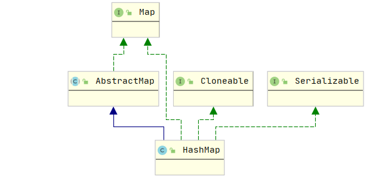
</div>

工具栏（Toolbar）：

<div align="center">  
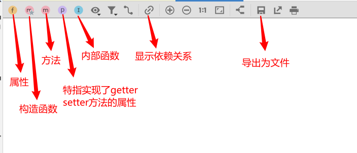
</div>

在IDEA中绘制UML则需安装插件`PlantUML`：

<div align="center">  
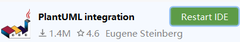
</div>

同时还需要[安装Graphviz](https://segmentfault.com/a/1190000022789556)才能正常显示，PlantUML的详细使用可参考——[PlantUML语言参考指引](http://plantuml.com/zh/guide)。`PlantUML`功能强大，但如果嫌弃在IDEA上使用 `PlantUML`麻烦的话，也可以用在线作图工具，如：[ProcessOn](https://www.processon.com/)，[WebChart](https://www.webchartnow.com/)。

## 1.2 UML 图分类

画 UML 图与写文章差不多，都是把自己的思想描述给别人看，关键在于思路和条理，UML 图大致分类：

1. 用例图（Use Case）

2. 静态结构图：**类图**、对象图、包图、组件图、部署图

3. 动态行为图：交互图（**时序图**与协作图）、状态图、活动图

其中，类图（Class Diagram）是描述类与类之间的关系的，是UML图中最核心的。时序图（Sequence Diagram）是显示对象之间交互的图，设计模式解析中也经常会用到时序图。

# 2 UML 类图

类图（ClassDiagram）是用来显示系统中的类、接口、协作以及它们之间的静态结构和关系的一种静态模型。根据类与类之间的耦合度从弱到强排列，UML 中的类图有以下几种关系：**依赖关系 < 关联关系 < 聚合关系 < 组合关系 < 泛化关系 = 实现关系**。

PlantUML用下面的符号来表示类之间的关系：

* 依赖，`Dependency`：`<..`
* 关联，`Association`：`<--`
* 聚合，`Aggregation`：`o--`
* 组合，`Composition`：`*--`

- 泛化，`Generalization`：`<|--`
- 实现，`Realization`：`<|..`

其中`--`替换成`..`就可以得到虚线。另外，其中的符号是可以改变方向的，例如：`<|--`表示右边的类泛化左边的类；`--|>`表示左边的类泛化右边的类。

例如：

```uml
@startuml
Class01 <.. Class02:依赖
Class03 <-- Class04:关联
Class05 o-- Class06:聚合
Class07 *-- Class08:组合
class09 <|-- Class10:泛化
Class11 <|.. Class12:实现
@enduml
```

生成的类图如下：

<div align="center">  
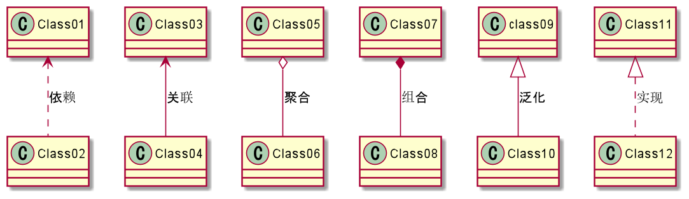
</div>

“可见性”表示该属性对类外的元素是否可见，包括公有（Public）、私有（Private）、受保护（Protected）和朋友（Friendly）4 种，在类图中分别用符号`+`、`-`、`#`、`~`表示。

例如：

<div align="center">  
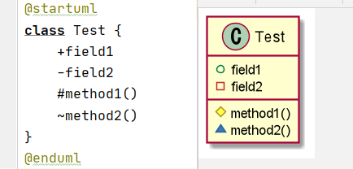
</div>

## 2.1 依赖（Dependency）

依赖关系是一种使用关系，它是对象之间耦合度最弱的一种关联方式，是临时性的关联。通常表现为，某个类的方法的参数使用了另外一个类的对象。

在UML类图中，依赖关系用带箭头的虚线表示，箭头从使用类指向被依赖的类。例如，人是依赖于手机进行语言传送的。

<div align="center">  
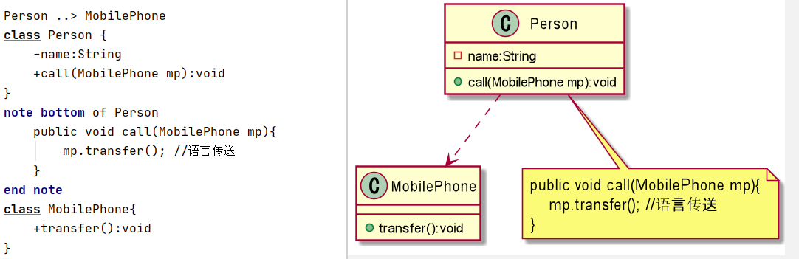
</div>

## 2.2 关联（Association）

关联关系是对象之间的一种引用关系，表示**一个类和另外一个类之间的联系**，如老师和学生，丈夫和妻子等。

关联具有**可导航性**，即关联可以是双向的，也可以是单向的。双向的关联可以用带两个箭头或者没有箭头的实线来表示，单向的关联用带一个箭头的实线来表示，箭头从使用类指向被关联的类。也可以在关联线的两端标注角色名，代表两种不同的角色。

例如，老师和学生之间的关系是双向的，一个老师可以有多个学生，一个学生也可以有多个老师。学生和课程之间是单向的，一个学生会学习多门课程，而课程是一个抽象的概念，它不拥有学生。

<div align="center">  
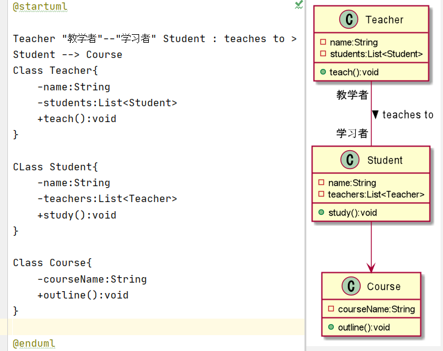
</div>

## 2.3 聚合（Aggregation）

聚合关系是关联关系的一种，是强**关联关系，是整体和部分之间的关系**，是`has-a`的关系。如学校和老师，车子和轮胎。

聚合关系在类中是通过成员对象来体现的，成员是整体的一部分，成员也可以脱离整体而存在。聚合关系可以用带空心菱形的实线来表示，菱形指向整体。

<div align="center">  
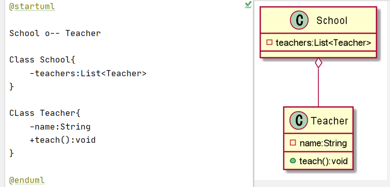
</div>

## 2.4 组合（Composition）

组合关系也是关联关系的一种，也表示**类之间的整体与部分的关系，但它是一种更强烈的聚合关系**，是 cxmtains-a 关系。部分对象不能脱离整体对象而单独存在，如人的身体和大脑之间的关系，大脑不能脱离身体而单独存在。

在UML类图中，用带实心菱形的实线来表示组合关系，菱形指向整体。

<div align="center">  
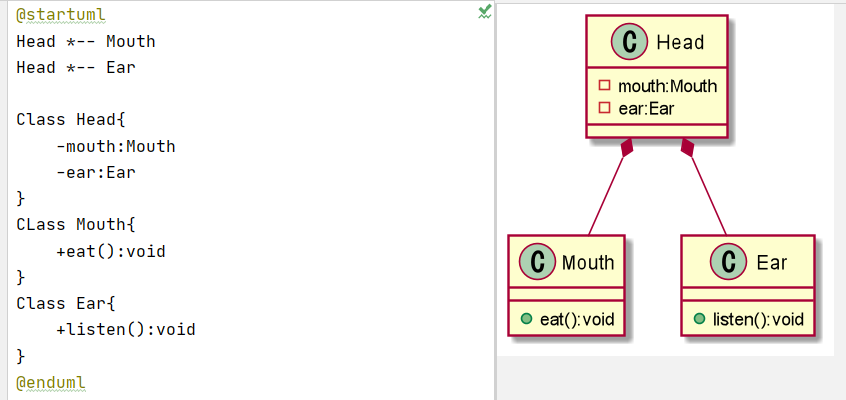
</div>

## 2.5 泛化（Generalization）

泛化关系是对象之间耦合度最大的一种关系，表示一般与特殊的关系，是**父类与子类之间的关系**，是一种**继承关系**，是 `is-a` 的关系。泛化关系用带空心三角箭头的实线来表示，箭头从子类指向父类。

例如，父类动物有一个吃的方法，小鸟和小狗都继承于动物类，小鸟有它特有的方法飞行，而狮子有特有的方法奔跑。

<div align="center">  
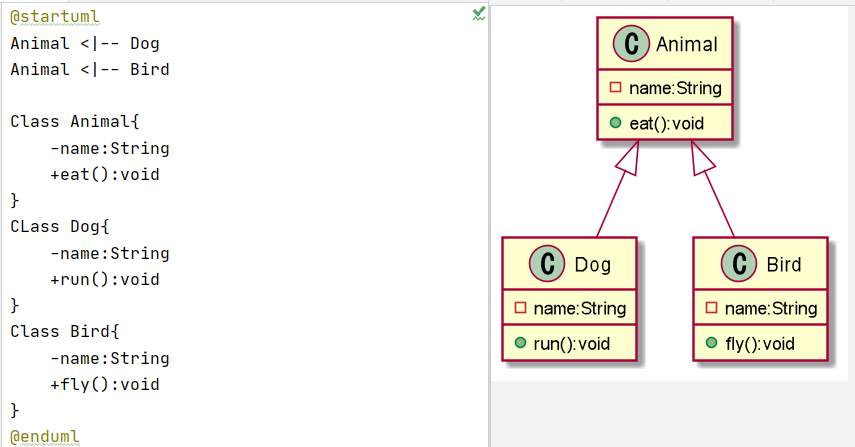
</div>

## 2.6 实现（Realization）

实现关系是**接口与实现类之间的关系**。在这种关系中，类实现了接口，类中的操作实现了接口中所声明的所有的抽象操作。

实现关系使用带空心三角箭头的虚线来表示，箭头从实现类指向接口。例如，汽车和船实现了交通工具。

<div align="center">  
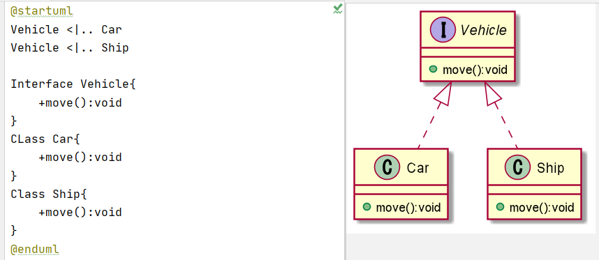
</div>

# 3 UML 时序图

时序图（Sequence Diagram）是显示对象之间交互的图，这些对象是按时间顺序排列的。时序图中显示的是参与交互的对象及其对象之间消息交互的顺序。

时序图包括的建模元素主要有：对象（Actor）、生命线（Lifeline）、控制焦点（Focus of control）、消息（Message）等等。

> IDEA 可使用`SequenceDiagram`插件绘制时序图

## 3.1 角色（Actor）

系统角色，可以是人、机器甚至其他的系统或者子系统。

<div align="center">  
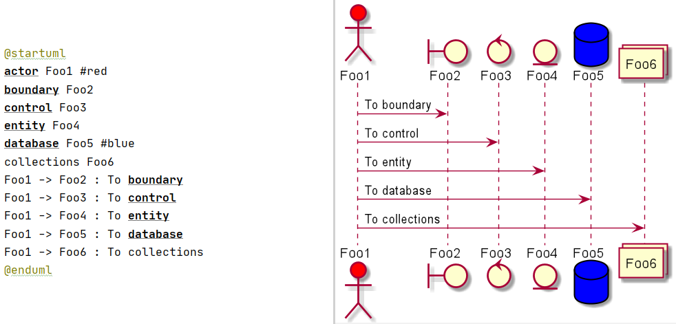
</div>

## 3.2 对象（Object）

 对象包括三种命名方式：

* 第一种方式包括**对象名和类名**。在时序图中，用`ObjectName:ClassName`表示；
* 第二种方式**只显示类名**，即表示他是一个匿名对象，即表示它是一个匿名对象。在时序图中，用`:ClassName`表示；
* 第三种方式**只显示对象名不显示类名**。在时序图中，就用`ObjectName`表示。

<div align="center">  
  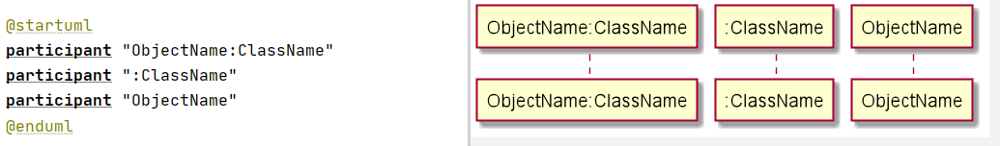
  </div>

## 3.3 生命线（Lifeline）

 在时序图中表示为从对象图标向下延伸的一条虚线，表示对象存在的时间。

##  3.4 控制焦点（Focus of Control）

又称为**激活期**，表示时间段的符号，在这个时间段内对象将执行相应的操作，用小矩形表示。PlantUML中使用关键字 activate 和 deactivate来表示参与者的生命活动。 一旦参与者被激活，它的生命线就会显示出来。

<div align="center">  
  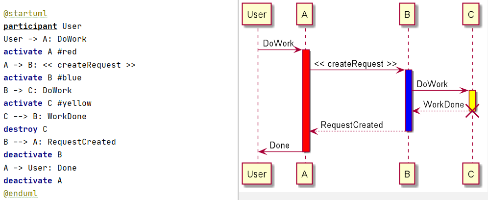
  </div>

##  3.5 消息（Message）

 消息一般分为同步消息（Synchronous Message），异步消息（Asynchronous Message）和返回消息（Return Message）。

- 同步消息的发送者把控制传递给消息的接收者，然后停止活动，等待消息的接收者返回消息或者控制。
- 异步消息的接收者和发送者是并发工作的。消息发送者通过消息把信号传递给消息的接收者，然后继续自己的活动，不等待接受者返回消息或者控制。
- 返回消息表示从过程调用返回。

##  3.6 自关联消息（Self-Message）

 表示方法的自身调用以及一个对象内的一个方法调用另外一个方法。

<div align="center">  
  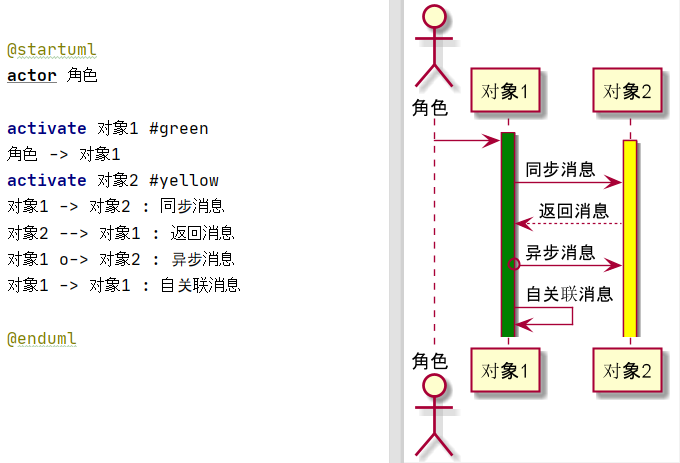
  </div>

# 参考

* [UML中的类图及类图之间的关系](http://c.biancheng.net/view/1319.html)
* [PlantUML语言参考指引](http://plantuml.com/zh/guide)
* [UML建模之时序图（Sequence Diagram）](https://www.cnblogs.com/ywqu/archive/2009/12/22/1629426.html)