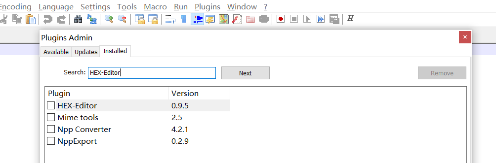
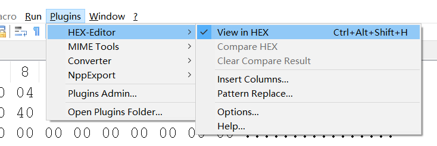

### 安装Xshell与Xftp后，会提示请更新到最新版本。

1、NotePad++安装HEX-Editor插件 
打开plugins Admin，搜索并Install与自己Notepad++版本相匹配的HEX-Editor插件

  

重启NotePad++

2、修改Xshell与Xftp安装目录下的“nslicense.dll” 
（复制出目录，修改完成再替换回去）
用Notepad++打开文件 

  

搜索16进制：7F 0C 81 F9 80 33 E1 01 0F 86 81 
将其替换成：7F 0C 81 F9 80 33 E1 01 0F 83 81 

- [x] 问题解决